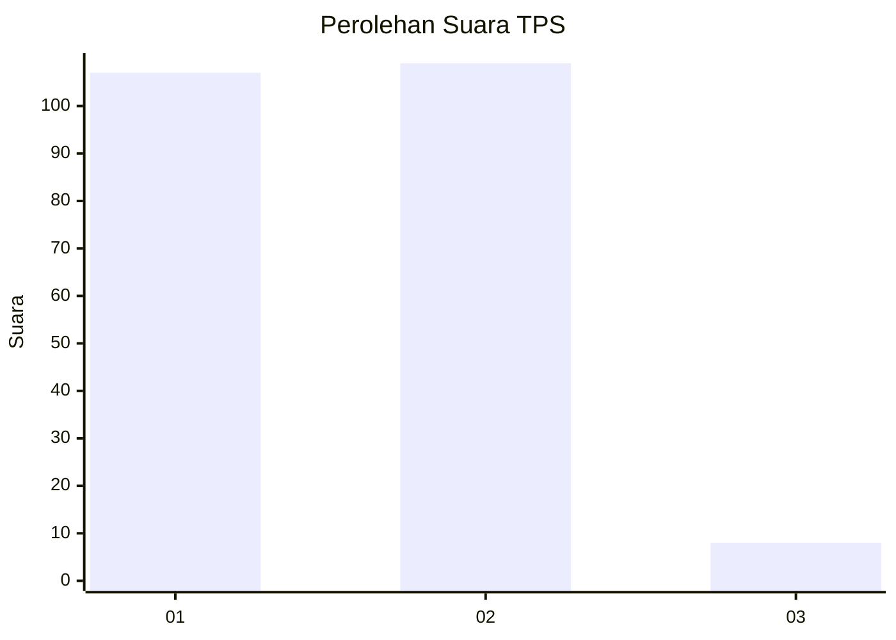
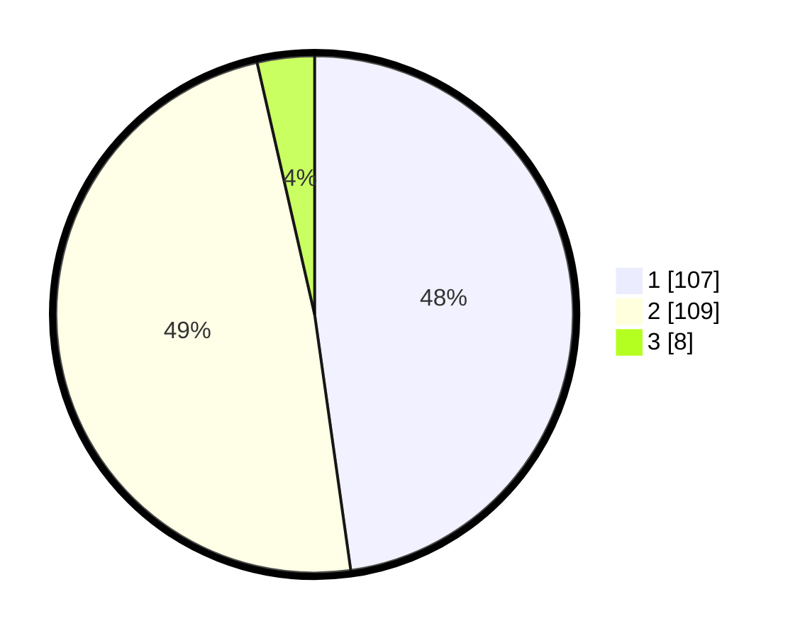

# Hasil

## Grafik

## Tabel

| No. | Nama Paslon    | Suara | Suara (raw) | Persentase |
|:--- |:-------------- | -----:| -----------:| ----------:|
| 1   | ANIES MUHAIMIN | 107   | [107][p-1]  | 47,77      |
| 2   | PRABOWO GIBRAN | 109   | [109][p-2]  | 48,66      |
| 3   | GANJAR MAHFUD  | 8     | [8][p-3]    | 3,57       |

[p-1]: https://github.com/gigit-pemilu/pemilu-2024-13-sumatera-barat/blob/main/pilpres/hitung-suara/sub/13-sumatera-barat/sub/01-pesisir-selatan/sub/01-pancung-soal/sub/2001-inderapura/sub/001-tps/sub/paslon-1.txt
[p-2]: https://github.com/gigit-pemilu/pemilu-2024-13-sumatera-barat/blob/main/pilpres/hitung-suara/sub/13-sumatera-barat/sub/01-pesisir-selatan/sub/01-pancung-soal/sub/2001-inderapura/sub/001-tps/sub/paslon-2.txt
[p-3]: https://github.com/gigit-pemilu/pemilu-2024-13-sumatera-barat/blob/main/pilpres/hitung-suara/sub/13-sumatera-barat/sub/01-pesisir-selatan/sub/01-pancung-soal/sub/2001-inderapura/sub/001-tps/sub/paslon-3.txt

## Foto C Plano

https://sirekap-obj-formc.kpu.go.id/c766/pemilu/ppwp/13/01/01/20/01/1301012001001-20240216-134632--10bffea3-3590-4c59-9d1e-8322e36cc5c4.jpg

https://sirekap-obj-formc.kpu.go.id/c766/pemilu/ppwp/13/01/01/20/01/1301012001001-20240216-134633--84e42245-f446-4273-83d3-d6161a0d7509.jpg

https://sirekap-obj-formc.kpu.go.id/c766/pemilu/ppwp/13/01/01/20/01/1301012001001-20240216-134633--79f716c5-9d75-4aad-a0c9-ccb41f803aa3.jpg

## Metadata

| Key        | Value               |
| ---------- | ------------------- |
| Time Stamp | 2024-02-22 18:00:00 |

## DATA PEMILIH TETAP

Jumlah pemilih dalam DPT: **291**.
 * L: **154**.
 * P: **137**.

## DATA PENGGUNA HAK PILIH

Jumlah pengguna hak pilih dalam DPT: **223**.
 * L: **113**.
 * P: **110**.

Jumlah pengguna hak pilih dalam DPTb: **4**.
 * L: **2**.
 * P: **2**.

Jumlah pengguna hak pilih dalam DPK: **0**.
 * L: **0**.
 * P: **0**.

Jumlah pengguna hak pilih: **227**.
 * L: **115**.
 * P: **112**.

## JUMLAH SUARA SAH DAN TIDAK SAH

JUMLAH SELURUH SUARA SAH: **224**.

JUMLAH SUARA TIDAK SAH: **3**.

JUMLAH SELURUH SUARA SAH DAN SUARA TIDAK SAH: **227**.

