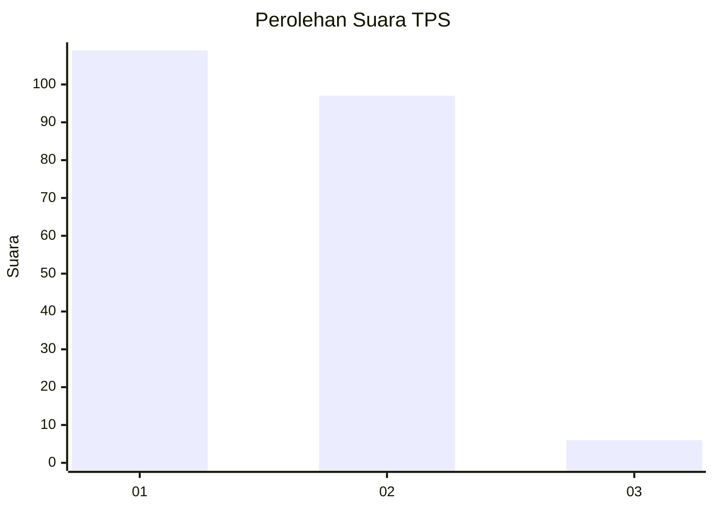
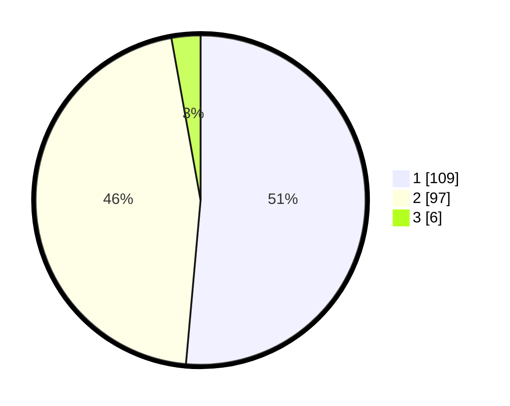

# Hasil

## Grafik

## Tabel

| No. | Nama Paslon    | Suara | Suara (raw) | Persentase |
|:--- |:-------------- | -----:| -----------:| ----------:|
| 1   | ANIES MUHAIMIN | 109   | [109][p-1]  | 51,42      |
| 2   | PRABOWO GIBRAN | 97    | [97][p-2]   | 45,75      |
| 3   | GANJAR MAHFUD  | 6     | [6][p-3]    | 2,83       |

[p-1]: https://github.com/gigit-pemilu/pemilu-2024-13-sumatera-barat/blob/main/pilpres/hitung-suara/sub/13-sumatera-barat/sub/01-pesisir-selatan/sub/01-pancung-soal/sub/2001-inderapura/sub/003-tps/sub/paslon-1.txt
[p-2]: https://github.com/gigit-pemilu/pemilu-2024-13-sumatera-barat/blob/main/pilpres/hitung-suara/sub/13-sumatera-barat/sub/01-pesisir-selatan/sub/01-pancung-soal/sub/2001-inderapura/sub/003-tps/sub/paslon-2.txt
[p-3]: https://github.com/gigit-pemilu/pemilu-2024-13-sumatera-barat/blob/main/pilpres/hitung-suara/sub/13-sumatera-barat/sub/01-pesisir-selatan/sub/01-pancung-soal/sub/2001-inderapura/sub/003-tps/sub/paslon-3.txt

## Foto C Plano

https://sirekap-obj-formc.kpu.go.id/aeb7/pemilu/ppwp/13/01/01/20/01/1301012001003-20240216-190450--60fa9d40-4bdf-4188-a56f-9b543384201c.jpg

https://sirekap-obj-formc.kpu.go.id/aeb7/pemilu/ppwp/13/01/01/20/01/1301012001003-20240216-190451--b3651556-a107-43a4-b00c-8afb8ce26add.jpg

https://sirekap-obj-formc.kpu.go.id/aeb7/pemilu/ppwp/13/01/01/20/01/1301012001003-20240216-190450--cb67918c-f753-4dca-a87a-b7af0aaa6ec6.jpg

## Metadata

| Key        | Value               |
| ---------- | ------------------- |
| Time Stamp | 2024-02-21 22:00:00 |

## DATA PEMILIH TETAP

Jumlah pemilih dalam DPT: **284**.
 * L: **139**.
 * P: **145**.

## DATA PENGGUNA HAK PILIH

Jumlah pengguna hak pilih dalam DPT: **215**.
 * L: **99**.
 * P: **116**.

Jumlah pengguna hak pilih dalam DPTb: **0**.
 * L: **0**.
 * P: **0**.

Jumlah pengguna hak pilih dalam DPK: **1**.
 * L: **0**.
 * P: **1**.

Jumlah pengguna hak pilih: **216**.
 * L: **99**.
 * P: **117**.

## JUMLAH SUARA SAH DAN TIDAK SAH

JUMLAH SELURUH SUARA SAH: **212**.

JUMLAH SUARA TIDAK SAH: **4**.

JUMLAH SELURUH SUARA SAH DAN SUARA TIDAK SAH: **216**.

