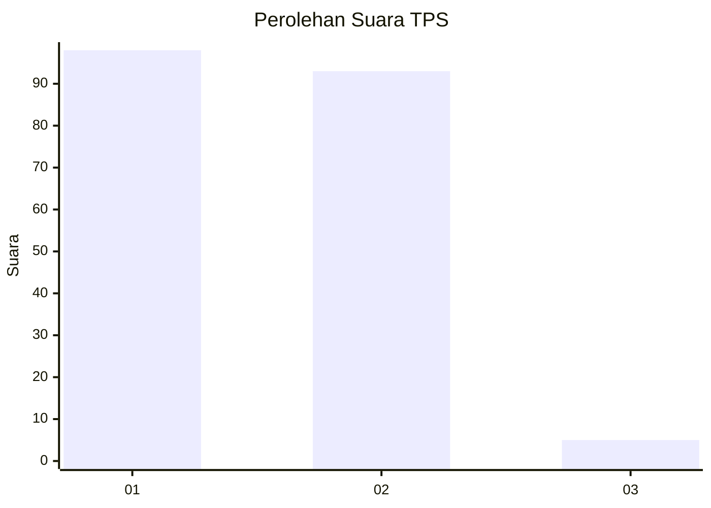
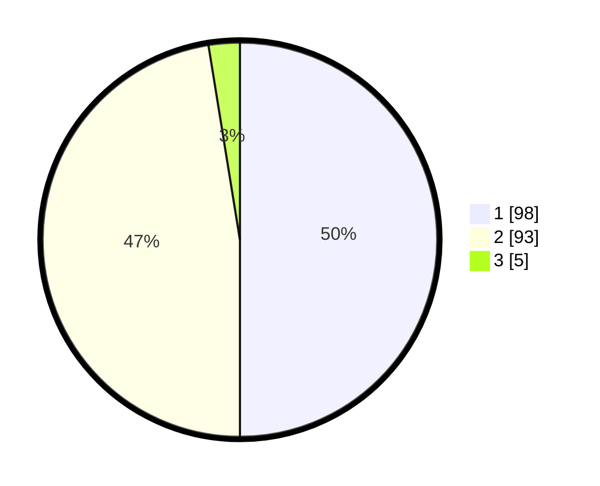

# Hasil

## Grafik

## Tabel

| No. | Nama Paslon    | Suara | Suara (raw) | Persentase |
|:--- |:-------------- | -----:| -----------:| ----------:|
| 1   | ANIES MUHAIMIN | 98    | [98][p-1]   | 50,00      |
| 2   | PRABOWO GIBRAN | 93    | [93][p-2]   | 47,45      |
| 3   | GANJAR MAHFUD  | 5     | [5][p-3]    | 2,55       |

[p-1]: https://github.com/gigit-pemilu/pemilu-2024-13-sumatera-barat/blob/main/pilpres/hitung-suara/sub/13-sumatera-barat/sub/01-pesisir-selatan/sub/01-pancung-soal/sub/2001-inderapura/sub/004-tps/sub/paslon-1.txt
[p-2]: https://github.com/gigit-pemilu/pemilu-2024-13-sumatera-barat/blob/main/pilpres/hitung-suara/sub/13-sumatera-barat/sub/01-pesisir-selatan/sub/01-pancung-soal/sub/2001-inderapura/sub/004-tps/sub/paslon-2.txt
[p-3]: https://github.com/gigit-pemilu/pemilu-2024-13-sumatera-barat/blob/main/pilpres/hitung-suara/sub/13-sumatera-barat/sub/01-pesisir-selatan/sub/01-pancung-soal/sub/2001-inderapura/sub/004-tps/sub/paslon-3.txt

## Foto C Plano

https://sirekap-obj-formc.kpu.go.id/e10d/pemilu/ppwp/13/01/01/20/01/1301012001004-20240217-195404--c5c6021f-07bf-4f28-8d4a-37e5e4aae38d.jpg

https://sirekap-obj-formc.kpu.go.id/e10d/pemilu/ppwp/13/01/01/20/01/1301012001004-20240217-195405--e7b91953-157d-4e15-8535-dfedd69e8b53.jpg

https://sirekap-obj-formc.kpu.go.id/e10d/pemilu/ppwp/13/01/01/20/01/1301012001004-20240217-195404--e132be9d-da68-4021-b111-37f81eadb359.jpg

## Metadata

| Key        | Value               |
| ---------- | ------------------- |
| Time Stamp | 2024-02-22 04:00:00 |

## DATA PEMILIH TETAP

Jumlah pemilih dalam DPT: **255**.
 * L: **126**.
 * P: **129**.

## DATA PENGGUNA HAK PILIH

Jumlah pengguna hak pilih dalam DPT: **196**.
 * L: **91**.
 * P: **105**.

Jumlah pengguna hak pilih dalam DPTb: **0**.
 * L: **0**.
 * P: **0**.

Jumlah pengguna hak pilih dalam DPK: **0**.
 * L: **0**.
 * P: **0**.

Jumlah pengguna hak pilih: **196**.
 * L: **91**.
 * P: **105**.

## JUMLAH SUARA SAH DAN TIDAK SAH

JUMLAH SELURUH SUARA SAH: **196**.

JUMLAH SUARA TIDAK SAH: **0**.

JUMLAH SELURUH SUARA SAH DAN SUARA TIDAK SAH: **196**.

