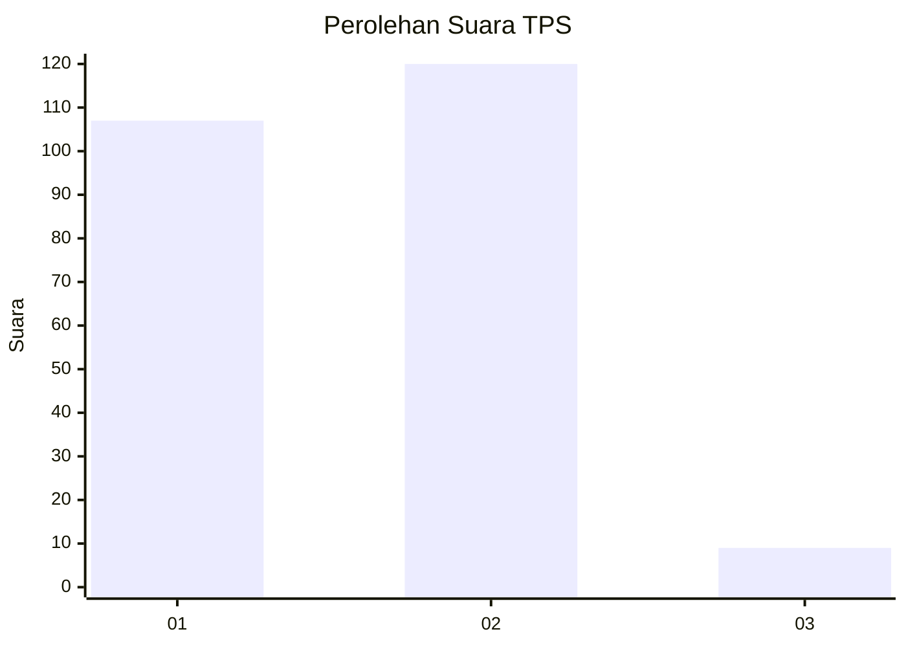
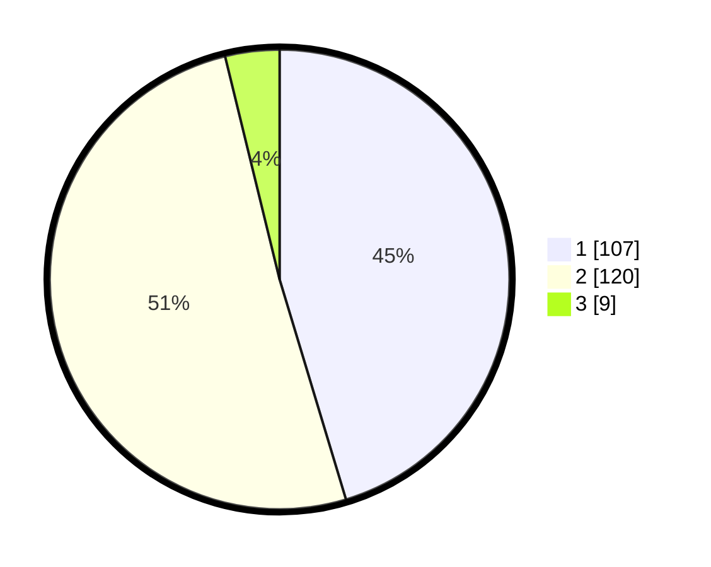

# Hasil

## Grafik

## Tabel

| No. | Nama Paslon    | Suara | Suara (raw) | Persentase |
|:--- |:-------------- | -----:| -----------:| ----------:|
| 1   | ANIES MUHAIMIN | 107   | [107][p-1]  | 45,34      |
| 2   | PRABOWO GIBRAN | 120   | [120][p-2]  | 50,85      |
| 3   | GANJAR MAHFUD  | 9     | [9][p-3]    | 3,81       |

[p-1]: https://github.com/gigit-pemilu/pemilu-2024-13-sumatera-barat/blob/main/pilpres/hitung-suara/sub/13-sumatera-barat/sub/01-pesisir-selatan/sub/01-pancung-soal/sub/2001-inderapura/sub/005-tps/sub/paslon-1.txt
[p-2]: https://github.com/gigit-pemilu/pemilu-2024-13-sumatera-barat/blob/main/pilpres/hitung-suara/sub/13-sumatera-barat/sub/01-pesisir-selatan/sub/01-pancung-soal/sub/2001-inderapura/sub/005-tps/sub/paslon-2.txt
[p-3]: https://github.com/gigit-pemilu/pemilu-2024-13-sumatera-barat/blob/main/pilpres/hitung-suara/sub/13-sumatera-barat/sub/01-pesisir-selatan/sub/01-pancung-soal/sub/2001-inderapura/sub/005-tps/sub/paslon-3.txt

## Foto C Plano

https://sirekap-obj-formc.kpu.go.id/b55a/pemilu/ppwp/13/01/01/20/01/1301012001005-20240217-203420--b74e275c-bf79-4df0-b992-ce0562f914b2.jpg

https://sirekap-obj-formc.kpu.go.id/b55a/pemilu/ppwp/13/01/01/20/01/1301012001005-20240217-203421--ca516990-accf-4782-8869-24a01f085f14.jpg

https://sirekap-obj-formc.kpu.go.id/b55a/pemilu/ppwp/13/01/01/20/01/1301012001005-20240217-203421--b2060b1c-bd54-49b4-8b59-28bba520069c.jpg

## Metadata

| Key        | Value               |
| ---------- | ------------------- |
| Time Stamp | 2024-02-21 21:00:04 |

## DATA PEMILIH TETAP

Jumlah pemilih dalam DPT: **289**.
 * L: **141**.
 * P: **148**.

## DATA PENGGUNA HAK PILIH

Jumlah pengguna hak pilih dalam DPT: **229**.
 * L: **104**.
 * P: **125**.

Jumlah pengguna hak pilih dalam DPTb: **0**.
 * L: **0**.
 * P: **0**.

Jumlah pengguna hak pilih dalam DPK: **10**.
 * L: **4**.
 * P: **6**.

Jumlah pengguna hak pilih: **239**.
 * L: **108**.
 * P: **131**.

## JUMLAH SUARA SAH DAN TIDAK SAH

JUMLAH SELURUH SUARA SAH: **236**.

JUMLAH SUARA TIDAK SAH: **3**.

JUMLAH SELURUH SUARA SAH DAN SUARA TIDAK SAH: **239**.

