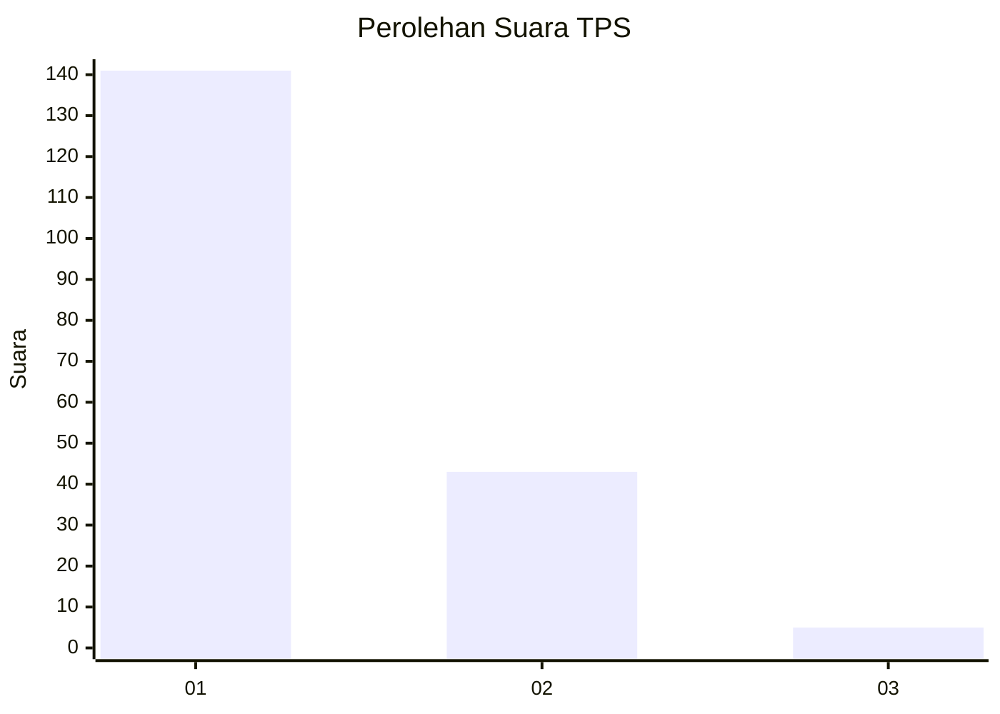
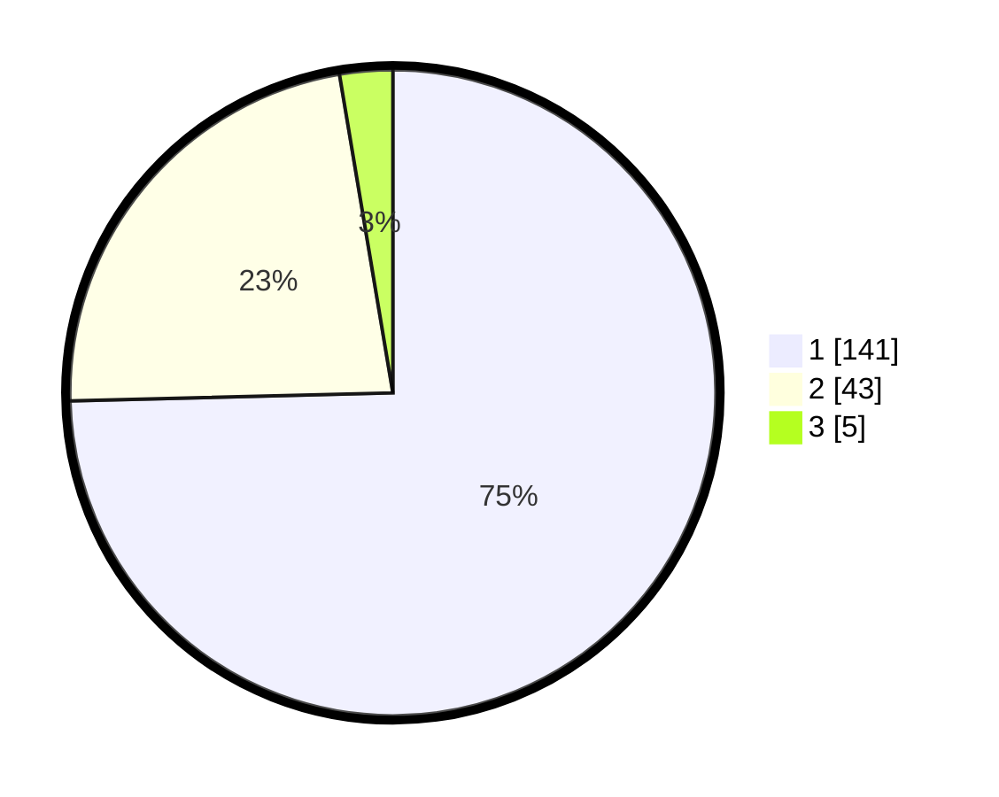

# Hasil

## Grafik

## Tabel

| No. | Nama Paslon    | Suara | Suara (raw) | Persentase |
|:--- |:-------------- | -----:| -----------:| ----------:|
| 1   | ANIES MUHAIMIN | 141   | [141][p-1]  | 74,60      |
| 2   | PRABOWO GIBRAN | 43    | [43][p-2]   | 22,75      |
| 3   | GANJAR MAHFUD  | 5     | [5][p-3]    | 2,65       |

[p-1]: https://github.com/gigit-pemilu/pemilu-2024-13-sumatera-barat/blob/main/pilpres/hitung-suara/sub/13-sumatera-barat/sub/01-pesisir-selatan/sub/03-lengayang/sub/2001-kambang/sub/006-tps/sub/paslon-1.txt
[p-2]: https://github.com/gigit-pemilu/pemilu-2024-13-sumatera-barat/blob/main/pilpres/hitung-suara/sub/13-sumatera-barat/sub/01-pesisir-selatan/sub/03-lengayang/sub/2001-kambang/sub/006-tps/sub/paslon-2.txt
[p-3]: https://github.com/gigit-pemilu/pemilu-2024-13-sumatera-barat/blob/main/pilpres/hitung-suara/sub/13-sumatera-barat/sub/01-pesisir-selatan/sub/03-lengayang/sub/2001-kambang/sub/006-tps/sub/paslon-3.txt

## Foto C Plano

https://sirekap-obj-formc.kpu.go.id/0f9b/pemilu/ppwp/13/01/03/20/01/1301032001006-20240215-011953--46f1c373-cad7-4547-b484-3f39bcba1dd2.jpg

https://sirekap-obj-formc.kpu.go.id/0f9b/pemilu/ppwp/13/01/03/20/01/1301032001006-20240215-015404--671a5ef4-9977-423c-9c1b-2eafd7fd251d.jpg

https://sirekap-obj-formc.kpu.go.id/0f9b/pemilu/ppwp/13/01/03/20/01/1301032001006-20240215-012330--969fd9ec-d6d8-4288-b3ec-854ece42538f.jpg

## Metadata

| Key        | Value               |
| ---------- | ------------------- |
| Time Stamp | 2024-02-17 13:37:34 |

