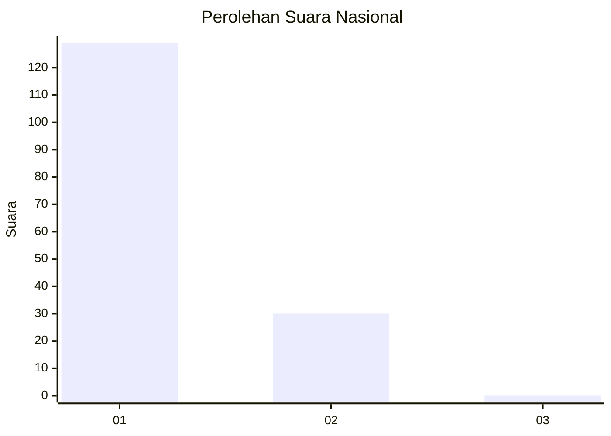
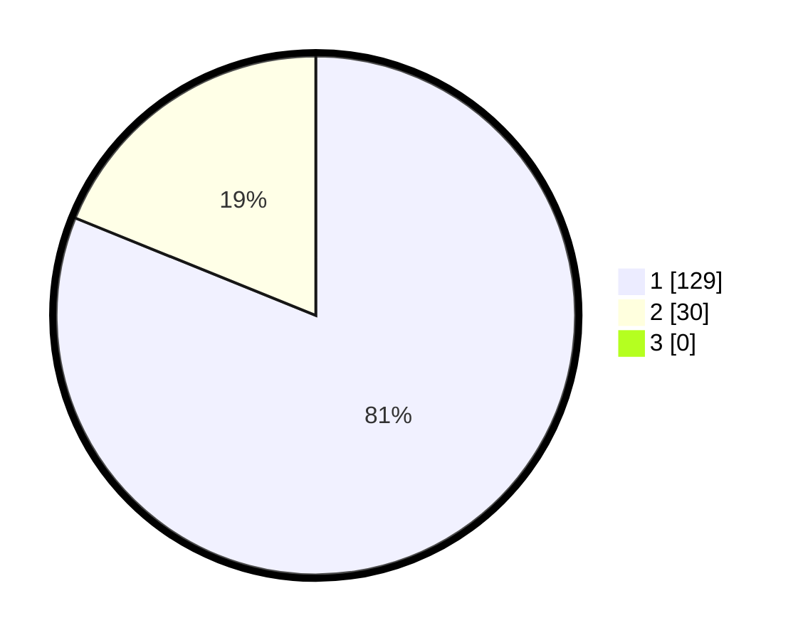

# Hasil

## Grafik

## Tabel

| No. | Nama Paslon    | Suara | Suara (raw) | Persentase |
|:--- |:-------------- | -----:| -----------:| ----------:|
| 1   | ANIES MUHAIMIN | 129   | [129][p-1]  | 81,13      |
| 2   | PRABOWO GIBRAN | 30    | [30][p-2]   | 18,87      |
| 3   | GANJAR MAHFUD  | 0     | [0][p-3]    | 0,00       |

[p-1]: https://github.com/gigit-pemilu/pemilu-2024/blob/main/pilpres/hitung-suara/sub/13-sumatera-barat/sub/01-pesisir-selatan/sub/03-lengayang/sub/2001-kambang/sub/017-tps/sub/paslon-1.txt
[p-2]: https://github.com/gigit-pemilu/pemilu-2024/blob/main/pilpres/hitung-suara/sub/13-sumatera-barat/sub/01-pesisir-selatan/sub/03-lengayang/sub/2001-kambang/sub/017-tps/sub/paslon-2.txt
[p-3]: https://github.com/gigit-pemilu/pemilu-2024/blob/main/pilpres/hitung-suara/sub/13-sumatera-barat/sub/01-pesisir-selatan/sub/03-lengayang/sub/2001-kambang/sub/017-tps/sub/paslon-3.txt

## Foto C Plano

https://sirekap-obj-formc.kpu.go.id/f375/pemilu/ppwp/13/01/03/20/01/1301032001017-20240215-004630--d19bf814-699b-4a3d-b7d5-5e5bcde8d075.jpg

https://sirekap-obj-formc.kpu.go.id/f375/pemilu/ppwp/13/01/03/20/01/1301032001017-20240215-004933--35ff5bbd-d09c-4173-9470-ba53f6f13985.jpg

https://sirekap-obj-formc.kpu.go.id/f375/pemilu/ppwp/13/01/03/20/01/1301032001017-20240215-014003--76e7b758-c063-494a-9a4b-835ef0103f5b.jpg

## Metadata

| Key        | Value               |
| ---------- | ------------------- |
| Time Stamp | 2024-02-17 13:37:34 |

