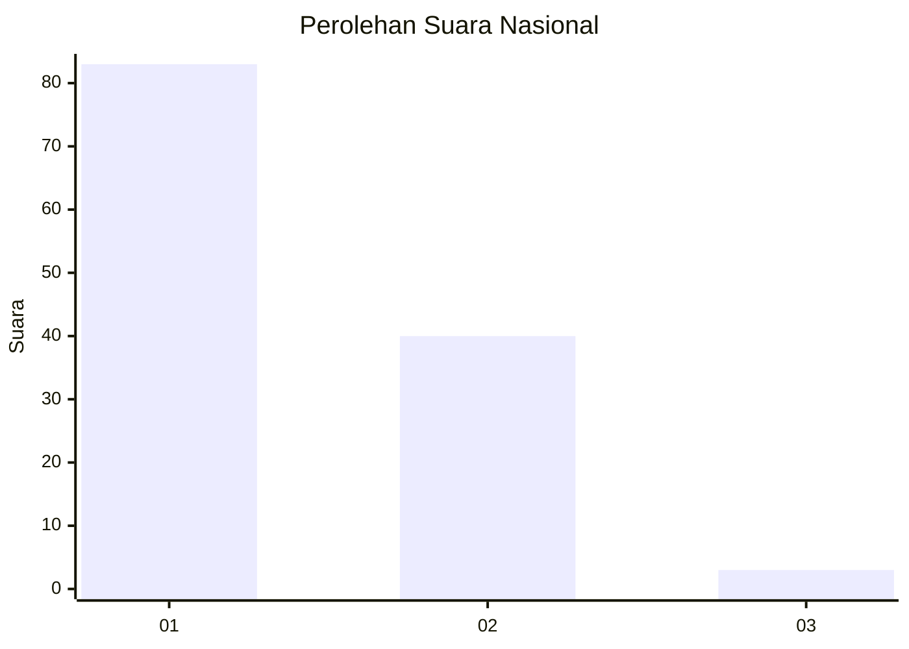
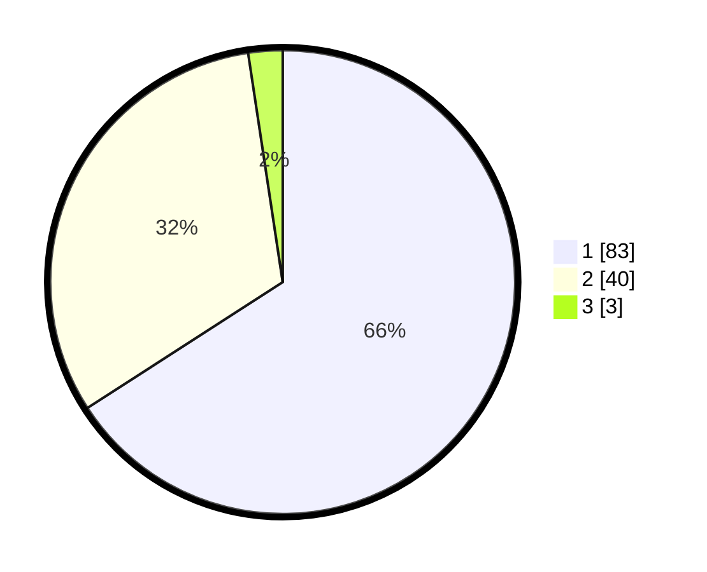

# Hasil

## Grafik

## Tabel

| No. | Nama Paslon    | Suara | Suara (raw) | Persentase |
|:--- |:-------------- | -----:| -----------:| ----------:|
| 1   | ANIES MUHAIMIN | 83    | [83][p-1]   | 65,87      |
| 2   | PRABOWO GIBRAN | 40    | [40][p-2]   | 31,75      |
| 3   | GANJAR MAHFUD  | 3     | [3][p-3]    | 2,38       |

[p-1]: https://github.com/gigit-pemilu/pemilu-2024/blob/main/pilpres/hitung-suara/sub/13-sumatera-barat/sub/01-pesisir-selatan/sub/03-lengayang/sub/2001-kambang/sub/018-tps/sub/paslon-1.txt
[p-2]: https://github.com/gigit-pemilu/pemilu-2024/blob/main/pilpres/hitung-suara/sub/13-sumatera-barat/sub/01-pesisir-selatan/sub/03-lengayang/sub/2001-kambang/sub/018-tps/sub/paslon-2.txt
[p-3]: https://github.com/gigit-pemilu/pemilu-2024/blob/main/pilpres/hitung-suara/sub/13-sumatera-barat/sub/01-pesisir-selatan/sub/03-lengayang/sub/2001-kambang/sub/018-tps/sub/paslon-3.txt

## Foto C Plano

https://sirekap-obj-formc.kpu.go.id/f074/pemilu/ppwp/13/01/03/20/01/1301032001018-20240215-050223--9a29ede5-71fe-42bb-8a12-c03ba6e293c7.jpg

https://sirekap-obj-formc.kpu.go.id/f074/pemilu/ppwp/13/01/03/20/01/1301032001018-20240215-030723--62ff53d7-f176-414c-b75e-71d31d63a358.jpg

https://sirekap-obj-formc.kpu.go.id/f074/pemilu/ppwp/13/01/03/20/01/1301032001018-20240215-030944--f06f5d06-954c-458d-ad47-08b037579e4b.jpg

## Metadata

| Key        | Value               |
| ---------- | ------------------- |
| Time Stamp | 2024-02-15 15:00:29 |

