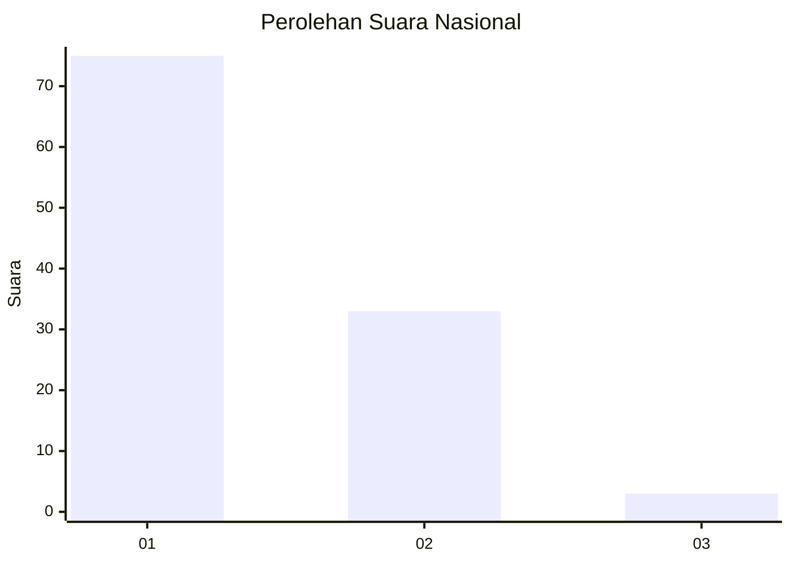
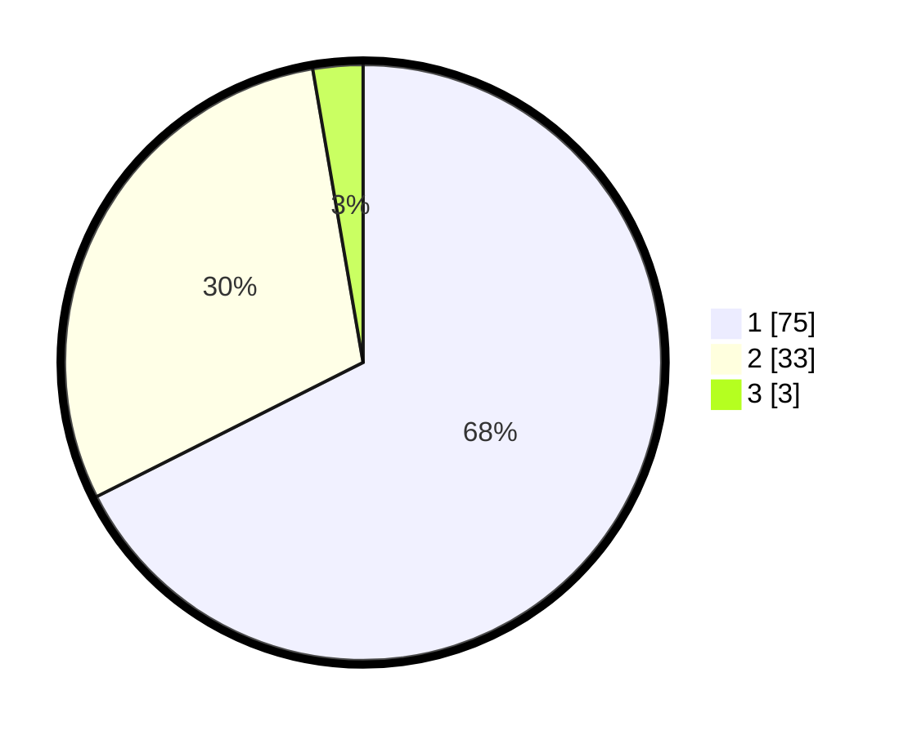

# Hasil

## Grafik

## Tabel

| No. | Nama Paslon    | Suara | Suara (raw) | Persentase |
|:--- |:-------------- | -----:| -----------:| ----------:|
| 1   | ANIES MUHAIMIN | 75    | [75][p-1]   | 67,57      |
| 2   | PRABOWO GIBRAN | 33    | [33][p-2]   | 29,73      |
| 3   | GANJAR MAHFUD  | 3     | [3][p-3]    | 2,70       |

[p-1]: https://github.com/gigit-pemilu/pemilu-2024/blob/main/pilpres/hitung-suara/sub/13-sumatera-barat/sub/01-pesisir-selatan/sub/03-lengayang/sub/2005-kambang-barat/sub/012-tps/sub/paslon-1.txt
[p-2]: https://github.com/gigit-pemilu/pemilu-2024/blob/main/pilpres/hitung-suara/sub/13-sumatera-barat/sub/01-pesisir-selatan/sub/03-lengayang/sub/2005-kambang-barat/sub/012-tps/sub/paslon-2.txt
[p-3]: https://github.com/gigit-pemilu/pemilu-2024/blob/main/pilpres/hitung-suara/sub/13-sumatera-barat/sub/01-pesisir-selatan/sub/03-lengayang/sub/2005-kambang-barat/sub/012-tps/sub/paslon-3.txt

## Foto C Plano

https://sirekap-obj-formc.kpu.go.id/c64e/pemilu/ppwp/13/01/03/20/05/1301032005012-20240215-015853--f4a30855-55c1-480f-9a9a-fda8bb9c1701.jpg

https://sirekap-obj-formc.kpu.go.id/c64e/pemilu/ppwp/13/01/03/20/05/1301032005012-20240215-020036--be2a15e8-9ce7-487e-93d8-375bd1dbdd8b.jpg

https://sirekap-obj-formc.kpu.go.id/c64e/pemilu/ppwp/13/01/03/20/05/1301032005012-20240215-020236--bb3c2046-8857-4011-8333-5bf4d9bcb7ac.jpg

## Metadata

| Key        | Value               |
| ---------- | ------------------- |
| Time Stamp | 2024-02-19 06:16:00 |

