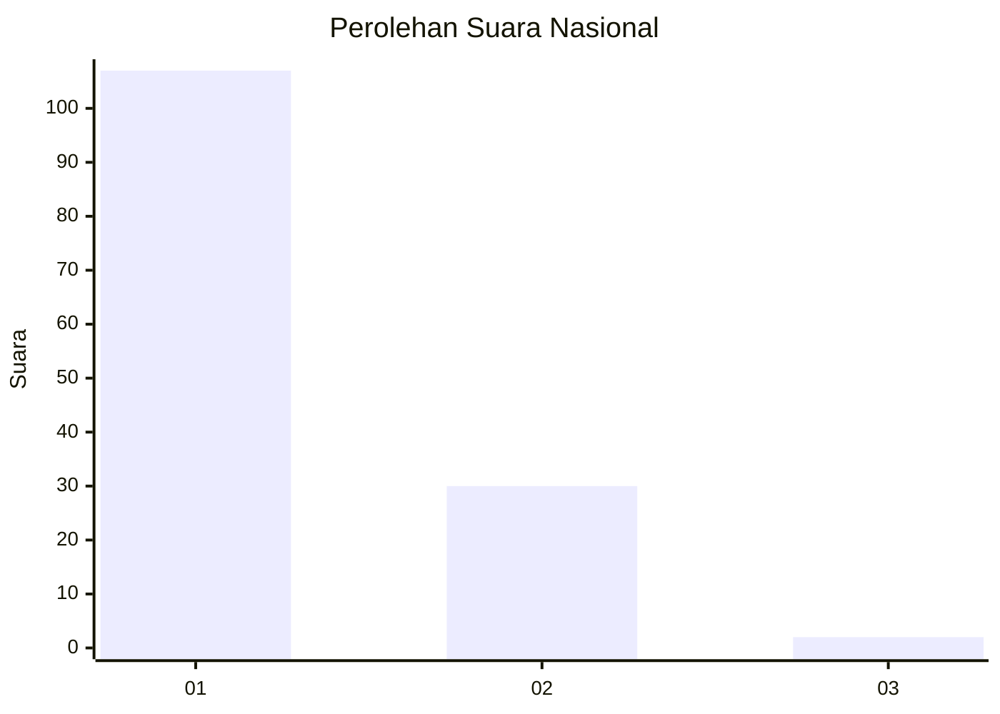
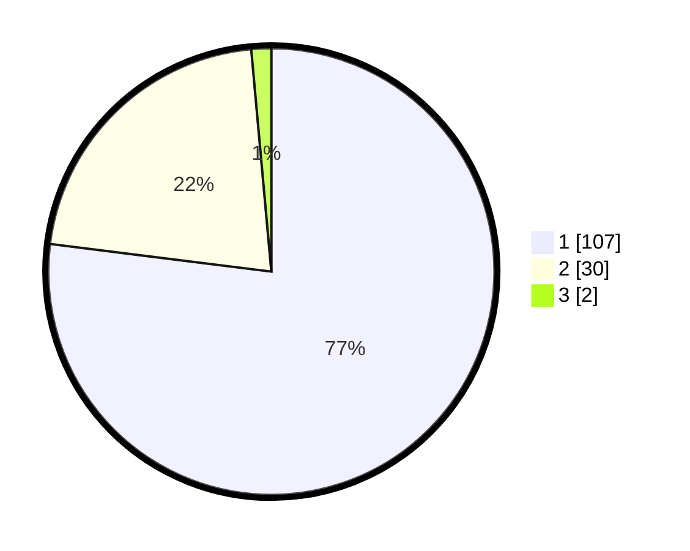

# Hasil

## Grafik

## Tabel

| No. | Nama Paslon    | Suara | Suara (raw) | Persentase |
|:--- |:-------------- | -----:| -----------:| ----------:|
| 1   | ANIES MUHAIMIN | 107   | [107][p-1]  | 76,98      |
| 2   | PRABOWO GIBRAN | 30    | [30][p-2]   | 21,58      |
| 3   | GANJAR MAHFUD  | 2     | [2][p-3]    | 1,44       |

[p-1]: https://github.com/gigit-pemilu/pemilu-2024/blob/main/pilpres/hitung-suara/sub/13-sumatera-barat/sub/01-pesisir-selatan/sub/03-lengayang/sub/2005-kambang-barat/sub/020-tps/sub/paslon-1.txt
[p-2]: https://github.com/gigit-pemilu/pemilu-2024/blob/main/pilpres/hitung-suara/sub/13-sumatera-barat/sub/01-pesisir-selatan/sub/03-lengayang/sub/2005-kambang-barat/sub/020-tps/sub/paslon-2.txt
[p-3]: https://github.com/gigit-pemilu/pemilu-2024/blob/main/pilpres/hitung-suara/sub/13-sumatera-barat/sub/01-pesisir-selatan/sub/03-lengayang/sub/2005-kambang-barat/sub/020-tps/sub/paslon-3.txt

## Foto C Plano

https://sirekap-obj-formc.kpu.go.id/ca86/pemilu/ppwp/13/01/03/20/05/1301032005020-20240215-073531--a5f6bc85-6135-47aa-b1b8-a709a3edffb0.jpg

https://sirekap-obj-formc.kpu.go.id/ca86/pemilu/ppwp/13/01/03/20/05/1301032005020-20240215-073649--8cfba61e-de9a-4124-a588-76b65aff7a46.jpg

https://sirekap-obj-formc.kpu.go.id/ca86/pemilu/ppwp/13/01/03/20/05/1301032005020-20240215-073750--bb9a979a-4401-4f0a-8bea-afe63eb91b60.jpg

## Metadata

| Key        | Value               |
| ---------- | ------------------- |
| Time Stamp | 2024-02-19 06:16:00 |

