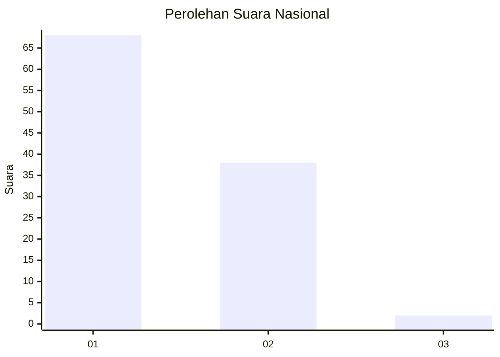
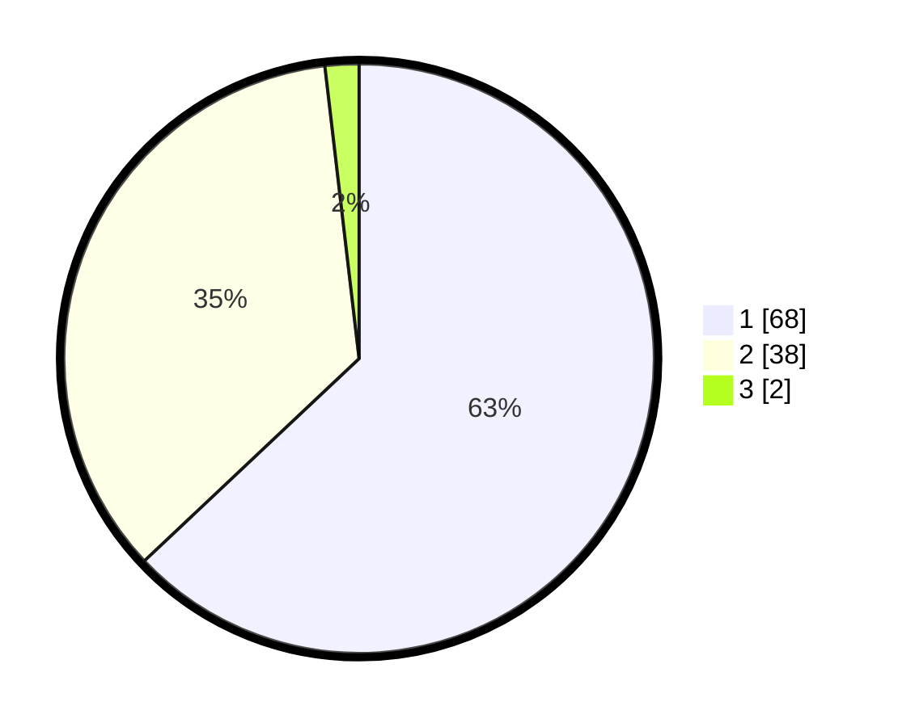

# Hasil

## Grafik

## Tabel

| No. | Nama Paslon    | Suara | Suara (raw) | Persentase |
|:--- |:-------------- | -----:| -----------:| ----------:|
| 1   | ANIES MUHAIMIN | 68    | [68][p-1]   | 62,96      |
| 2   | PRABOWO GIBRAN | 38    | [38][p-2]   | 35,19      |
| 3   | GANJAR MAHFUD  | 2     | [2][p-3]    | 1,85       |

[p-1]: https://github.com/gigit-pemilu/pemilu-2024/blob/main/pilpres/hitung-suara/sub/13-sumatera-barat/sub/01-pesisir-selatan/sub/03-lengayang/sub/2006-lakitan-utara/sub/002-tps/sub/paslon-1.txt
[p-2]: https://github.com/gigit-pemilu/pemilu-2024/blob/main/pilpres/hitung-suara/sub/13-sumatera-barat/sub/01-pesisir-selatan/sub/03-lengayang/sub/2006-lakitan-utara/sub/002-tps/sub/paslon-2.txt
[p-3]: https://github.com/gigit-pemilu/pemilu-2024/blob/main/pilpres/hitung-suara/sub/13-sumatera-barat/sub/01-pesisir-selatan/sub/03-lengayang/sub/2006-lakitan-utara/sub/002-tps/sub/paslon-3.txt

## Foto C Plano

https://sirekap-obj-formc.kpu.go.id/ad10/pemilu/ppwp/13/01/03/20/06/1301032006002-20240215-000838--5a9f0d0a-24da-44c7-83ae-3abdef7384be.jpg

https://sirekap-obj-formc.kpu.go.id/ad10/pemilu/ppwp/13/01/03/20/06/1301032006002-20240214-235542--1bcf6bb0-f107-4c01-a62d-977289fa1735.jpg

https://sirekap-obj-formc.kpu.go.id/ad10/pemilu/ppwp/13/01/03/20/06/1301032006002-20240215-000113--22ae431e-9e13-42a9-adc4-e40ec9f2c526.jpg

## Metadata

| Key        | Value               |
| ---------- | ------------------- |
| Time Stamp | 2024-02-19 06:16:00 |

