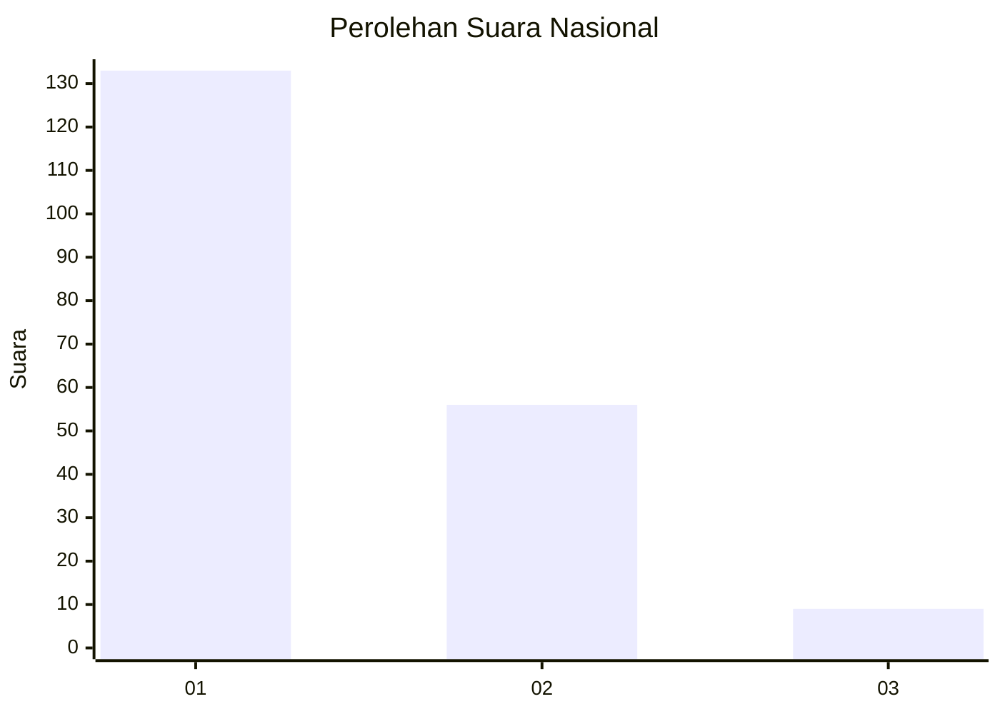
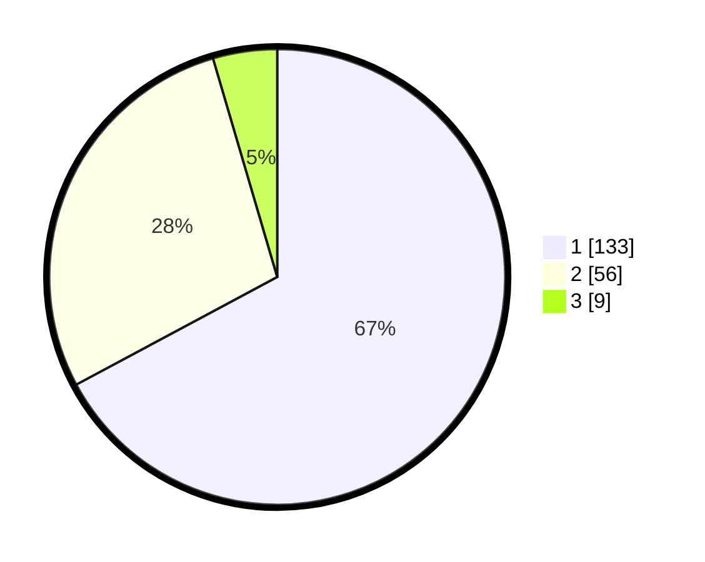

# Hasil

## Grafik

## Tabel

| No. | Nama Paslon    | Suara | Suara (raw) | Persentase |
|:--- |:-------------- | -----:| -----------:| ----------:|
| 1   | ANIES MUHAIMIN | 133   | [133][p-1]  | 67,17      |
| 2   | PRABOWO GIBRAN | 56    | [56][p-2]   | 28,28      |
| 3   | GANJAR MAHFUD  | 9     | [9][p-3]    | 4,55       |

[p-1]: https://github.com/gigit-pemilu/pemilu-2024/blob/main/pilpres/hitung-suara/sub/13-sumatera-barat/sub/01-pesisir-selatan/sub/03-lengayang/sub/2006-lakitan-utara/sub/007-tps/sub/paslon-1.txt
[p-2]: https://github.com/gigit-pemilu/pemilu-2024/blob/main/pilpres/hitung-suara/sub/13-sumatera-barat/sub/01-pesisir-selatan/sub/03-lengayang/sub/2006-lakitan-utara/sub/007-tps/sub/paslon-2.txt
[p-3]: https://github.com/gigit-pemilu/pemilu-2024/blob/main/pilpres/hitung-suara/sub/13-sumatera-barat/sub/01-pesisir-selatan/sub/03-lengayang/sub/2006-lakitan-utara/sub/007-tps/sub/paslon-3.txt

## Foto C Plano

https://sirekap-obj-formc.kpu.go.id/38cb/pemilu/ppwp/13/01/03/20/06/1301032006007-20240215-031415--359d3910-5818-46c9-820a-499ba3b7f3f7.jpg

https://sirekap-obj-formc.kpu.go.id/38cb/pemilu/ppwp/13/01/03/20/06/1301032006007-20240215-031856--397a4947-06e1-44f0-96e0-efc0d481add0.jpg

https://sirekap-obj-formc.kpu.go.id/38cb/pemilu/ppwp/13/01/03/20/06/1301032006007-20240215-031126--e449dbd8-f9b9-4edd-8406-d61e4c9bf9f1.jpg

## Metadata

| Key        | Value               |
| ---------- | ------------------- |
| Time Stamp | 2024-02-19 06:16:00 |

