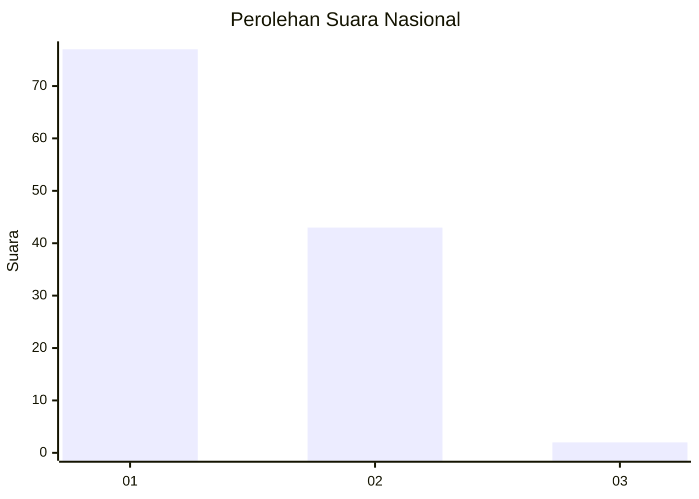
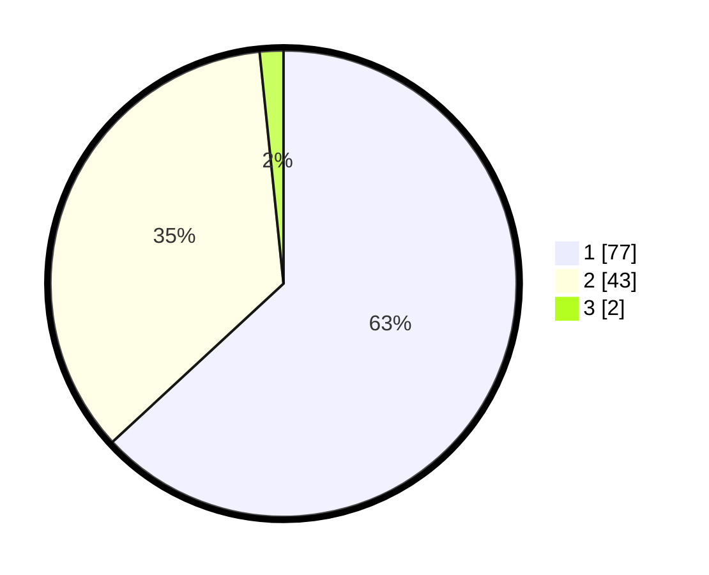

# Hasil

## Grafik

## Tabel

| No. | Nama Paslon    | Suara | Suara (raw) | Persentase |
|:--- |:-------------- | -----:| -----------:| ----------:|
| 1   | ANIES MUHAIMIN | 77    | [77][p-1]   | 63,11      |
| 2   | PRABOWO GIBRAN | 43    | [43][p-2]   | 35,25      |
| 3   | GANJAR MAHFUD  | 2     | [2][p-3]    | 1,64       |

[p-1]: https://github.com/gigit-pemilu/pemilu-2024/blob/main/pilpres/hitung-suara/sub/13-sumatera-barat/sub/01-pesisir-selatan/sub/04-batang-kapas/sub/2001-iv-koto-hilie/sub/012-tps/sub/paslon-1.txt
[p-2]: https://github.com/gigit-pemilu/pemilu-2024/blob/main/pilpres/hitung-suara/sub/13-sumatera-barat/sub/01-pesisir-selatan/sub/04-batang-kapas/sub/2001-iv-koto-hilie/sub/012-tps/sub/paslon-2.txt
[p-3]: https://github.com/gigit-pemilu/pemilu-2024/blob/main/pilpres/hitung-suara/sub/13-sumatera-barat/sub/01-pesisir-selatan/sub/04-batang-kapas/sub/2001-iv-koto-hilie/sub/012-tps/sub/paslon-3.txt

## Foto C Plano

https://sirekap-obj-formc.kpu.go.id/b653/pemilu/ppwp/13/01/04/20/01/1301042001012-20240214-215408--c8f512e7-baa9-4c2f-abc5-7066ee657bc9.jpg

https://sirekap-obj-formc.kpu.go.id/b653/pemilu/ppwp/13/01/04/20/01/1301042001012-20240214-215250--1b22070d-fc3e-4fdf-b34a-72a6a1888ac4.jpg

https://sirekap-obj-formc.kpu.go.id/b653/pemilu/ppwp/13/01/04/20/01/1301042001012-20240214-215344--4e7dd493-3bbd-43e0-b20e-0b4b2beeacbf.jpg

## Metadata

| Key        | Value               |
| ---------- | ------------------- |
| Time Stamp | 2024-02-24 22:31:28 |

