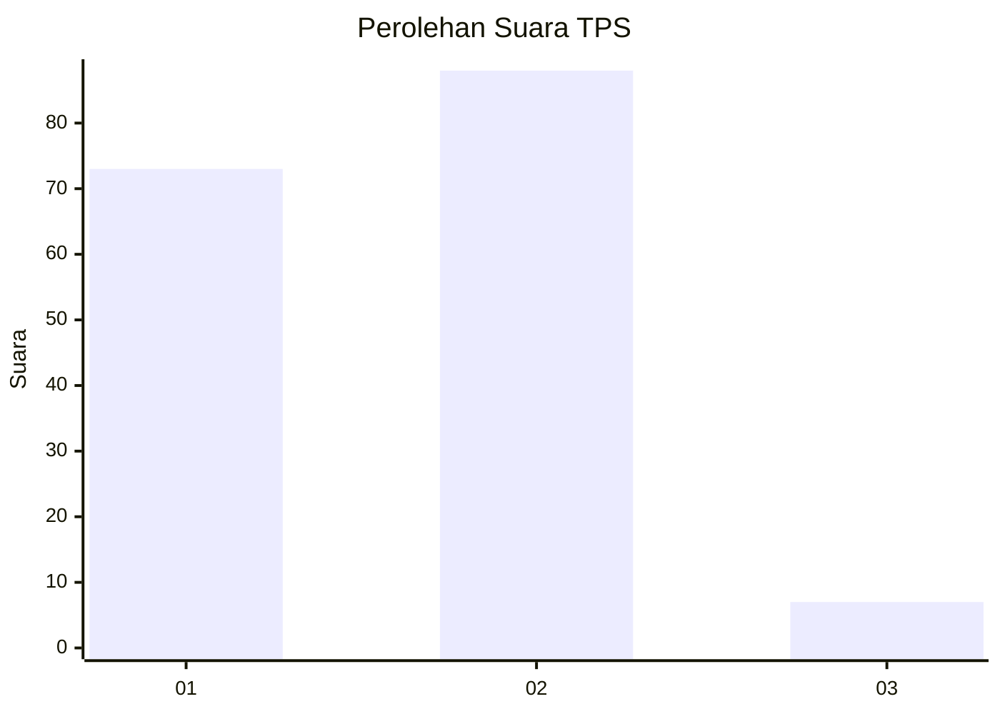
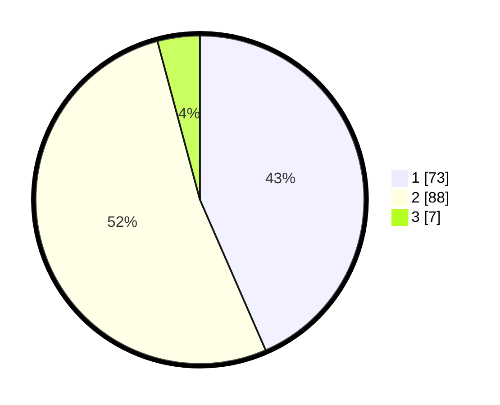

# Hasil

## Grafik

## Tabel

| No. | Nama Paslon    | Suara | Suara (raw) | Persentase |
|:--- |:-------------- | -----:| -----------:| ----------:|
| 1   | ANIES MUHAIMIN | 73    | [73][p-1]   | 43,45      |
| 2   | PRABOWO GIBRAN | 88    | [88][p-2]   | 52,38      |
| 3   | GANJAR MAHFUD  | 7     | [7][p-3]    | 4,17       |

[p-1]: https://github.com/gigit-pemilu/pemilu-2024-13-sumatera-barat/blob/main/pilpres/hitung-suara/sub/13-sumatera-barat/sub/01-pesisir-selatan/sub/04-batang-kapas/sub/2006-teratak-tempatih-iv-koto-mudiek/sub/004-tps/sub/paslon-1.txt
[p-2]: https://github.com/gigit-pemilu/pemilu-2024-13-sumatera-barat/blob/main/pilpres/hitung-suara/sub/13-sumatera-barat/sub/01-pesisir-selatan/sub/04-batang-kapas/sub/2006-teratak-tempatih-iv-koto-mudiek/sub/004-tps/sub/paslon-2.txt
[p-3]: https://github.com/gigit-pemilu/pemilu-2024-13-sumatera-barat/blob/main/pilpres/hitung-suara/sub/13-sumatera-barat/sub/01-pesisir-selatan/sub/04-batang-kapas/sub/2006-teratak-tempatih-iv-koto-mudiek/sub/004-tps/sub/paslon-3.txt

## Foto C Plano

https://sirekap-obj-formc.kpu.go.id/bfc3/pemilu/ppwp/13/01/04/20/06/1301042006004-20240222-145010--83a12a8e-c613-49c1-b74e-d9157c512c71.jpg

https://sirekap-obj-formc.kpu.go.id/bfc3/pemilu/ppwp/13/01/04/20/06/1301042006004-20240214-220014--3766abc1-a5d1-4e4c-850e-5bd3fac1f45d.jpg

https://sirekap-obj-formc.kpu.go.id/bfc3/pemilu/ppwp/13/01/04/20/06/1301042006004-20240214-220543--658ac9a7-6142-469c-a54e-ed6b47e58e1a.jpg

## Metadata

| Key        | Value               |
| ---------- | ------------------- |
| Time Stamp | 2024-02-22 15:00:00 |

