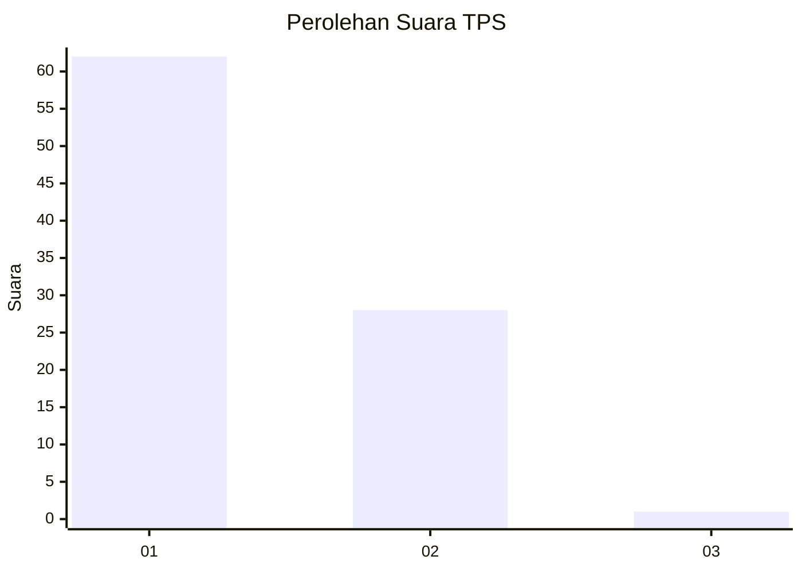
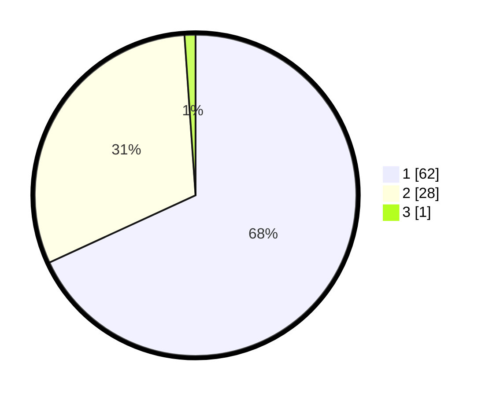

# Hasil

## Grafik

## Tabel

| No. | Nama Paslon    | Suara | Suara (raw) | Persentase |
|:--- |:-------------- | -----:| -----------:| ----------:|
| 1   | ANIES MUHAIMIN | 62    | [62][p-1]   | 68,13      |
| 2   | PRABOWO GIBRAN | 28    | [28][p-2]   | 30,77      |
| 3   | GANJAR MAHFUD  | 1     | [1][p-3]    | 1,10       |

[p-1]: https://github.com/gigit-pemilu/pemilu-2024-13-sumatera-barat/blob/main/pilpres/hitung-suara/sub/13-sumatera-barat/sub/01-pesisir-selatan/sub/05-iv-jurai/sub/2015-sungai-gayo-lumpo/sub/002-tps/sub/paslon-1.txt
[p-2]: https://github.com/gigit-pemilu/pemilu-2024-13-sumatera-barat/blob/main/pilpres/hitung-suara/sub/13-sumatera-barat/sub/01-pesisir-selatan/sub/05-iv-jurai/sub/2015-sungai-gayo-lumpo/sub/002-tps/sub/paslon-2.txt
[p-3]: https://github.com/gigit-pemilu/pemilu-2024-13-sumatera-barat/blob/main/pilpres/hitung-suara/sub/13-sumatera-barat/sub/01-pesisir-selatan/sub/05-iv-jurai/sub/2015-sungai-gayo-lumpo/sub/002-tps/sub/paslon-3.txt

## Foto C Plano

https://sirekap-obj-formc.kpu.go.id/a934/pemilu/ppwp/13/01/05/20/15/1301052015002-20240215-035725--3e28c92d-b127-42fb-928c-b5119ffe50d4.jpg

https://sirekap-obj-formc.kpu.go.id/a934/pemilu/ppwp/13/01/05/20/15/1301052015002-20240214-212901--55add1eb-3541-42fd-b917-3dc6dfc31749.jpg

https://sirekap-obj-formc.kpu.go.id/a934/pemilu/ppwp/13/01/05/20/15/1301052015002-20240214-213520--6ca54b91-5e0e-4f99-9348-79f284c82146.jpg

## Metadata

| Key        | Value               |
| ---------- | ------------------- |
| Time Stamp | 2024-02-22 17:00:00 |

