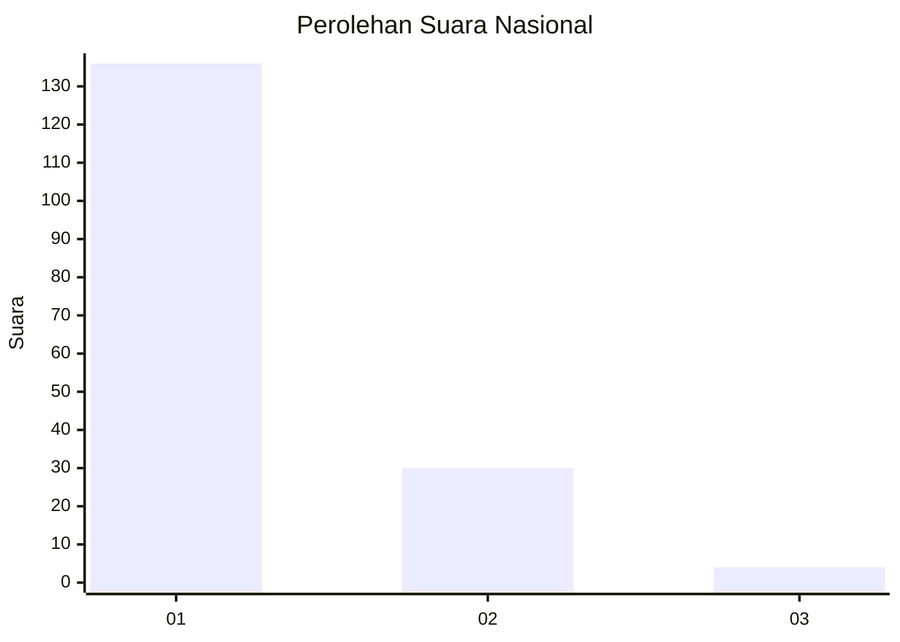
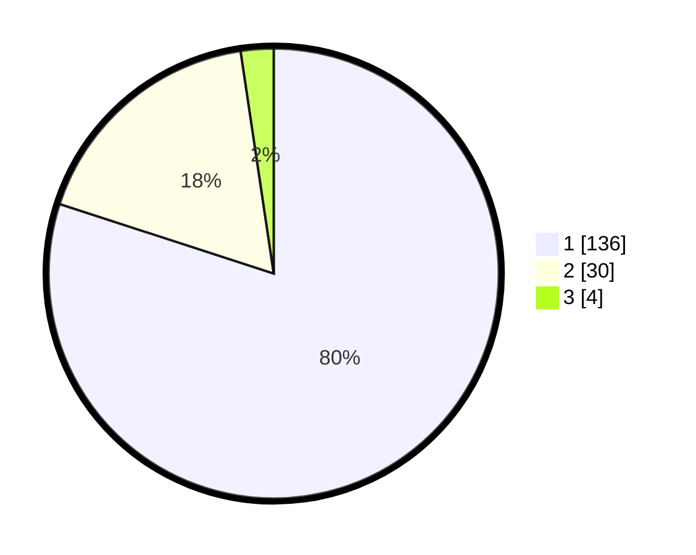

# Hasil

## Grafik

## Tabel

| No. | Nama Paslon    | Suara | Suara (raw) | Persentase |
|:--- |:-------------- | -----:| -----------:| ----------:|
| 1   | ANIES MUHAIMIN | 136   | [136][p-1]  | 80,00      |
| 2   | PRABOWO GIBRAN | 30    | [30][p-2]   | 17,65      |
| 3   | GANJAR MAHFUD  | 4     | [4][p-3]    | 2,35       |

[p-1]: https://github.com/gigit-pemilu/pemilu-2024/blob/main/pilpres/hitung-suara/sub/13-sumatera-barat/sub/01-pesisir-selatan/sub/06-bayang/sub/2005-koto-berapak/sub/001-tps/sub/paslon-1.txt
[p-2]: https://github.com/gigit-pemilu/pemilu-2024/blob/main/pilpres/hitung-suara/sub/13-sumatera-barat/sub/01-pesisir-selatan/sub/06-bayang/sub/2005-koto-berapak/sub/001-tps/sub/paslon-2.txt
[p-3]: https://github.com/gigit-pemilu/pemilu-2024/blob/main/pilpres/hitung-suara/sub/13-sumatera-barat/sub/01-pesisir-selatan/sub/06-bayang/sub/2005-koto-berapak/sub/001-tps/sub/paslon-3.txt

## Foto C Plano

https://sirekap-obj-formc.kpu.go.id/24fa/pemilu/ppwp/13/01/06/20/05/1301062005001-20240215-025633--e23a5325-096c-40f1-be7e-8fc5b37d0002.jpg

https://sirekap-obj-formc.kpu.go.id/24fa/pemilu/ppwp/13/01/06/20/05/1301062005001-20240215-030104--5e75d6a5-25c0-42d4-aa5a-d9610ba32221.jpg

https://sirekap-obj-formc.kpu.go.id/24fa/pemilu/ppwp/13/01/06/20/05/1301062005001-20240215-030409--7f8bc43c-658c-4e4d-9a5b-cff452070aa0.jpg

## Metadata

| Key        | Value               |
| ---------- | ------------------- |
| Time Stamp | 2024-02-24 22:31:28 |

