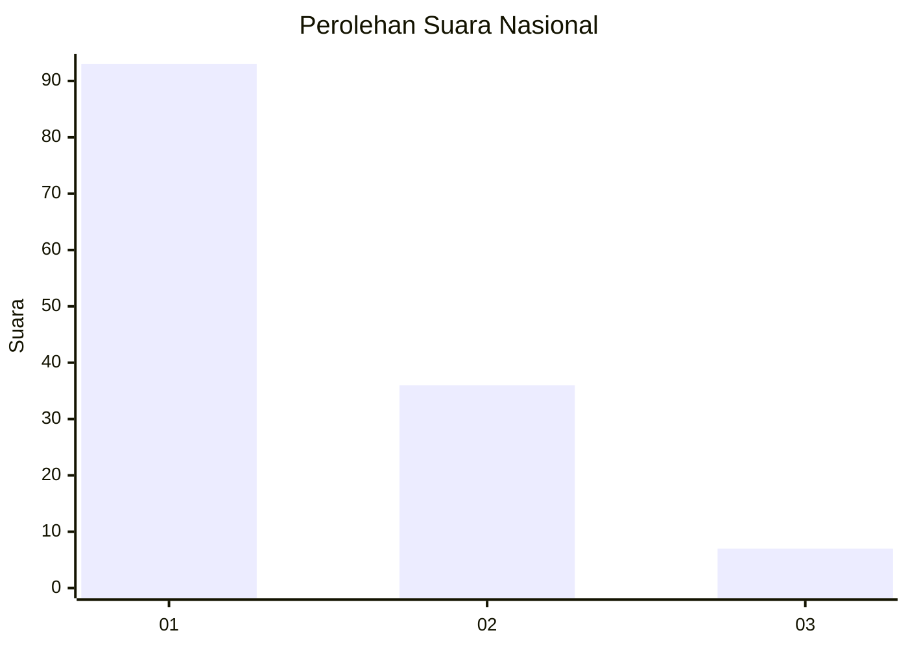
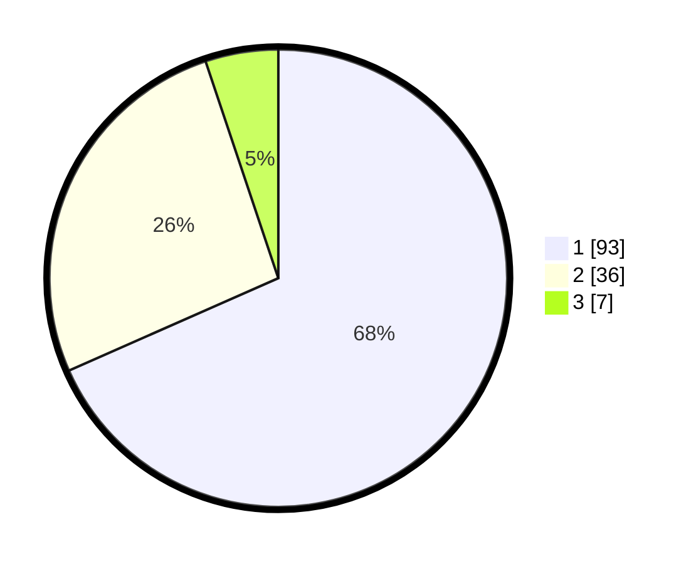

# Hasil

## Grafik

## Tabel

| No. | Nama Paslon    | Suara | Suara (raw) | Persentase |
|:--- |:-------------- | -----:| -----------:| ----------:|
| 1   | ANIES MUHAIMIN | 93    | [93][p-1]   | 68,38      |
| 2   | PRABOWO GIBRAN | 36    | [36][p-2]   | 26,47      |
| 3   | GANJAR MAHFUD  | 7     | [7][p-3]    | 5,15       |

[p-1]: https://github.com/gigit-pemilu/pemilu-2024/blob/main/pilpres/hitung-suara/sub/13-sumatera-barat/sub/02-solok/sub/09-ix-koto-sungai-lasi/sub/2001-taruang-taruang/sub/007-tps/sub/paslon-1.txt
[p-2]: https://github.com/gigit-pemilu/pemilu-2024/blob/main/pilpres/hitung-suara/sub/13-sumatera-barat/sub/02-solok/sub/09-ix-koto-sungai-lasi/sub/2001-taruang-taruang/sub/007-tps/sub/paslon-2.txt
[p-3]: https://github.com/gigit-pemilu/pemilu-2024/blob/main/pilpres/hitung-suara/sub/13-sumatera-barat/sub/02-solok/sub/09-ix-koto-sungai-lasi/sub/2001-taruang-taruang/sub/007-tps/sub/paslon-3.txt

## Foto C Plano

https://sirekap-obj-formc.kpu.go.id/d432/pemilu/ppwp/13/02/09/20/01/1302092001007-20240214-222718--3945c036-5460-4f4e-b6b7-46e1aaeba754.jpg

https://sirekap-obj-formc.kpu.go.id/d432/pemilu/ppwp/13/02/09/20/01/1302092001007-20240214-214533--6b29991e-28cb-46c6-bd61-ea892faa2f1b.jpg

https://sirekap-obj-formc.kpu.go.id/d432/pemilu/ppwp/13/02/09/20/01/1302092001007-20240214-214551--1d7a9763-eba5-42b2-9c2b-59ef11828b61.jpg

## Metadata

| Key        | Value               |
| ---------- | ------------------- |
| Time Stamp | 2024-02-15 23:29:50 |

