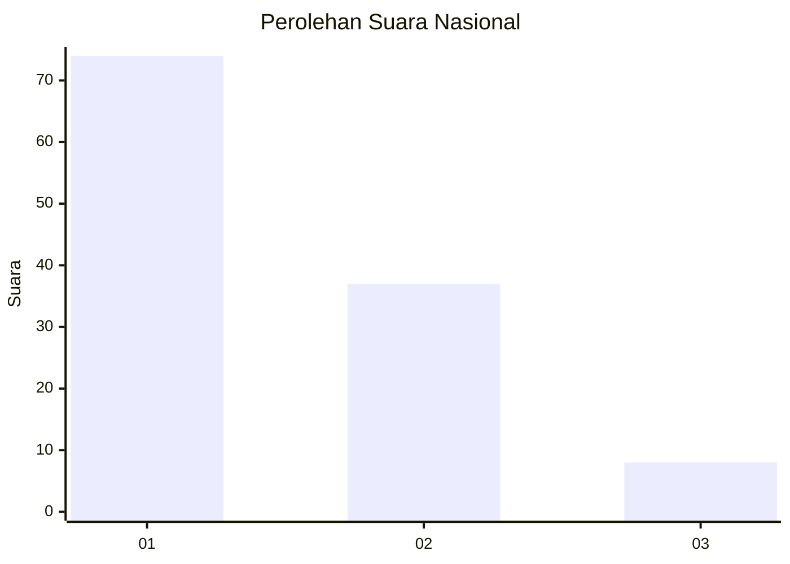
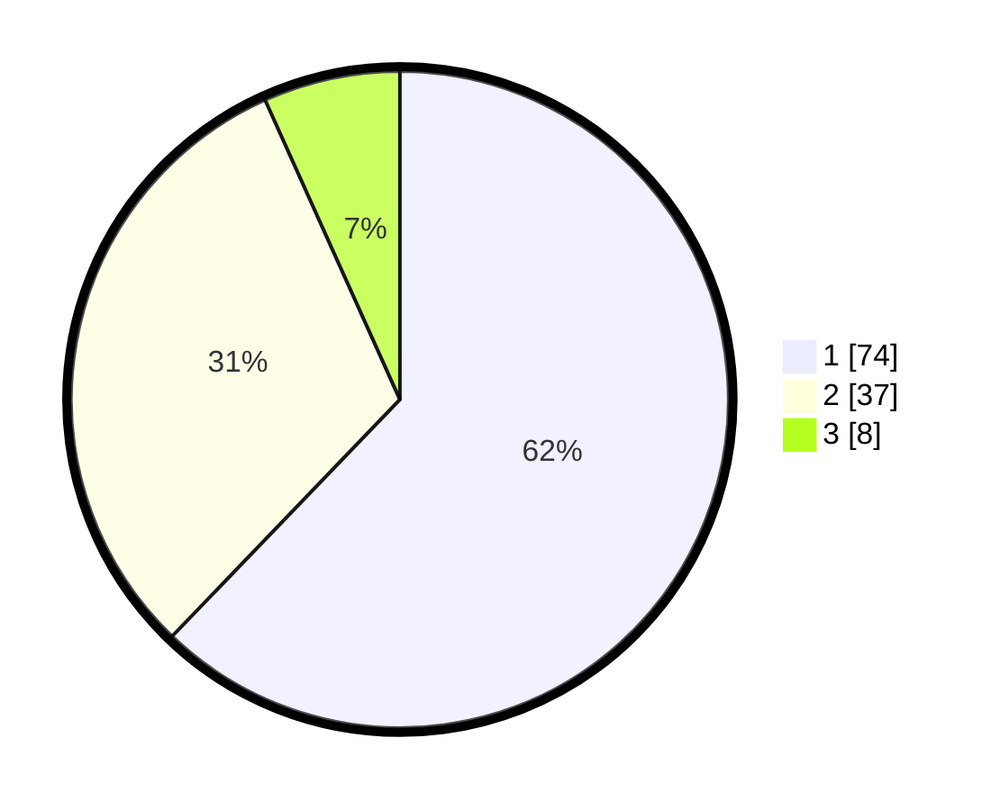

# Hasil

## Grafik

## Tabel

| No. | Nama Paslon    | Suara | Suara (raw) | Persentase |
|:--- |:-------------- | -----:| -----------:| ----------:|
| 1   | ANIES MUHAIMIN | 74    | [74][p-1]   | 62,18      |
| 2   | PRABOWO GIBRAN | 37    | [37][p-2]   | 31,09      |
| 3   | GANJAR MAHFUD  | 8     | [8][p-3]    | 6,72       |

[p-1]: https://github.com/gigit-pemilu/pemilu-2024/blob/main/pilpres/hitung-suara/sub/13-sumatera-barat/sub/02-solok/sub/10-kubung/sub/2002-selayo/sub/016-tps/sub/paslon-1.txt
[p-2]: https://github.com/gigit-pemilu/pemilu-2024/blob/main/pilpres/hitung-suara/sub/13-sumatera-barat/sub/02-solok/sub/10-kubung/sub/2002-selayo/sub/016-tps/sub/paslon-2.txt
[p-3]: https://github.com/gigit-pemilu/pemilu-2024/blob/main/pilpres/hitung-suara/sub/13-sumatera-barat/sub/02-solok/sub/10-kubung/sub/2002-selayo/sub/016-tps/sub/paslon-3.txt

## Foto C Plano

https://sirekap-obj-formc.kpu.go.id/dbcc/pemilu/ppwp/13/02/10/20/02/1302102002016-20240218-110120--97c583a4-26c4-44f9-9019-a56abfd9052e.jpg

https://sirekap-obj-formc.kpu.go.id/dbcc/pemilu/ppwp/13/02/10/20/02/1302102002016-20240218-110626--946e0435-cf51-43a1-bd5a-0af4fb20e9d8.jpg

https://sirekap-obj-formc.kpu.go.id/dbcc/pemilu/ppwp/13/02/10/20/02/1302102002016-20240215-121257--1f33c4b6-80f5-4e16-becc-b4f116c5a8a3.jpg

## Metadata

| Key        | Value               |
| ---------- | ------------------- |
| Time Stamp | 2024-02-25 17:00:00 |

