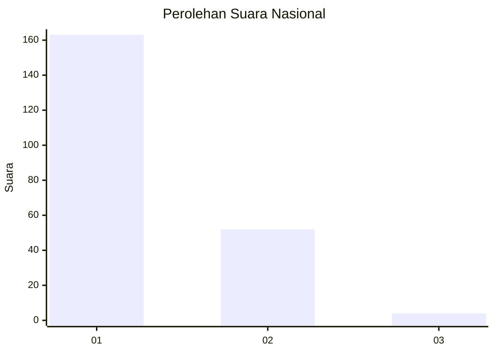
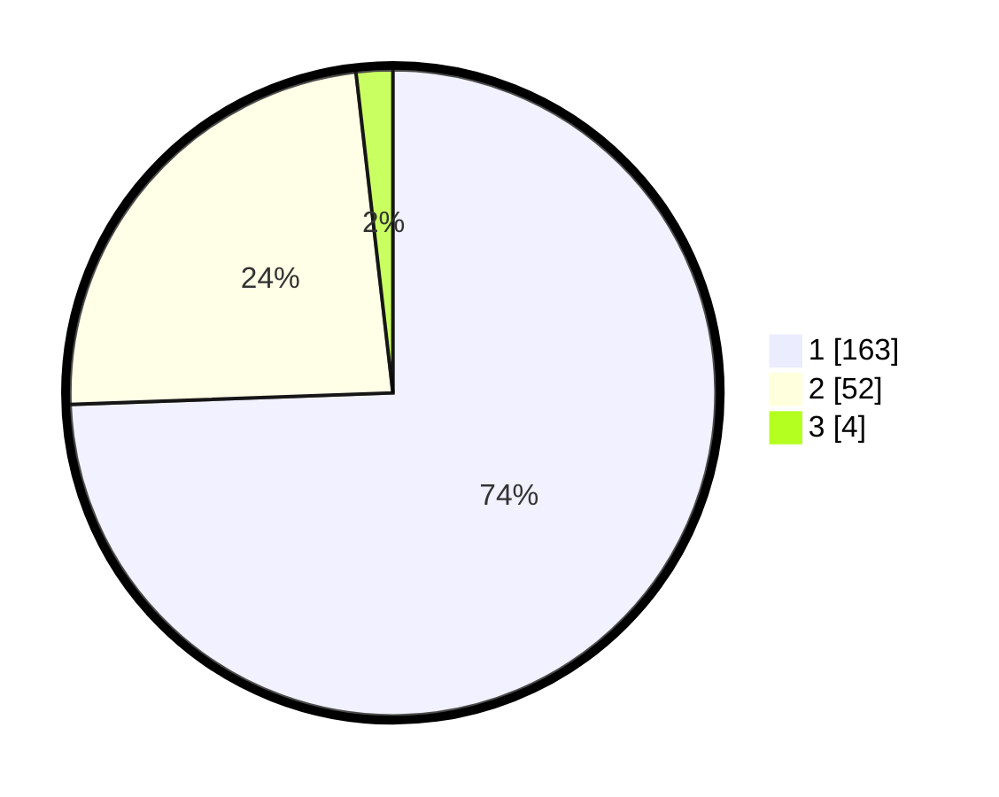

# Hasil

## Grafik

## Tabel

| No. | Nama Paslon    | Suara | Suara (raw) | Persentase |
|:--- |:-------------- | -----:| -----------:| ----------:|
| 1   | ANIES MUHAIMIN | 163   | [163][p-1]  | 74,43      |
| 2   | PRABOWO GIBRAN | 52    | [52][p-2]   | 23,74      |
| 3   | GANJAR MAHFUD  | 4     | [4][p-3]    | 1,83       |

[p-1]: https://github.com/gigit-pemilu/pemilu-2024/blob/main/pilpres/hitung-suara/sub/13-sumatera-barat/sub/02-solok/sub/10-kubung/sub/2002-selayo/sub/021-tps/sub/paslon-1.txt
[p-2]: https://github.com/gigit-pemilu/pemilu-2024/blob/main/pilpres/hitung-suara/sub/13-sumatera-barat/sub/02-solok/sub/10-kubung/sub/2002-selayo/sub/021-tps/sub/paslon-2.txt
[p-3]: https://github.com/gigit-pemilu/pemilu-2024/blob/main/pilpres/hitung-suara/sub/13-sumatera-barat/sub/02-solok/sub/10-kubung/sub/2002-selayo/sub/021-tps/sub/paslon-3.txt

## Foto C Plano

https://sirekap-obj-formc.kpu.go.id/8b17/pemilu/ppwp/13/02/10/20/02/1302102002021-20240225-212408--c7182b3a-97b6-44e8-9b20-65a3a142bc6a.jpg

https://sirekap-obj-formc.kpu.go.id/8b17/pemilu/ppwp/13/02/10/20/02/1302102002021-20240225-212847--a3fc2259-1c90-4367-a4af-b65c40e70fcf.jpg

https://sirekap-obj-formc.kpu.go.id/8b17/pemilu/ppwp/13/02/10/20/02/1302102002021-20240225-213046--fdf0c6aa-82be-4951-aaee-df7e1a51d37c.jpg

## Metadata

| Key        | Value               |
| ---------- | ------------------- |
| Time Stamp | 2024-02-26 18:00:00 |

## DATA PEMILIH TETAP

Jumlah pemilih dalam DPT: **0**.
 * L: **0**.
 * P: **0**.

## DATA PENGGUNA HAK PILIH

Jumlah pengguna hak pilih dalam DPT: **1**.
 * L: **0**.
 * P: **0**.

Jumlah pengguna hak pilih dalam DPTb: **7**.
 * L: **200**.
 * P: **0**.

Jumlah pengguna hak pilih dalam DPK: **505**.
 * L: **503**.
 * P: **0**.

Jumlah pengguna hak pilih: **0**.
 * L: **0**.
 * P: **200**.

## JUMLAH SUARA SAH DAN TIDAK SAH

JUMLAH SELURUH SUARA SAH: **219**.

JUMLAH SUARA TIDAK SAH: **0**.

JUMLAH SELURUH SUARA SAH DAN SUARA TIDAK SAH: **219**.

