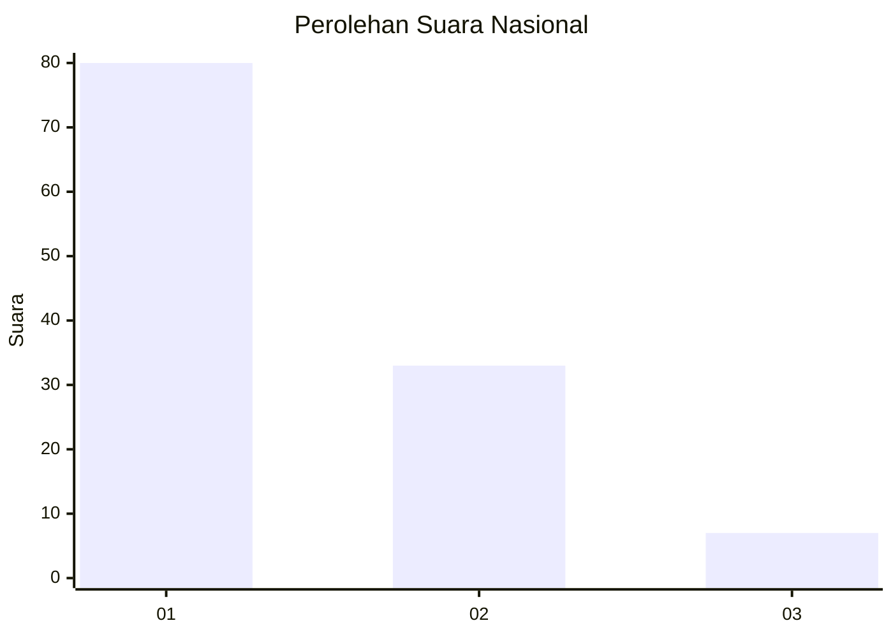
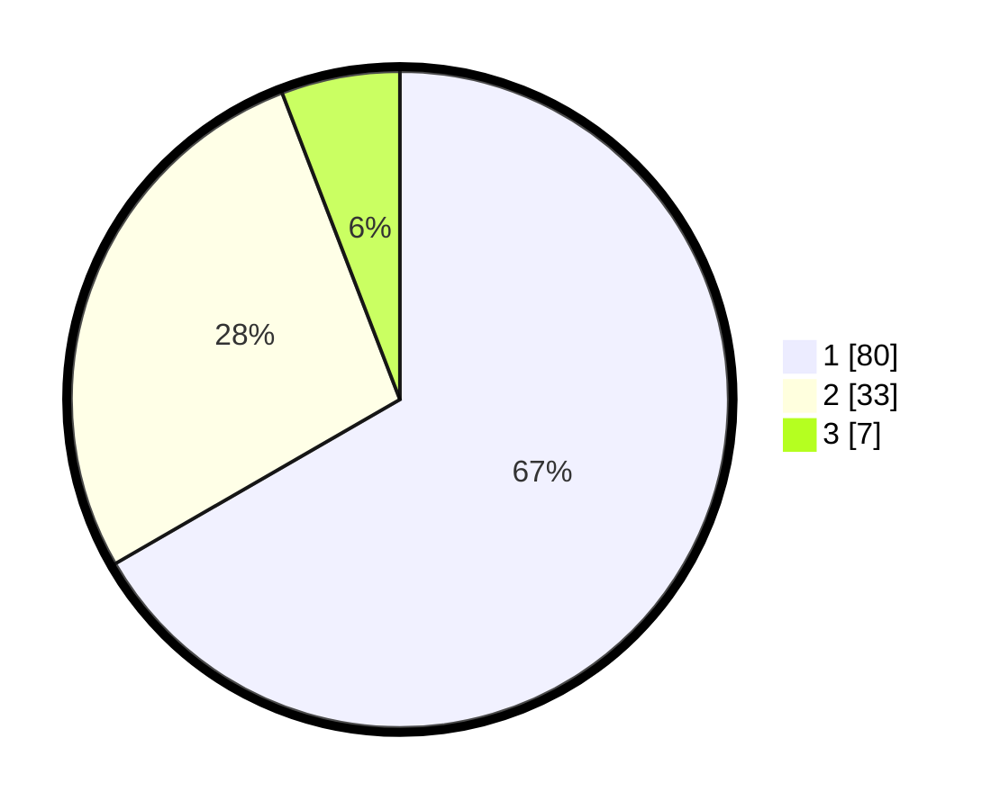

# Hasil

## Grafik

## Tabel

| No. | Nama Paslon    | Suara | Suara (raw) | Persentase |
|:--- |:-------------- | -----:| -----------:| ----------:|
| 1   | ANIES MUHAIMIN | 80    | [80][p-1]   | 66,67      |
| 2   | PRABOWO GIBRAN | 33    | [33][p-2]   | 27,50      |
| 3   | GANJAR MAHFUD  | 7     | [7][p-3]    | 5,83       |

[p-1]: https://github.com/gigit-pemilu/pemilu-2024/blob/main/pilpres/hitung-suara/sub/13-sumatera-barat/sub/02-solok/sub/10-kubung/sub/2002-selayo/sub/048-tps/sub/paslon-1.txt
[p-2]: https://github.com/gigit-pemilu/pemilu-2024/blob/main/pilpres/hitung-suara/sub/13-sumatera-barat/sub/02-solok/sub/10-kubung/sub/2002-selayo/sub/048-tps/sub/paslon-2.txt
[p-3]: https://github.com/gigit-pemilu/pemilu-2024/blob/main/pilpres/hitung-suara/sub/13-sumatera-barat/sub/02-solok/sub/10-kubung/sub/2002-selayo/sub/048-tps/sub/paslon-3.txt

## Foto C Plano

https://sirekap-obj-formc.kpu.go.id/8538/pemilu/ppwp/13/02/10/20/02/1302102002048-20240222-221937--e9033bf4-92e7-4876-ba61-391dfbd03cbf.jpg

https://sirekap-obj-formc.kpu.go.id/8538/pemilu/ppwp/13/02/10/20/02/1302102002048-20240222-222356--396c9ae9-74db-4482-be49-a8eeb635c683.jpg

https://sirekap-obj-formc.kpu.go.id/8538/pemilu/ppwp/13/02/10/20/02/1302102002048-20240222-222457--1ef30f6f-f989-4f41-84d9-afb5f3015c76.jpg

## Metadata

| Key        | Value               |
| ---------- | ------------------- |
| Time Stamp | 2024-02-25 21:00:00 |

