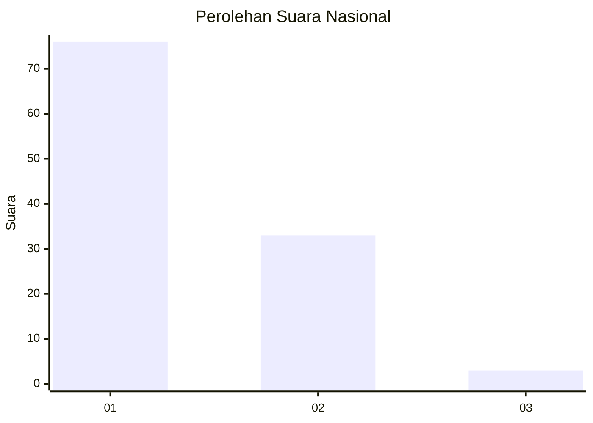
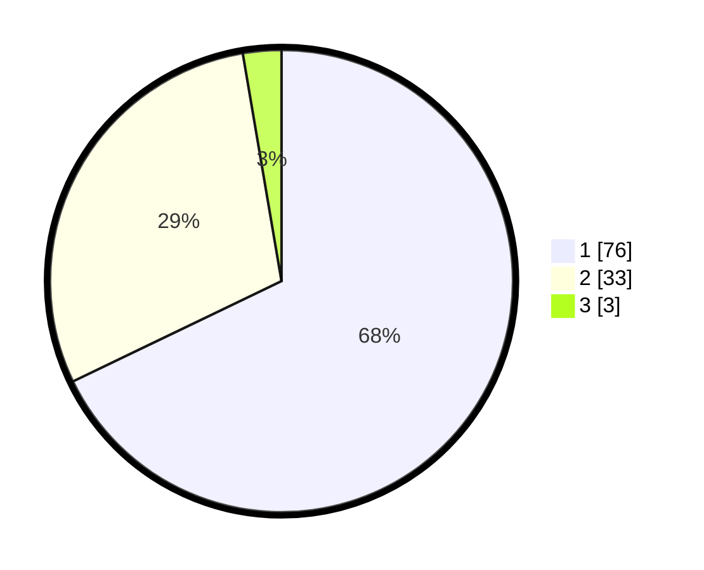

# Hasil

## Grafik

## Tabel

| No. | Nama Paslon    | Suara | Suara (raw) | Persentase |
|:--- |:-------------- | -----:| -----------:| ----------:|
| 1   | ANIES MUHAIMIN | 76    | [76][p-1]   | 67,86      |
| 2   | PRABOWO GIBRAN | 33    | [33][p-2]   | 29,46      |
| 3   | GANJAR MAHFUD  | 3     | [3][p-3]    | 2,68       |

[p-1]: https://github.com/gigit-pemilu/pemilu-2024/blob/main/pilpres/hitung-suara/sub/13-sumatera-barat/sub/02-solok/sub/10-kubung/sub/2003-panyakalan/sub/003-tps/sub/paslon-1.txt
[p-2]: https://github.com/gigit-pemilu/pemilu-2024/blob/main/pilpres/hitung-suara/sub/13-sumatera-barat/sub/02-solok/sub/10-kubung/sub/2003-panyakalan/sub/003-tps/sub/paslon-2.txt
[p-3]: https://github.com/gigit-pemilu/pemilu-2024/blob/main/pilpres/hitung-suara/sub/13-sumatera-barat/sub/02-solok/sub/10-kubung/sub/2003-panyakalan/sub/003-tps/sub/paslon-3.txt

## Foto C Plano

https://sirekap-obj-formc.kpu.go.id/7602/pemilu/ppwp/13/02/10/20/03/1302102003003-20240214-214330--a8402e68-effd-4de4-b58b-4c52392d322a.jpg

https://sirekap-obj-formc.kpu.go.id/7602/pemilu/ppwp/13/02/10/20/03/1302102003003-20240214-221827--a73b41e7-2fbe-4524-a781-e1f505c5aaa2.jpg

https://sirekap-obj-formc.kpu.go.id/7602/pemilu/ppwp/13/02/10/20/03/1302102003003-20240214-221935--cb69d1af-f1f2-4485-b517-4b8d9ec5438b.jpg

## Metadata

| Key        | Value               |
| ---------- | ------------------- |
| Time Stamp | 2024-02-16 02:30:27 |

