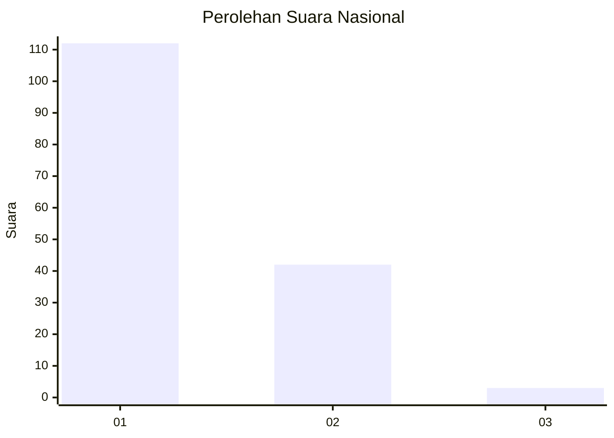
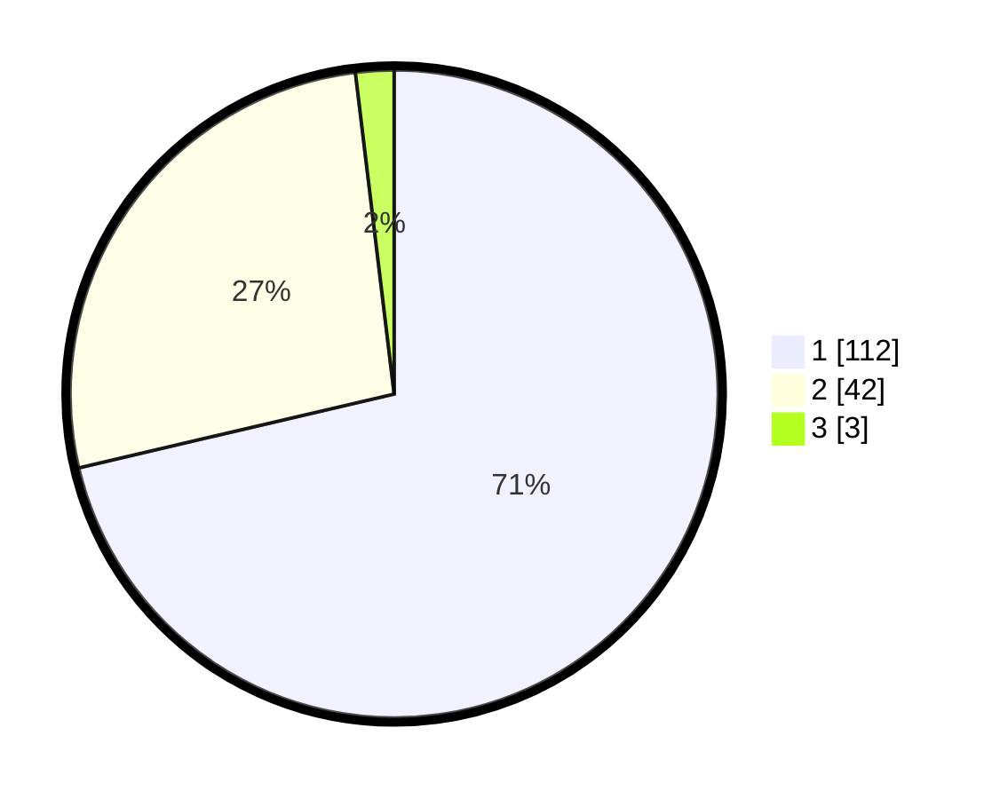

# Hasil

## Grafik

## Tabel

| No. | Nama Paslon    | Suara | Suara (raw) | Persentase |
|:--- |:-------------- | -----:| -----------:| ----------:|
| 1   | ANIES MUHAIMIN | 112   | [112][p-1]  | 71,34      |
| 2   | PRABOWO GIBRAN | 42    | [42][p-2]   | 26,75      |
| 3   | GANJAR MAHFUD  | 3     | [3][p-3]    | 1,91       |

[p-1]: https://github.com/gigit-pemilu/pemilu-2024/blob/main/pilpres/hitung-suara/sub/13-sumatera-barat/sub/02-solok/sub/10-kubung/sub/2003-panyakalan/sub/011-tps/sub/paslon-1.txt
[p-2]: https://github.com/gigit-pemilu/pemilu-2024/blob/main/pilpres/hitung-suara/sub/13-sumatera-barat/sub/02-solok/sub/10-kubung/sub/2003-panyakalan/sub/011-tps/sub/paslon-2.txt
[p-3]: https://github.com/gigit-pemilu/pemilu-2024/blob/main/pilpres/hitung-suara/sub/13-sumatera-barat/sub/02-solok/sub/10-kubung/sub/2003-panyakalan/sub/011-tps/sub/paslon-3.txt

## Foto C Plano

https://sirekap-obj-formc.kpu.go.id/0076/pemilu/ppwp/13/02/10/20/03/1302102003011-20240214-190955--acaf1ca3-3faa-491f-9b34-d08655e809e5.jpg

https://sirekap-obj-formc.kpu.go.id/0076/pemilu/ppwp/13/02/10/20/03/1302102003011-20240214-191226--3941bb30-6d4d-44ab-a4b5-ecf1aa6b608d.jpg

https://sirekap-obj-formc.kpu.go.id/0076/pemilu/ppwp/13/02/10/20/03/1302102003011-20240214-191340--5befd68a-50a2-4f11-801b-1644237dec91.jpg

## Metadata

| Key        | Value               |
| ---------- | ------------------- |
| Time Stamp | 2024-02-16 02:30:27 |

