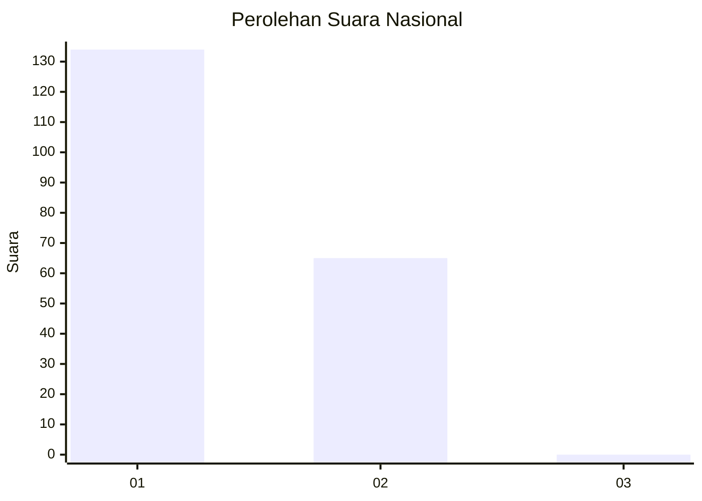
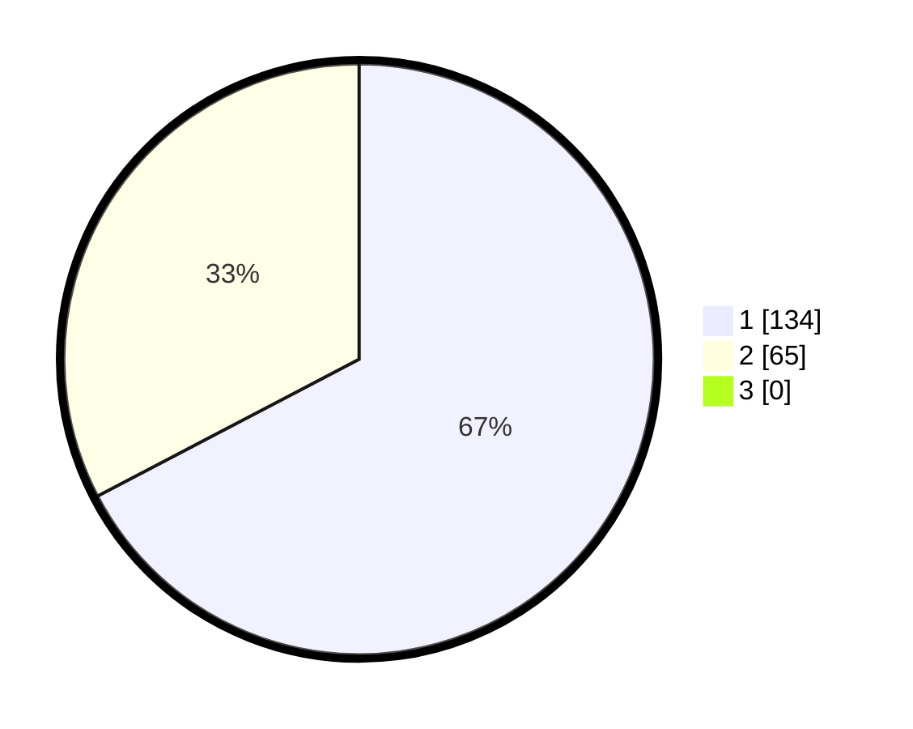

# Hasil

## Grafik

## Tabel

| No. | Nama Paslon    | Suara | Suara (raw) | Persentase |
|:--- |:-------------- | -----:| -----------:| ----------:|
| 1   | ANIES MUHAIMIN | 134   | [134][p-1]  | 67,34      |
| 2   | PRABOWO GIBRAN | 65    | [65][p-2]   | 32,66      |
| 3   | GANJAR MAHFUD  | 0     | [0][p-3]    | 0,00       |

[p-1]: https://github.com/gigit-pemilu/pemilu-2024/blob/main/pilpres/hitung-suara/sub/13-sumatera-barat/sub/02-solok/sub/10-kubung/sub/2005-gantuang-ciri/sub/001-tps/sub/paslon-1.txt
[p-2]: https://github.com/gigit-pemilu/pemilu-2024/blob/main/pilpres/hitung-suara/sub/13-sumatera-barat/sub/02-solok/sub/10-kubung/sub/2005-gantuang-ciri/sub/001-tps/sub/paslon-2.txt
[p-3]: https://github.com/gigit-pemilu/pemilu-2024/blob/main/pilpres/hitung-suara/sub/13-sumatera-barat/sub/02-solok/sub/10-kubung/sub/2005-gantuang-ciri/sub/001-tps/sub/paslon-3.txt

## Foto C Plano

https://sirekap-obj-formc.kpu.go.id/35d4/pemilu/ppwp/13/02/10/20/05/1302102005001-20240217-122708--5666ef88-8f35-493c-b352-a5155976746b.jpg

https://sirekap-obj-formc.kpu.go.id/35d4/pemilu/ppwp/13/02/10/20/05/1302102005001-20240215-043750--e0db6079-1a73-479e-920e-2592df9c6041.jpg

https://sirekap-obj-formc.kpu.go.id/35d4/pemilu/ppwp/13/02/10/20/05/1302102005001-20240215-043931--d758a560-c896-4f7b-afe3-f539700fe12f.jpg

## Metadata

| Key        | Value               |
| ---------- | ------------------- |
| Time Stamp | 2024-02-17 13:37:34 |

