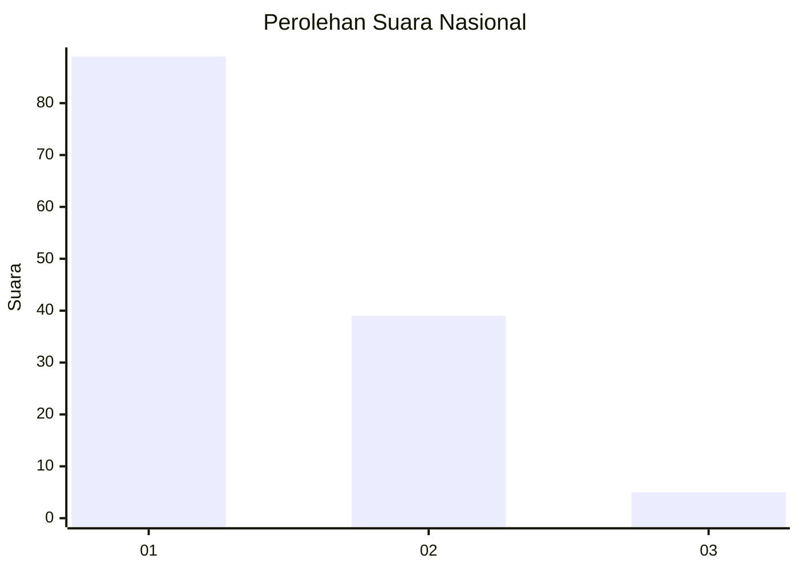
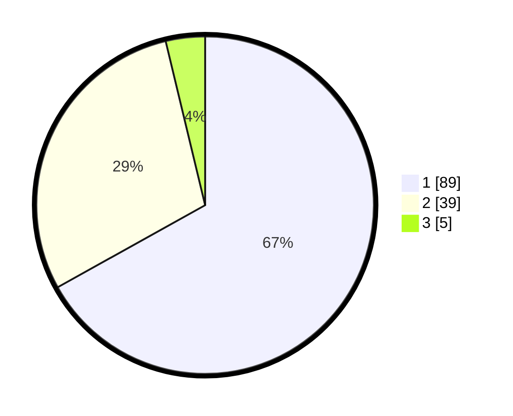

# Hasil

## Grafik

## Tabel

| No. | Nama Paslon    | Suara | Suara (raw) | Persentase |
|:--- |:-------------- | -----:| -----------:| ----------:|
| 1   | ANIES MUHAIMIN | 89    | [89][p-1]   | 66,92      |
| 2   | PRABOWO GIBRAN | 39    | [39][p-2]   | 29,32      |
| 3   | GANJAR MAHFUD  | 5     | [5][p-3]    | 3,76       |

[p-1]: https://github.com/gigit-pemilu/pemilu-2024/blob/main/pilpres/hitung-suara/sub/13-sumatera-barat/sub/02-solok/sub/10-kubung/sub/2005-gantuang-ciri/sub/011-tps/sub/paslon-1.txt
[p-2]: https://github.com/gigit-pemilu/pemilu-2024/blob/main/pilpres/hitung-suara/sub/13-sumatera-barat/sub/02-solok/sub/10-kubung/sub/2005-gantuang-ciri/sub/011-tps/sub/paslon-2.txt
[p-3]: https://github.com/gigit-pemilu/pemilu-2024/blob/main/pilpres/hitung-suara/sub/13-sumatera-barat/sub/02-solok/sub/10-kubung/sub/2005-gantuang-ciri/sub/011-tps/sub/paslon-3.txt

## Foto C Plano

https://sirekap-obj-formc.kpu.go.id/28ab/pemilu/ppwp/13/02/10/20/05/1302102005011-20240214-211825--602e6d01-6a09-463d-9ecd-5ce635ed5f4b.jpg

https://sirekap-obj-formc.kpu.go.id/28ab/pemilu/ppwp/13/02/10/20/05/1302102005011-20240215-034455--89c005b7-9aa5-4d04-84de-8d7c50eb8c0c.jpg

https://sirekap-obj-formc.kpu.go.id/28ab/pemilu/ppwp/13/02/10/20/05/1302102005011-20240214-204356--97e090ed-d3e6-4fe7-9014-6502c3f892f1.jpg

## Metadata

| Key        | Value               |
| ---------- | ------------------- |
| Time Stamp | 2024-02-16 16:25:10 |

