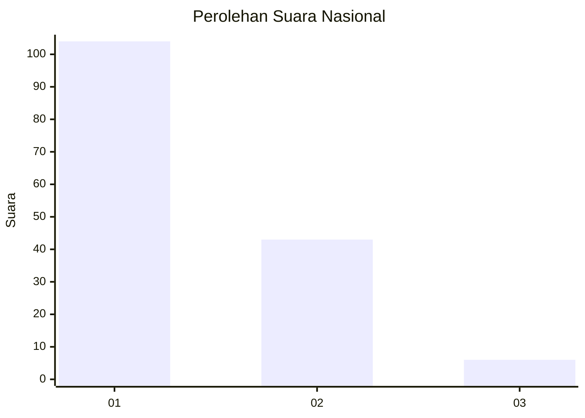
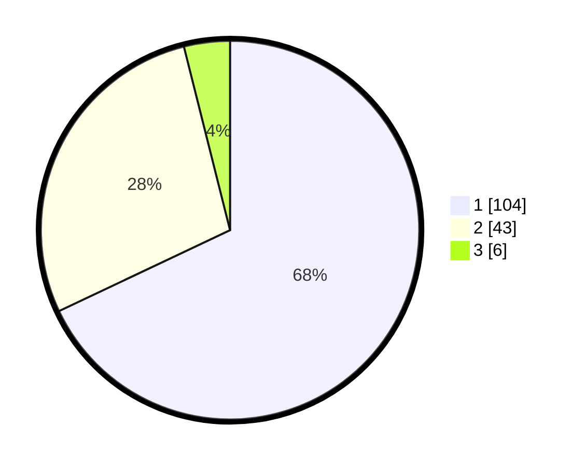

# Hasil

## Grafik

## Tabel

| No. | Nama Paslon    | Suara | Suara (raw) | Persentase |
|:--- |:-------------- | -----:| -----------:| ----------:|
| 1   | ANIES MUHAIMIN | 104   | [104][p-1]  | 67,97      |
| 2   | PRABOWO GIBRAN | 43    | [43][p-2]   | 28,10      |
| 3   | GANJAR MAHFUD  | 6     | [6][p-3]    | 3,92       |

[p-1]: https://github.com/gigit-pemilu/pemilu-2024/blob/main/pilpres/hitung-suara/sub/13-sumatera-barat/sub/02-solok/sub/10-kubung/sub/2005-gantuang-ciri/sub/015-tps/sub/paslon-1.txt
[p-2]: https://github.com/gigit-pemilu/pemilu-2024/blob/main/pilpres/hitung-suara/sub/13-sumatera-barat/sub/02-solok/sub/10-kubung/sub/2005-gantuang-ciri/sub/015-tps/sub/paslon-2.txt
[p-3]: https://github.com/gigit-pemilu/pemilu-2024/blob/main/pilpres/hitung-suara/sub/13-sumatera-barat/sub/02-solok/sub/10-kubung/sub/2005-gantuang-ciri/sub/015-tps/sub/paslon-3.txt

## Foto C Plano

https://sirekap-obj-formc.kpu.go.id/764e/pemilu/ppwp/13/02/10/20/05/1302102005015-20240215-035319--be971a8d-355c-4f69-8527-a8ba8a801d11.jpg

https://sirekap-obj-formc.kpu.go.id/764e/pemilu/ppwp/13/02/10/20/05/1302102005015-20240215-040302--27ea52cd-2916-4210-8814-b76620339118.jpg

https://sirekap-obj-formc.kpu.go.id/764e/pemilu/ppwp/13/02/10/20/05/1302102005015-20240215-035801--ac92c66d-6f85-4b69-9b9b-ebd1e6455fb7.jpg

## Metadata

| Key        | Value               |
| ---------- | ------------------- |
| Time Stamp | 2024-02-16 02:30:27 |

