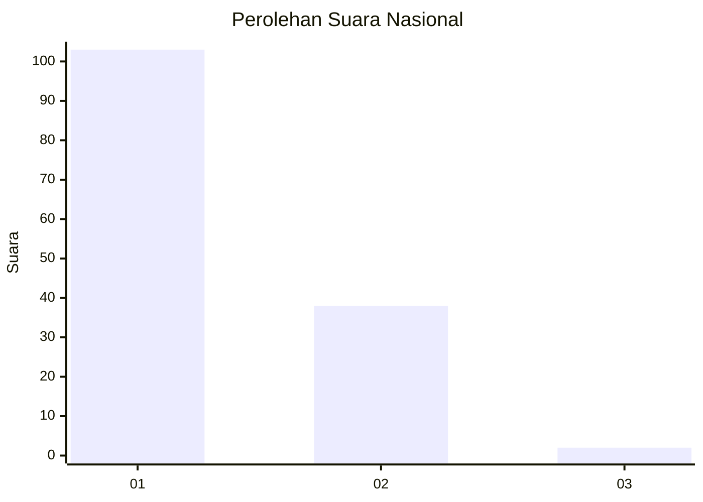
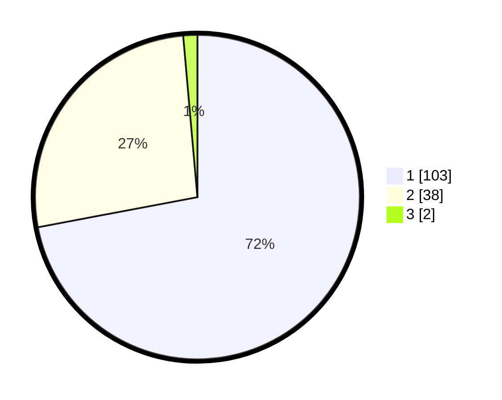

# Hasil

## Grafik

## Tabel

| No. | Nama Paslon    | Suara | Suara (raw) | Persentase |
|:--- |:-------------- | -----:| -----------:| ----------:|
| 1   | ANIES MUHAIMIN | 103   | [103][p-1]  | 72,03      |
| 2   | PRABOWO GIBRAN | 38    | [38][p-2]   | 26,57      |
| 3   | GANJAR MAHFUD  | 2     | [2][p-3]    | 1,40       |

[p-1]: https://github.com/gigit-pemilu/pemilu-2024/blob/main/pilpres/hitung-suara/sub/13-sumatera-barat/sub/02-solok/sub/10-kubung/sub/2006-saok-laweh/sub/019-tps/sub/paslon-1.txt
[p-2]: https://github.com/gigit-pemilu/pemilu-2024/blob/main/pilpres/hitung-suara/sub/13-sumatera-barat/sub/02-solok/sub/10-kubung/sub/2006-saok-laweh/sub/019-tps/sub/paslon-2.txt
[p-3]: https://github.com/gigit-pemilu/pemilu-2024/blob/main/pilpres/hitung-suara/sub/13-sumatera-barat/sub/02-solok/sub/10-kubung/sub/2006-saok-laweh/sub/019-tps/sub/paslon-3.txt

## Foto C Plano

https://sirekap-obj-formc.kpu.go.id/055a/pemilu/ppwp/13/02/10/20/06/1302102006019-20240215-090825--3f631518-ab19-4cca-a64b-b1c754c96f30.jpg

https://sirekap-obj-formc.kpu.go.id/055a/pemilu/ppwp/13/02/10/20/06/1302102006019-20240215-002159--582ffaa5-287c-4d13-84ae-c45cef62f2fd.jpg

https://sirekap-obj-formc.kpu.go.id/055a/pemilu/ppwp/13/02/10/20/06/1302102006019-20240215-002335--d77ab1c1-4b69-4aa4-a833-19b10e0b2197.jpg

## Metadata

| Key        | Value               |
| ---------- | ------------------- |
| Time Stamp | 2024-02-16 02:30:27 |

