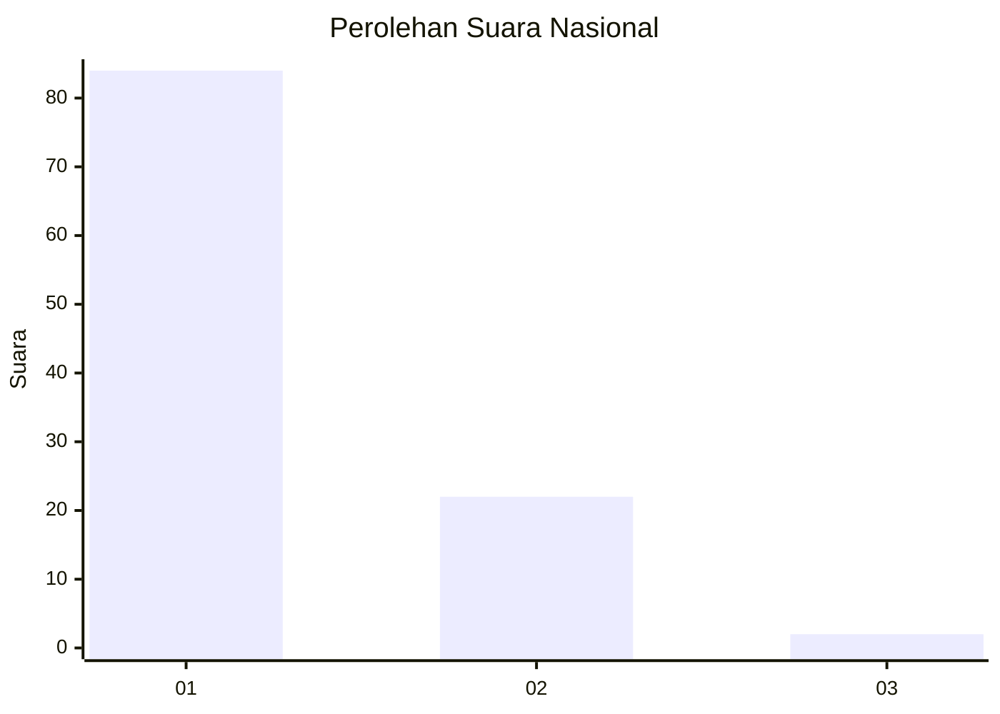
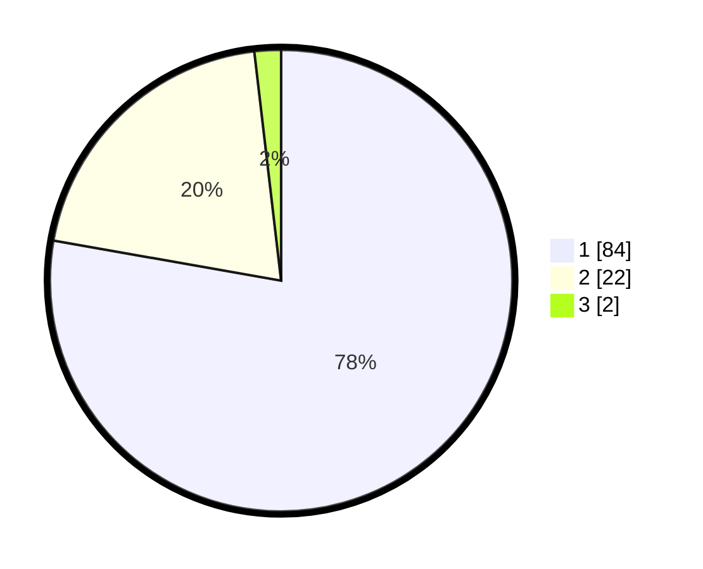

# Hasil

## Grafik

## Tabel

| No. | Nama Paslon    | Suara | Suara (raw) | Persentase |
|:--- |:-------------- | -----:| -----------:| ----------:|
| 1   | ANIES MUHAIMIN | 84    | [84][p-1]   | 77,78      |
| 2   | PRABOWO GIBRAN | 22    | [22][p-2]   | 20,37      |
| 3   | GANJAR MAHFUD  | 2     | [2][p-3]    | 1,85       |

[p-1]: https://github.com/gigit-pemilu/pemilu-2024/blob/main/pilpres/hitung-suara/sub/13-sumatera-barat/sub/02-solok/sub/11-x-koto-singkarak/sub/2001-sumani/sub/001-tps/sub/paslon-1.txt
[p-2]: https://github.com/gigit-pemilu/pemilu-2024/blob/main/pilpres/hitung-suara/sub/13-sumatera-barat/sub/02-solok/sub/11-x-koto-singkarak/sub/2001-sumani/sub/001-tps/sub/paslon-2.txt
[p-3]: https://github.com/gigit-pemilu/pemilu-2024/blob/main/pilpres/hitung-suara/sub/13-sumatera-barat/sub/02-solok/sub/11-x-koto-singkarak/sub/2001-sumani/sub/001-tps/sub/paslon-3.txt

## Foto C Plano

https://sirekap-obj-formc.kpu.go.id/e329/pemilu/ppwp/13/02/11/20/01/1302112001001-20240214-224713--27a67c5b-c40a-493f-8115-bd86dec4358d.jpg

https://sirekap-obj-formc.kpu.go.id/e329/pemilu/ppwp/13/02/11/20/01/1302112001001-20240214-224156--6f749912-5414-4777-96fa-fb18fd4d0cf2.jpg

https://sirekap-obj-formc.kpu.go.id/e329/pemilu/ppwp/13/02/11/20/01/1302112001001-20240214-224341--57e0fcca-f8f9-41e8-9ed4-9787c244e408.jpg

## Metadata

| Key        | Value               |
| ---------- | ------------------- |
| Time Stamp | 2024-02-15 23:29:50 |

