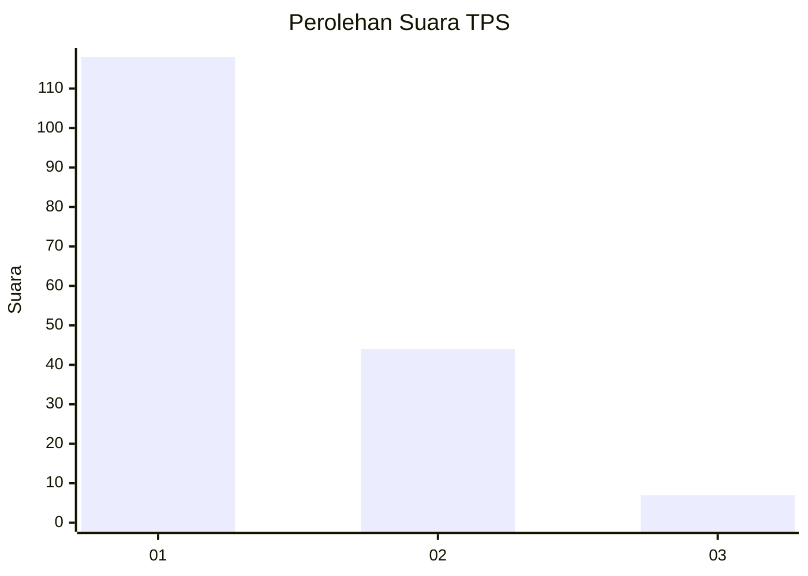
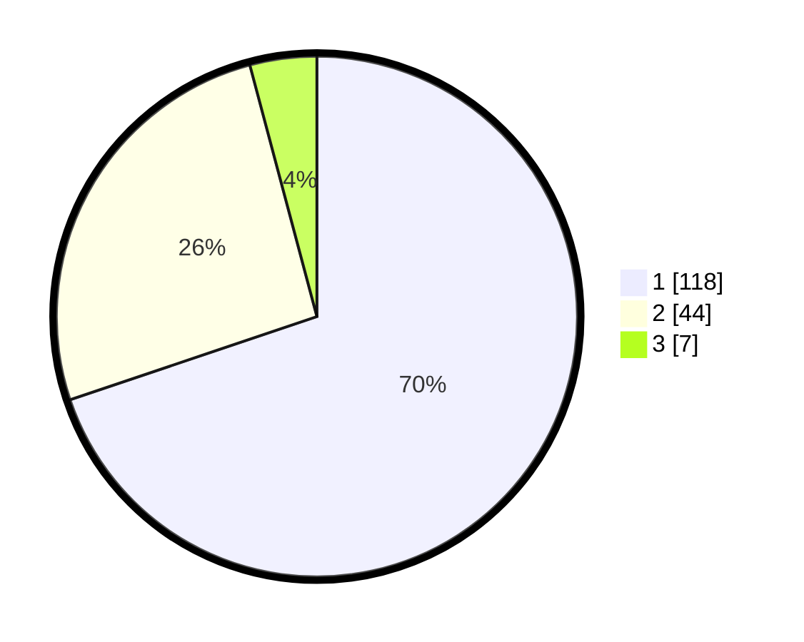

# Hasil

## Grafik

## Tabel

| No. | Nama Paslon    | Suara | Suara (raw) | Persentase |
|:--- |:-------------- | -----:| -----------:| ----------:|
| 1   | ANIES MUHAIMIN | 118   | [118][p-1]  | 69,82      |
| 2   | PRABOWO GIBRAN | 44    | [44][p-2]   | 26,04      |
| 3   | GANJAR MAHFUD  | 7     | [7][p-3]    | 4,14       |

[p-1]: https://github.com/gigit-pemilu/pemilu-2024-13-sumatera-barat/blob/main/pilpres/hitung-suara/sub/13-sumatera-barat/sub/02-solok/sub/11-x-koto-singkarak/sub/2001-sumani/sub/009-tps/sub/paslon-1.txt
[p-2]: https://github.com/gigit-pemilu/pemilu-2024-13-sumatera-barat/blob/main/pilpres/hitung-suara/sub/13-sumatera-barat/sub/02-solok/sub/11-x-koto-singkarak/sub/2001-sumani/sub/009-tps/sub/paslon-2.txt
[p-3]: https://github.com/gigit-pemilu/pemilu-2024-13-sumatera-barat/blob/main/pilpres/hitung-suara/sub/13-sumatera-barat/sub/02-solok/sub/11-x-koto-singkarak/sub/2001-sumani/sub/009-tps/sub/paslon-3.txt

## Foto C Plano

https://sirekap-obj-formc.kpu.go.id/bfee/pemilu/ppwp/13/02/11/20/01/1302112001009-20240215-033116--bb8415d9-030c-4f53-a767-f741af5731a7.jpg

https://sirekap-obj-formc.kpu.go.id/bfee/pemilu/ppwp/13/02/11/20/01/1302112001009-20240215-033302--a5ea775d-381d-4cea-a895-5b2b3e5e01c3.jpg

https://sirekap-obj-formc.kpu.go.id/bfee/pemilu/ppwp/13/02/11/20/01/1302112001009-20240215-033444--5f9363af-cb23-46d9-81aa-6fa6f2dd8597.jpg

## Metadata

| Key        | Value               |
| ---------- | ------------------- |
| Time Stamp | 2024-02-16 22:01:00 |

