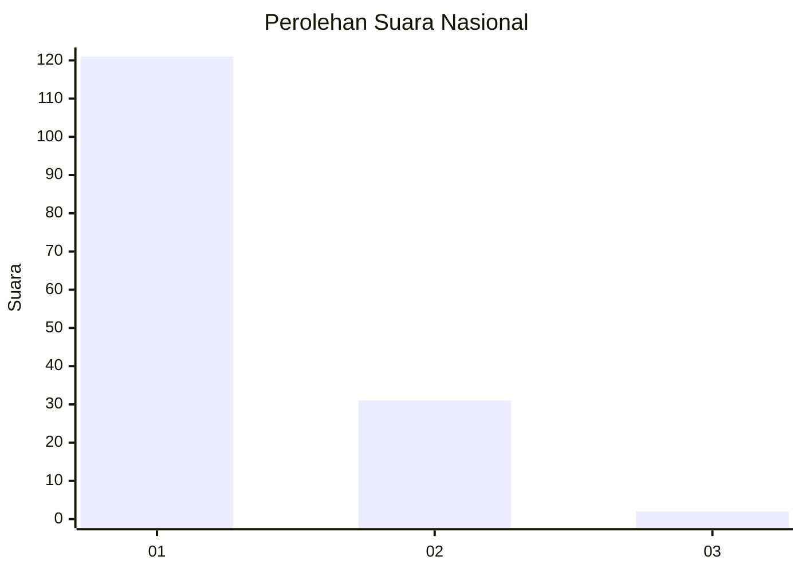
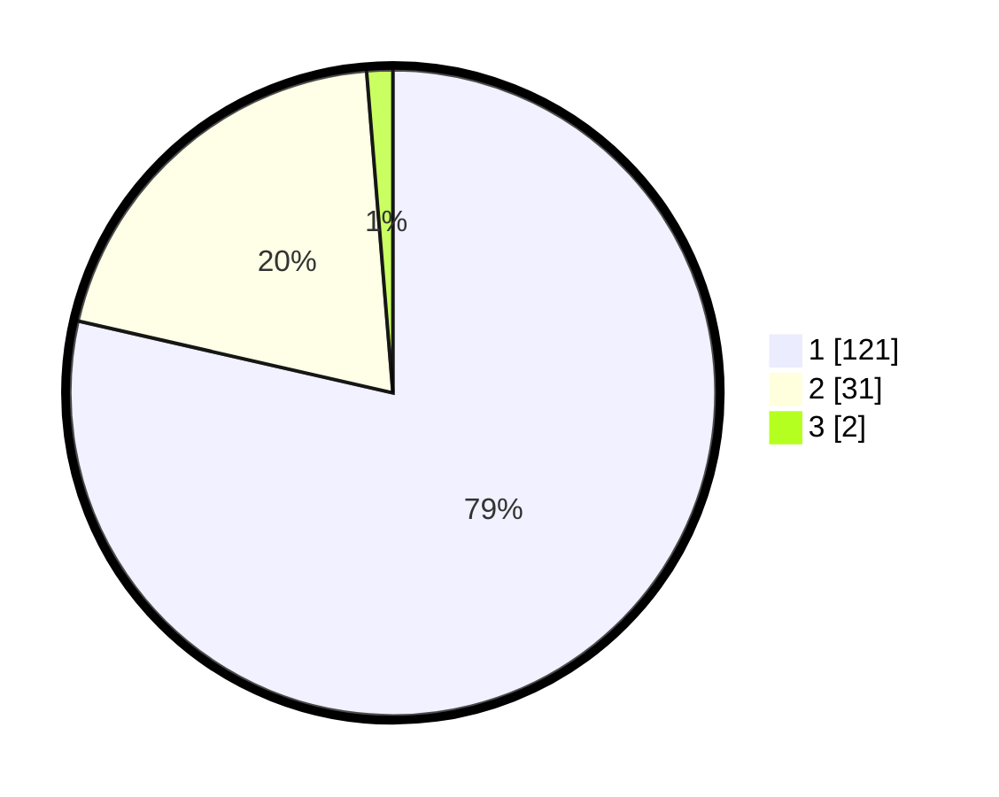

# Hasil

## Grafik

## Tabel

| No. | Nama Paslon    | Suara | Suara (raw) | Persentase |
|:--- |:-------------- | -----:| -----------:| ----------:|
| 1   | ANIES MUHAIMIN | 121   | [121][p-1]  | 78,57      |
| 2   | PRABOWO GIBRAN | 31    | [31][p-2]   | 20,13      |
| 3   | GANJAR MAHFUD  | 2     | [2][p-3]    | 1,30       |

[p-1]: https://github.com/gigit-pemilu/pemilu-2024/blob/main/pilpres/hitung-suara/sub/13-sumatera-barat/sub/02-solok/sub/11-x-koto-singkarak/sub/2001-sumani/sub/020-tps/sub/paslon-1.txt
[p-2]: https://github.com/gigit-pemilu/pemilu-2024/blob/main/pilpres/hitung-suara/sub/13-sumatera-barat/sub/02-solok/sub/11-x-koto-singkarak/sub/2001-sumani/sub/020-tps/sub/paslon-2.txt
[p-3]: https://github.com/gigit-pemilu/pemilu-2024/blob/main/pilpres/hitung-suara/sub/13-sumatera-barat/sub/02-solok/sub/11-x-koto-singkarak/sub/2001-sumani/sub/020-tps/sub/paslon-3.txt

## Foto C Plano

https://sirekap-obj-formc.kpu.go.id/cfcb/pemilu/ppwp/13/02/11/20/01/1302112001020-20240214-222655--0221b380-e8b7-4fee-accd-09032b7b18ea.jpg

https://sirekap-obj-formc.kpu.go.id/cfcb/pemilu/ppwp/13/02/11/20/01/1302112001020-20240227-121001--ab8131d0-83de-4a7f-bc0d-89d32fa73bfa.jpg

https://sirekap-obj-formc.kpu.go.id/cfcb/pemilu/ppwp/13/02/11/20/01/1302112001020-20240227-121017--c0ed292c-0801-4e59-b2f0-4f03333a6b1c.jpg

## Metadata

| Key        | Value               |
| ---------- | ------------------- |
| Time Stamp | 2024-02-27 22:00:00 |

