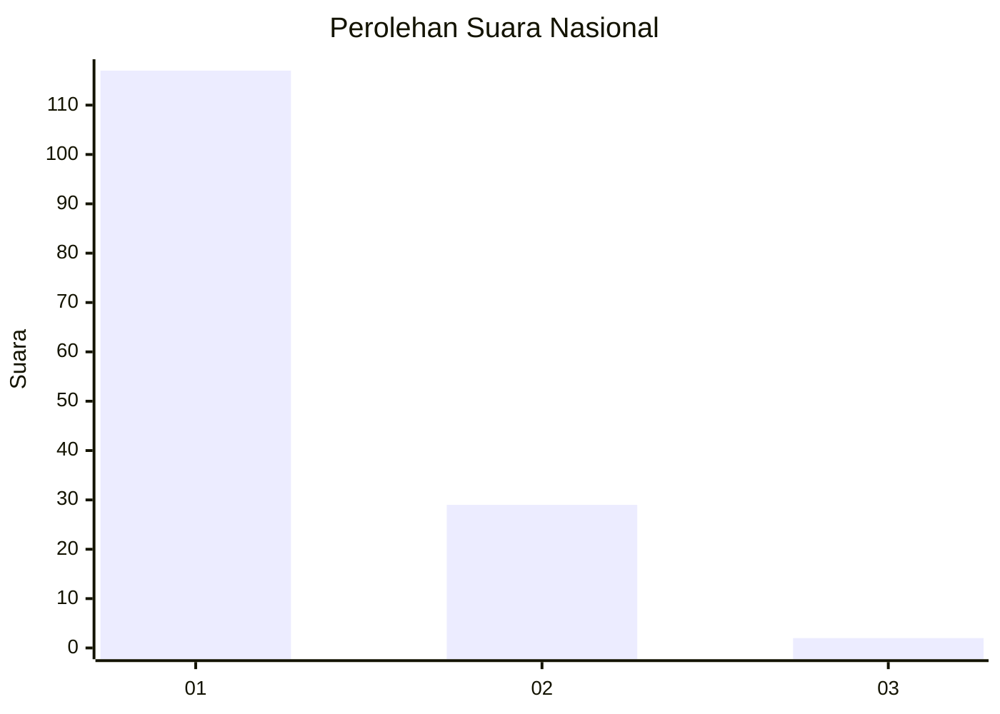
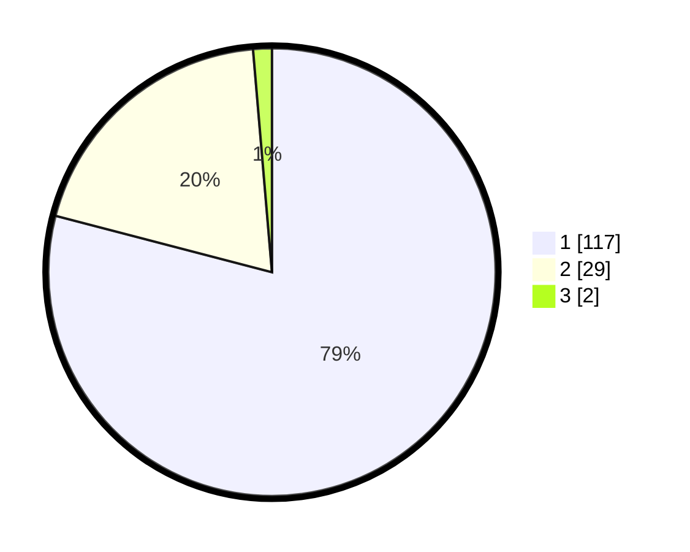

# Hasil

## Grafik

## Tabel

| No. | Nama Paslon    | Suara | Suara (raw) | Persentase |
|:--- |:-------------- | -----:| -----------:| ----------:|
| 1   | ANIES MUHAIMIN | 117   | [117][p-1]  | 79,05      |
| 2   | PRABOWO GIBRAN | 29    | [29][p-2]   | 19,59      |
| 3   | GANJAR MAHFUD  | 2     | [2][p-3]    | 1,35       |

[p-1]: https://github.com/gigit-pemilu/pemilu-2024/blob/main/pilpres/hitung-suara/sub/13-sumatera-barat/sub/02-solok/sub/11-x-koto-singkarak/sub/2003-koto-sani/sub/026-tps/sub/paslon-1.txt
[p-2]: https://github.com/gigit-pemilu/pemilu-2024/blob/main/pilpres/hitung-suara/sub/13-sumatera-barat/sub/02-solok/sub/11-x-koto-singkarak/sub/2003-koto-sani/sub/026-tps/sub/paslon-2.txt
[p-3]: https://github.com/gigit-pemilu/pemilu-2024/blob/main/pilpres/hitung-suara/sub/13-sumatera-barat/sub/02-solok/sub/11-x-koto-singkarak/sub/2003-koto-sani/sub/026-tps/sub/paslon-3.txt

## Foto C Plano

https://sirekap-obj-formc.kpu.go.id/34eb/pemilu/ppwp/13/02/11/20/03/1302112003026-20240215-021056--cb788f25-9846-429e-acc1-3f2827d82d76.jpg

https://sirekap-obj-formc.kpu.go.id/34eb/pemilu/ppwp/13/02/11/20/03/1302112003026-20240215-020546--775dae0a-35af-4ef6-9042-081c8e996019.jpg

https://sirekap-obj-formc.kpu.go.id/34eb/pemilu/ppwp/13/02/11/20/03/1302112003026-20240215-020834--95b25cc3-f28c-491c-9dd1-02ac668157c2.jpg

## Metadata

| Key        | Value               |
| ---------- | ------------------- |
| Time Stamp | 2024-02-16 03:00:26 |

