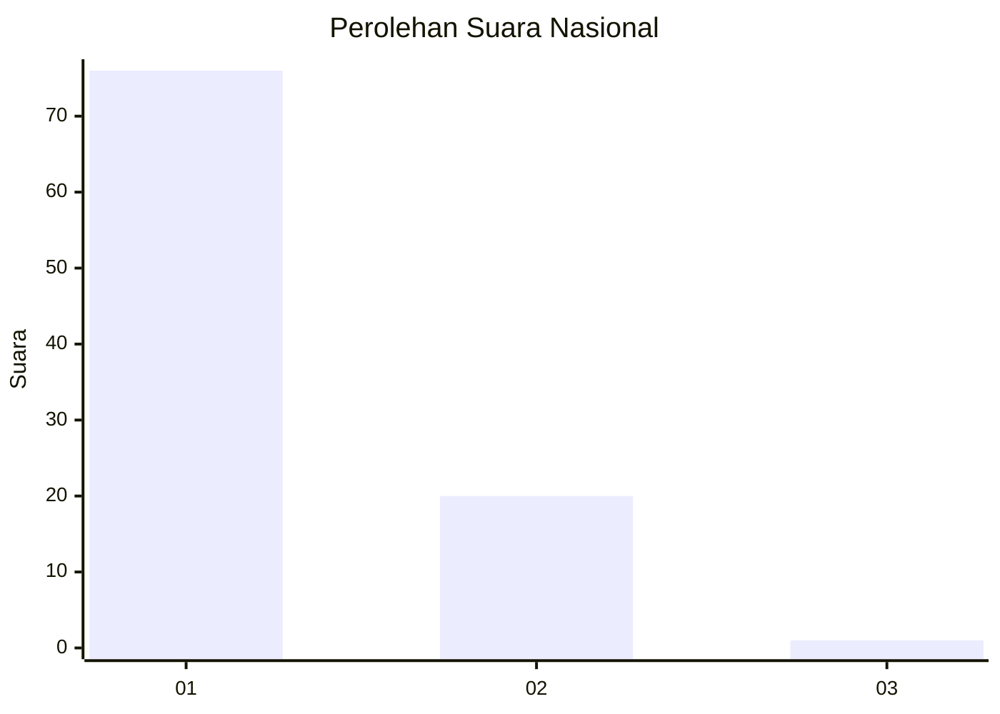
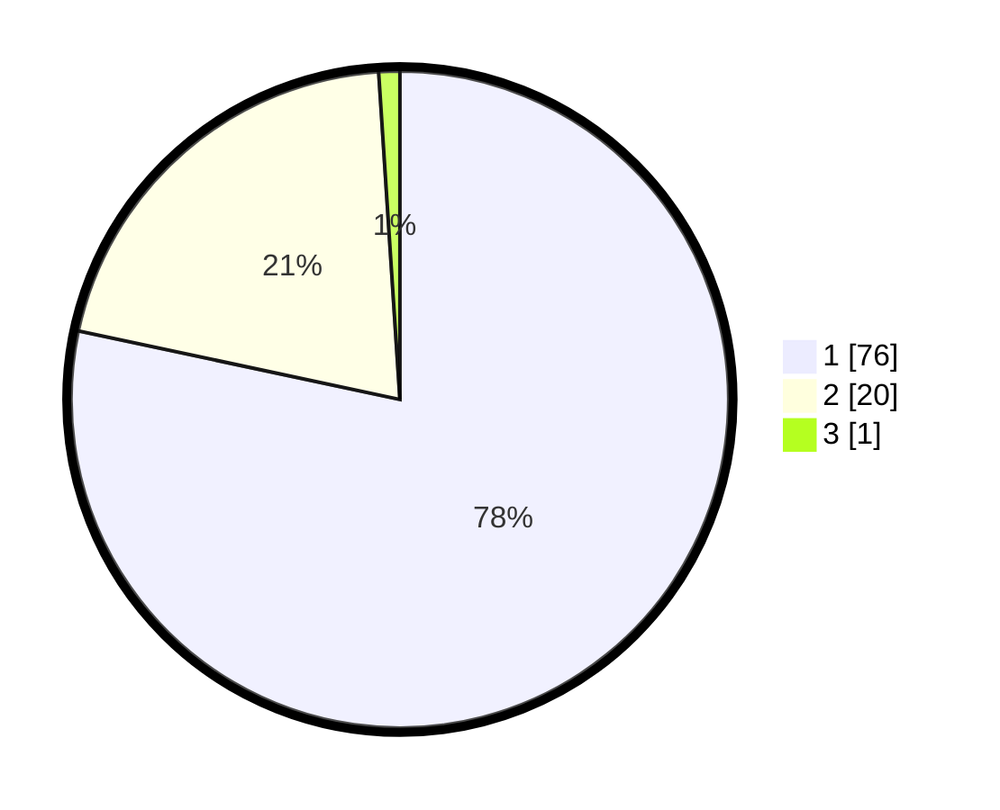

# Hasil

## Grafik

## Tabel

| No. | Nama Paslon    | Suara | Suara (raw) | Persentase |
|:--- |:-------------- | -----:| -----------:| ----------:|
| 1   | ANIES MUHAIMIN | 76    | [76][p-1]   | 78,35      |
| 2   | PRABOWO GIBRAN | 20    | [20][p-2]   | 20,62      |
| 3   | GANJAR MAHFUD  | 1     | [1][p-3]    | 1,03       |

[p-1]: https://github.com/gigit-pemilu/pemilu-2024/blob/main/pilpres/hitung-suara/sub/13-sumatera-barat/sub/02-solok/sub/11-x-koto-singkarak/sub/2008-saniangbaka/sub/019-tps/sub/paslon-1.txt
[p-2]: https://github.com/gigit-pemilu/pemilu-2024/blob/main/pilpres/hitung-suara/sub/13-sumatera-barat/sub/02-solok/sub/11-x-koto-singkarak/sub/2008-saniangbaka/sub/019-tps/sub/paslon-2.txt
[p-3]: https://github.com/gigit-pemilu/pemilu-2024/blob/main/pilpres/hitung-suara/sub/13-sumatera-barat/sub/02-solok/sub/11-x-koto-singkarak/sub/2008-saniangbaka/sub/019-tps/sub/paslon-3.txt

## Foto C Plano

https://sirekap-obj-formc.kpu.go.id/657d/pemilu/ppwp/13/02/11/20/08/1302112008019-20240215-085648--df28b9f2-6de1-4409-a132-27e0cd0ed6fb.jpg

https://sirekap-obj-formc.kpu.go.id/657d/pemilu/ppwp/13/02/11/20/08/1302112008019-20240215-085820--a87cebf1-036f-486b-b1a2-35e857dd094a.jpg

https://sirekap-obj-formc.kpu.go.id/657d/pemilu/ppwp/13/02/11/20/08/1302112008019-20240215-085920--9dbdcdd0-1ad5-4e26-8a13-101ee466c7b2.jpg

## Metadata

| Key        | Value               |
| ---------- | ------------------- |
| Time Stamp | 2024-02-16 03:00:26 |

