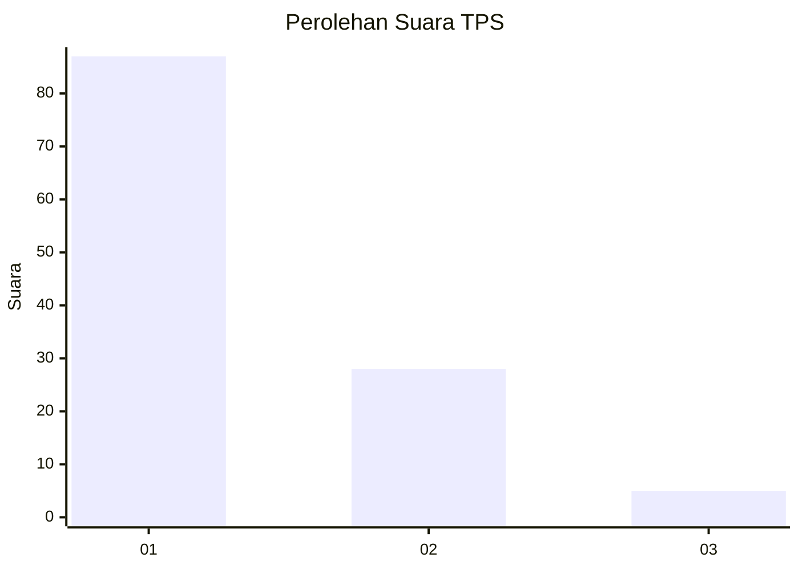
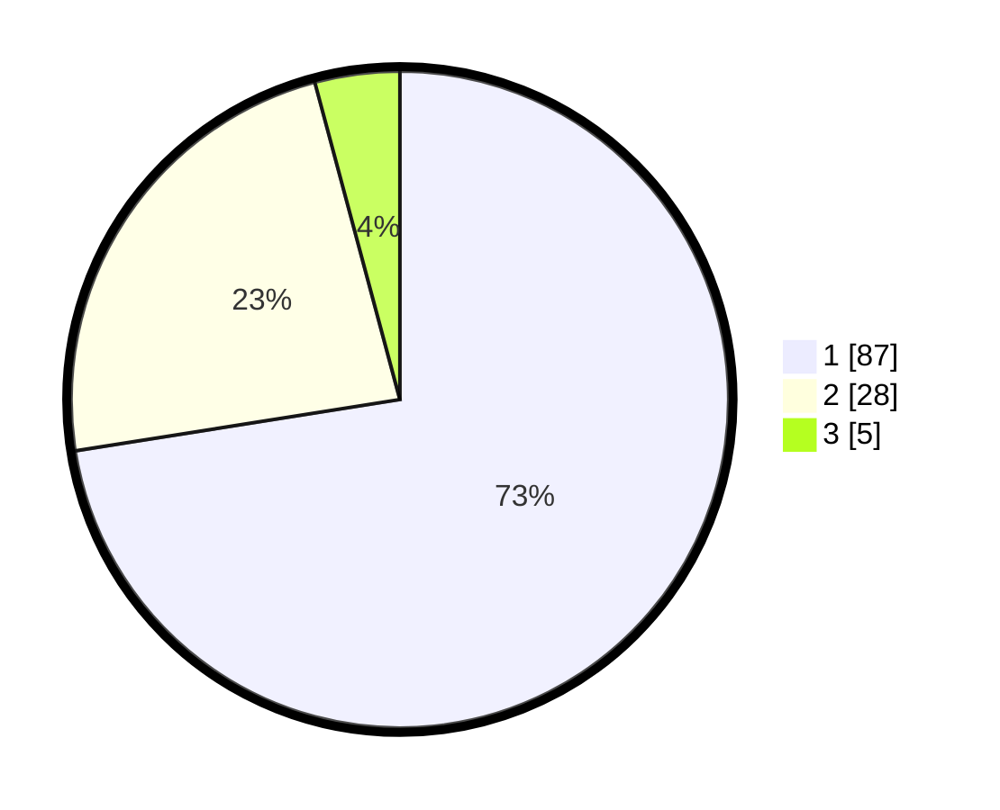

# Hasil

## Grafik

## Tabel

| No. | Nama Paslon    | Suara | Suara (raw) | Persentase |
|:--- |:-------------- | -----:| -----------:| ----------:|
| 1   | ANIES MUHAIMIN | 87    | [87][p-1]   | 72,50      |
| 2   | PRABOWO GIBRAN | 28    | [28][p-2]   | 23,33      |
| 3   | GANJAR MAHFUD  | 5     | [5][p-3]    | 4,17       |

[p-1]: https://github.com/gigit-pemilu/pemilu-2024-13-sumatera-barat/blob/main/pilpres/hitung-suara/sub/13-sumatera-barat/sub/02-solok/sub/12-x-koto-diatas/sub/2001-sulit-air/sub/027-tps/sub/paslon-1.txt
[p-2]: https://github.com/gigit-pemilu/pemilu-2024-13-sumatera-barat/blob/main/pilpres/hitung-suara/sub/13-sumatera-barat/sub/02-solok/sub/12-x-koto-diatas/sub/2001-sulit-air/sub/027-tps/sub/paslon-2.txt
[p-3]: https://github.com/gigit-pemilu/pemilu-2024-13-sumatera-barat/blob/main/pilpres/hitung-suara/sub/13-sumatera-barat/sub/02-solok/sub/12-x-koto-diatas/sub/2001-sulit-air/sub/027-tps/sub/paslon-3.txt

## Foto C Plano

https://sirekap-obj-formc.kpu.go.id/26a1/pemilu/ppwp/13/02/12/20/01/1302122001027-20240214-235011--3821d731-0506-4c32-bf0e-e1db4e01a1c4.jpg

https://sirekap-obj-formc.kpu.go.id/26a1/pemilu/ppwp/13/02/12/20/01/1302122001027-20240214-235227--ef98d1fc-012e-475b-a6bb-98e94661229a.jpg

https://sirekap-obj-formc.kpu.go.id/26a1/pemilu/ppwp/13/02/12/20/01/1302122001027-20240214-235512--ad9d04e3-a2cc-46f6-8a80-b7f14d13be87.jpg

## Metadata

| Key        | Value               |
| ---------- | ------------------- |
| Time Stamp | 2024-02-15 23:29:50 |

