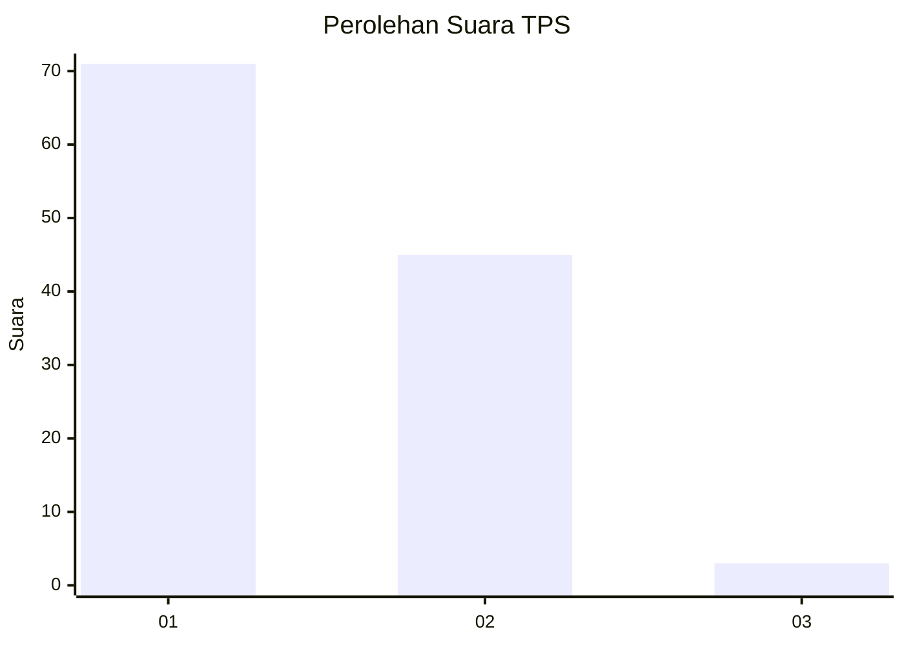
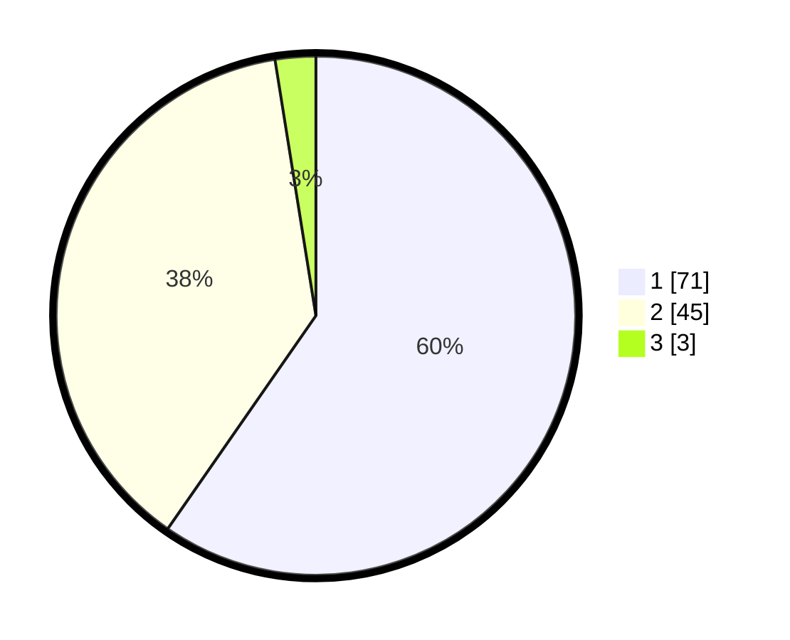

# Hasil

## Grafik

## Tabel

| No. | Nama Paslon    | Suara | Suara (raw) | Persentase |
|:--- |:-------------- | -----:| -----------:| ----------:|
| 1   | ANIES MUHAIMIN | 71    | [71][p-1]   | 59,66      |
| 2   | PRABOWO GIBRAN | 45    | [45][p-2]   | 37,82      |
| 3   | GANJAR MAHFUD  | 3     | [3][p-3]    | 2,52       |

[p-1]: https://github.com/gigit-pemilu/pemilu-2024-13-sumatera-barat/blob/main/pilpres/hitung-suara/sub/13-sumatera-barat/sub/02-solok/sub/12-x-koto-diatas/sub/2003-paninjauan/sub/006-tps/sub/paslon-1.txt
[p-2]: https://github.com/gigit-pemilu/pemilu-2024-13-sumatera-barat/blob/main/pilpres/hitung-suara/sub/13-sumatera-barat/sub/02-solok/sub/12-x-koto-diatas/sub/2003-paninjauan/sub/006-tps/sub/paslon-2.txt
[p-3]: https://github.com/gigit-pemilu/pemilu-2024-13-sumatera-barat/blob/main/pilpres/hitung-suara/sub/13-sumatera-barat/sub/02-solok/sub/12-x-koto-diatas/sub/2003-paninjauan/sub/006-tps/sub/paslon-3.txt

## Foto C Plano

https://sirekap-obj-formc.kpu.go.id/235f/pemilu/ppwp/13/02/12/20/03/1302122003006-20240227-163135--0eea4d36-7a2d-4ebc-922e-078c6a431cfd.jpg

https://sirekap-obj-formc.kpu.go.id/235f/pemilu/ppwp/13/02/12/20/03/1302122003006-20240215-003151--4559236e-9b71-4495-aeb0-e1a31b60a655.jpg

https://sirekap-obj-formc.kpu.go.id/235f/pemilu/ppwp/13/02/12/20/03/1302122003006-20240227-163408--6c2891ce-f6da-41c8-b5e4-3424f4bdfc9b.jpg

## Metadata

| Key        | Value               |
| ---------- | ------------------- |
| Time Stamp | 2024-02-27 17:00:00 |

