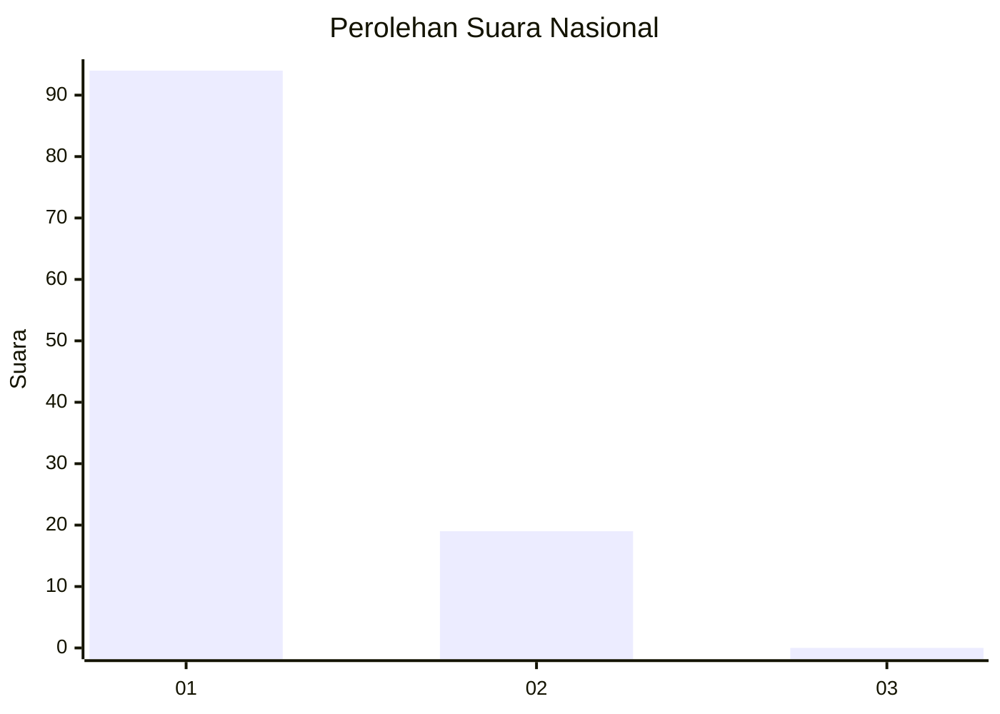
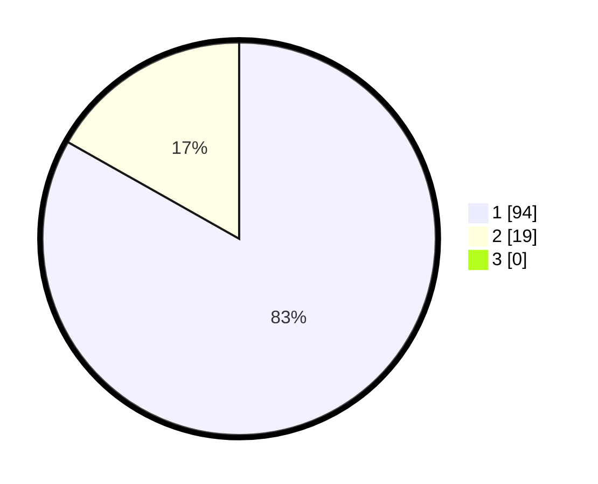

# Hasil

## Grafik

## Tabel

| No. | Nama Paslon    | Suara | Suara (raw) | Persentase |
|:--- |:-------------- | -----:| -----------:| ----------:|
| 1   | ANIES MUHAIMIN | 94    | [94][p-1]   | 83,19      |
| 2   | PRABOWO GIBRAN | 19    | [19][p-2]   | 16,81      |
| 3   | GANJAR MAHFUD  | 0     | [0][p-3]    | 0,00       |

[p-1]: https://github.com/gigit-pemilu/pemilu-2024/blob/main/pilpres/hitung-suara/sub/13-sumatera-barat/sub/02-solok/sub/13-junjung-sirih/sub/2001-paninggahan/sub/026-tps/sub/paslon-1.txt
[p-2]: https://github.com/gigit-pemilu/pemilu-2024/blob/main/pilpres/hitung-suara/sub/13-sumatera-barat/sub/02-solok/sub/13-junjung-sirih/sub/2001-paninggahan/sub/026-tps/sub/paslon-2.txt
[p-3]: https://github.com/gigit-pemilu/pemilu-2024/blob/main/pilpres/hitung-suara/sub/13-sumatera-barat/sub/02-solok/sub/13-junjung-sirih/sub/2001-paninggahan/sub/026-tps/sub/paslon-3.txt

## Foto C Plano

https://sirekap-obj-formc.kpu.go.id/ac8b/pemilu/ppwp/13/02/13/20/01/1302132001026-20240215-000747--8a1753ea-2d1c-4ad2-9cc5-b3cced78d230.jpg

https://sirekap-obj-formc.kpu.go.id/ac8b/pemilu/ppwp/13/02/13/20/01/1302132001026-20240215-025928--531b09d5-0c8c-4646-9d6d-d2808f3817d7.jpg

https://sirekap-obj-formc.kpu.go.id/ac8b/pemilu/ppwp/13/02/13/20/01/1302132001026-20240215-000937--1b117e4f-f833-4d1f-8812-8773d3c4b7df.jpg

## Metadata

| Key        | Value               |
| ---------- | ------------------- |
| Time Stamp | 2024-02-16 03:00:26 |

