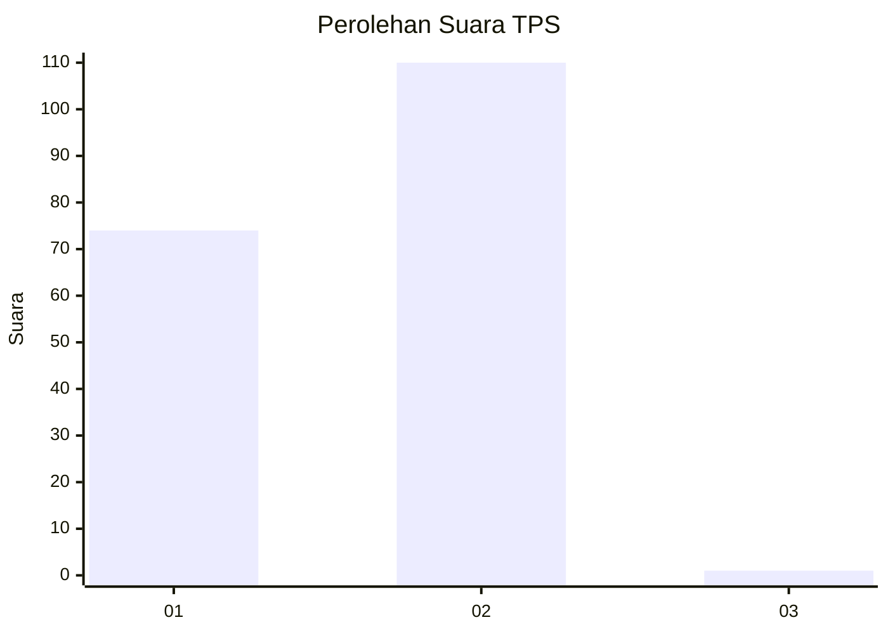
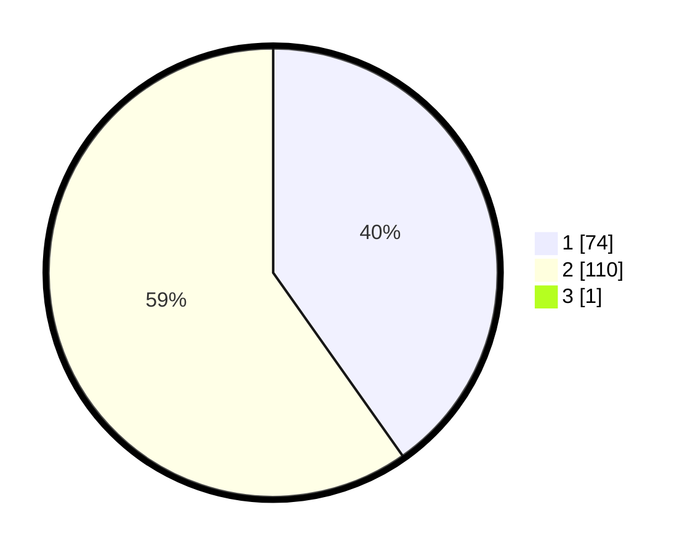

# Hasil

## Grafik

## Tabel

| No. | Nama Paslon    | Suara | Suara (raw) | Persentase |
|:--- |:-------------- | -----:| -----------:| ----------:|
| 1   | ANIES MUHAIMIN | 74    | [74][p-1]   | 40,00      |
| 2   | PRABOWO GIBRAN | 110   | [110][p-2]  | 59,46      |
| 3   | GANJAR MAHFUD  | 1     | [1][p-3]    | 0,54       |

[p-1]: https://github.com/gigit-pemilu/pemilu-2024-13-sumatera-barat/blob/main/pilpres/hitung-suara/sub/13-sumatera-barat/sub/02-solok/sub/19-danau-kembar/sub/2001-simpang-tj-nan-iv/sub/008-tps/sub/paslon-1.txt
[p-2]: https://github.com/gigit-pemilu/pemilu-2024-13-sumatera-barat/blob/main/pilpres/hitung-suara/sub/13-sumatera-barat/sub/02-solok/sub/19-danau-kembar/sub/2001-simpang-tj-nan-iv/sub/008-tps/sub/paslon-2.txt
[p-3]: https://github.com/gigit-pemilu/pemilu-2024-13-sumatera-barat/blob/main/pilpres/hitung-suara/sub/13-sumatera-barat/sub/02-solok/sub/19-danau-kembar/sub/2001-simpang-tj-nan-iv/sub/008-tps/sub/paslon-3.txt

## Foto C Plano

https://sirekap-obj-formc.kpu.go.id/cc11/pemilu/ppwp/13/02/19/20/01/1302192001008-20240217-152112--eff9e552-e86a-4f5f-92d7-c757e612607e.jpg

https://sirekap-obj-formc.kpu.go.id/cc11/pemilu/ppwp/13/02/19/20/01/1302192001008-20240217-152524--4d3cdbe9-d4c0-4ee9-b5d1-3a7a8b370eac.jpg

https://sirekap-obj-formc.kpu.go.id/cc11/pemilu/ppwp/13/02/19/20/01/1302192001008-20240217-152412--9abe8443-30ae-407f-8f01-d1b6ffd0701e.jpg

## Metadata

| Key        | Value               |
| ---------- | ------------------- |
| Time Stamp | 2024-02-20 12:00:00 |

## DATA PEMILIH TETAP

Jumlah pemilih dalam DPT: **314**.
 * L: **50**.
 * P: **654**.

## DATA PENGGUNA HAK PILIH

Jumlah pengguna hak pilih dalam DPT: **688**.
 * L: **92**.
 * P: **45**.

Jumlah pengguna hak pilih dalam DPTb: **1**.
 * L: **80**.
 * P: **8**.

Jumlah pengguna hak pilih dalam DPK: **2**.
 * L: **0**.
 * P: **6**.

Jumlah pengguna hak pilih: **141**.
 * L: **43**.
 * P: **48**.

## JUMLAH SUARA SAH DAN TIDAK SAH

JUMLAH SELURUH SUARA SAH: **185**.

JUMLAH SUARA TIDAK SAH: **6**.

JUMLAH SELURUH SUARA SAH DAN SUARA TIDAK SAH: **191**.

