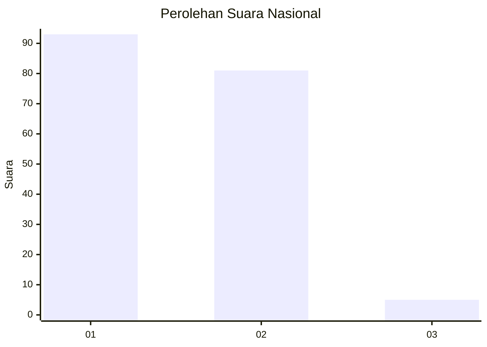
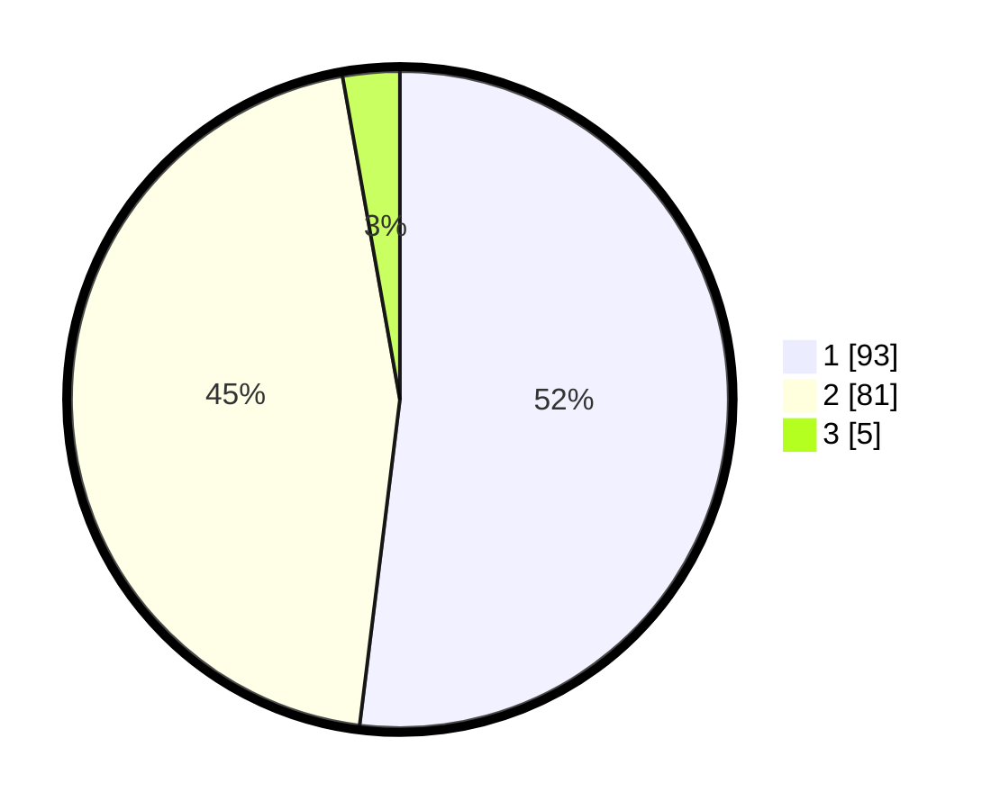

# Hasil

## Grafik

## Tabel

| No. | Nama Paslon    | Suara | Suara (raw) | Persentase |
|:--- |:-------------- | -----:| -----------:| ----------:|
| 1   | ANIES MUHAIMIN | 93    | [93][p-1]   | 51,96      |
| 2   | PRABOWO GIBRAN | 81    | [81][p-2]   | 45,25      |
| 3   | GANJAR MAHFUD  | 5     | [5][p-3]    | 2,79       |

[p-1]: https://github.com/gigit-pemilu/pemilu-2024/blob/main/pilpres/hitung-suara/sub/13-sumatera-barat/sub/02-solok/sub/19-danau-kembar/sub/2001-simpang-tj-nan-iv/sub/009-tps/sub/paslon-1.txt
[p-2]: https://github.com/gigit-pemilu/pemilu-2024/blob/main/pilpres/hitung-suara/sub/13-sumatera-barat/sub/02-solok/sub/19-danau-kembar/sub/2001-simpang-tj-nan-iv/sub/009-tps/sub/paslon-2.txt
[p-3]: https://github.com/gigit-pemilu/pemilu-2024/blob/main/pilpres/hitung-suara/sub/13-sumatera-barat/sub/02-solok/sub/19-danau-kembar/sub/2001-simpang-tj-nan-iv/sub/009-tps/sub/paslon-3.txt

## Foto C Plano

https://sirekap-obj-formc.kpu.go.id/0c6a/pemilu/ppwp/13/02/19/20/01/1302192001009-20240214-212218--0daf0600-86d7-4124-ac73-d954c40f32ad.jpg

https://sirekap-obj-formc.kpu.go.id/0c6a/pemilu/ppwp/13/02/19/20/01/1302192001009-20240214-212615--a6b0a843-aacc-4d67-88d2-14304ca41c1e.jpg

https://sirekap-obj-formc.kpu.go.id/0c6a/pemilu/ppwp/13/02/19/20/01/1302192001009-20240214-212851--86a03ae9-9fd0-41f9-848b-f0da73b42118.jpg

## Metadata

| Key        | Value               |
| ---------- | ------------------- |
| Time Stamp | 2024-02-16 16:25:10 |

