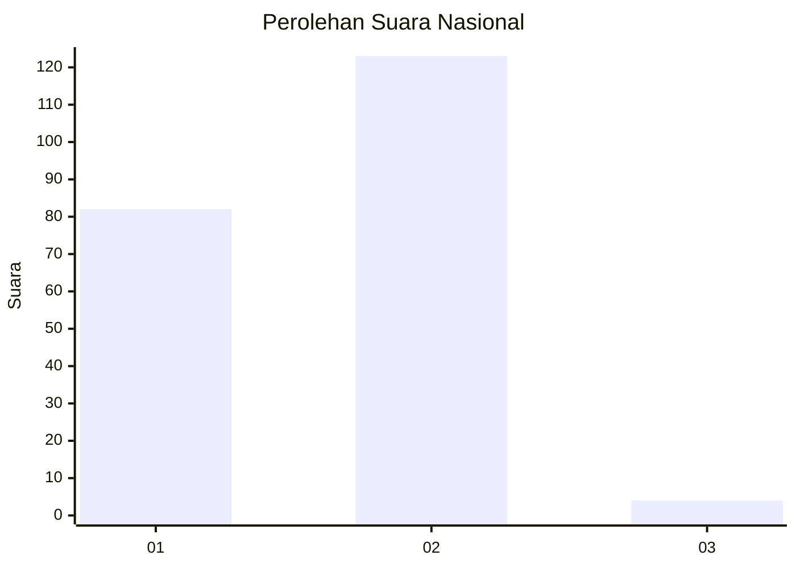
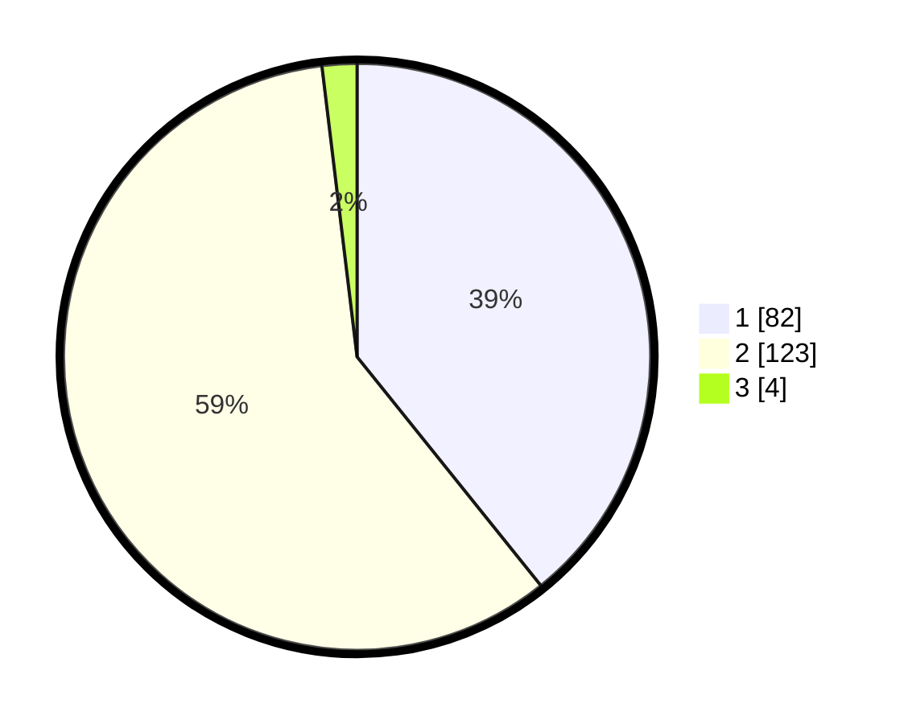

# Hasil

## Grafik

## Tabel

| No. | Nama Paslon    | Suara | Suara (raw) | Persentase |
|:--- |:-------------- | -----:| -----------:| ----------:|
| 1   | ANIES MUHAIMIN | 82    | [82][p-1]   | 39,23      |
| 2   | PRABOWO GIBRAN | 123   | [123][p-2]  | 58,85      |
| 3   | GANJAR MAHFUD  | 4     | [4][p-3]    | 1,91       |

[p-1]: https://github.com/gigit-pemilu/pemilu-2024/blob/main/pilpres/hitung-suara/sub/13-sumatera-barat/sub/03-sijunjung/sub/04-sijunjung/sub/2001-muaro/sub/015-tps/sub/paslon-1.txt
[p-2]: https://github.com/gigit-pemilu/pemilu-2024/blob/main/pilpres/hitung-suara/sub/13-sumatera-barat/sub/03-sijunjung/sub/04-sijunjung/sub/2001-muaro/sub/015-tps/sub/paslon-2.txt
[p-3]: https://github.com/gigit-pemilu/pemilu-2024/blob/main/pilpres/hitung-suara/sub/13-sumatera-barat/sub/03-sijunjung/sub/04-sijunjung/sub/2001-muaro/sub/015-tps/sub/paslon-3.txt

## Foto C Plano

https://sirekap-obj-formc.kpu.go.id/99d5/pemilu/ppwp/13/03/04/20/01/1303042001015-20240215-025831--e0a772b8-5be9-4515-bc62-a31eb44333d2.jpg

https://sirekap-obj-formc.kpu.go.id/99d5/pemilu/ppwp/13/03/04/20/01/1303042001015-20240215-025737--3fdf8ca0-91ab-4450-90d3-91e8ce35552a.jpg

https://sirekap-obj-formc.kpu.go.id/99d5/pemilu/ppwp/13/03/04/20/01/1303042001015-20240215-025837--be278041-4dd7-4462-a00a-c0bd8c22888c.jpg

## Metadata

| Key        | Value               |
| ---------- | ------------------- |
| Time Stamp | 2024-02-22 11:00:00 |

