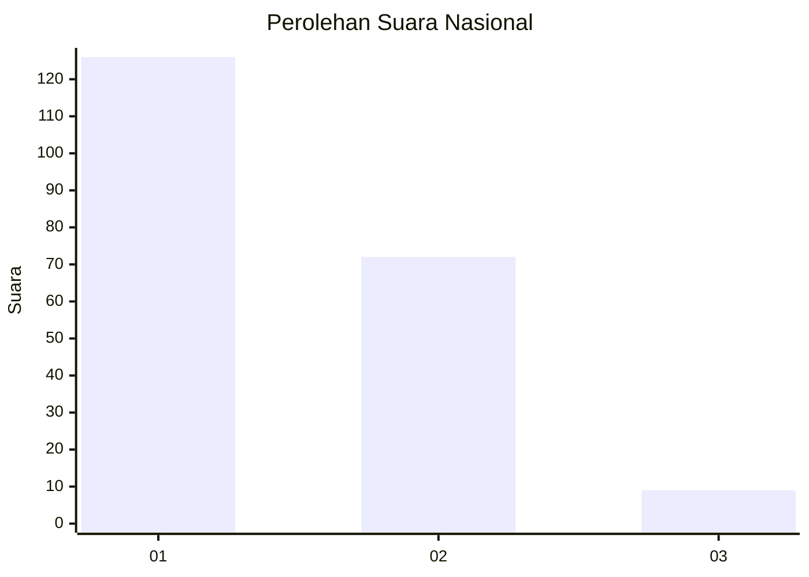
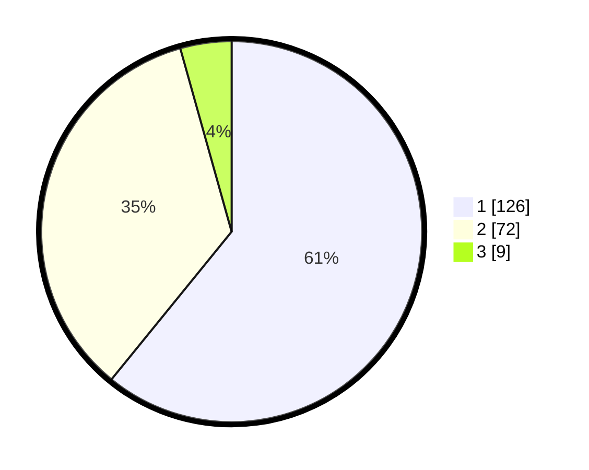

# Hasil

## Grafik

## Tabel

| No. | Nama Paslon    | Suara | Suara (raw) | Persentase |
|:--- |:-------------- | -----:| -----------:| ----------:|
| 1   | ANIES MUHAIMIN | 126   | [126][p-1]  | 60,87      |
| 2   | PRABOWO GIBRAN | 72    | [72][p-2]   | 34,78      |
| 3   | GANJAR MAHFUD  | 9     | [9][p-3]    | 4,35       |

[p-1]: https://github.com/gigit-pemilu/pemilu-2024/blob/main/pilpres/hitung-suara/sub/13-sumatera-barat/sub/03-sijunjung/sub/04-sijunjung/sub/2001-muaro/sub/019-tps/sub/paslon-1.txt
[p-2]: https://github.com/gigit-pemilu/pemilu-2024/blob/main/pilpres/hitung-suara/sub/13-sumatera-barat/sub/03-sijunjung/sub/04-sijunjung/sub/2001-muaro/sub/019-tps/sub/paslon-2.txt
[p-3]: https://github.com/gigit-pemilu/pemilu-2024/blob/main/pilpres/hitung-suara/sub/13-sumatera-barat/sub/03-sijunjung/sub/04-sijunjung/sub/2001-muaro/sub/019-tps/sub/paslon-3.txt

## Foto C Plano

https://sirekap-obj-formc.kpu.go.id/3ace/pemilu/ppwp/13/03/04/20/01/1303042001019-20240215-013302--4e2aa129-dc59-4a22-94b3-541f26f15952.jpg

https://sirekap-obj-formc.kpu.go.id/3ace/pemilu/ppwp/13/03/04/20/01/1303042001019-20240215-015207--0265103f-916c-4932-8cc6-de2facec0113.jpg

https://sirekap-obj-formc.kpu.go.id/3ace/pemilu/ppwp/13/03/04/20/01/1303042001019-20240215-013847--5e17c047-45b8-4e17-828a-0b94c227b0f9.jpg

## Metadata

| Key        | Value               |
| ---------- | ------------------- |
| Time Stamp | 2024-02-22 10:00:00 |

