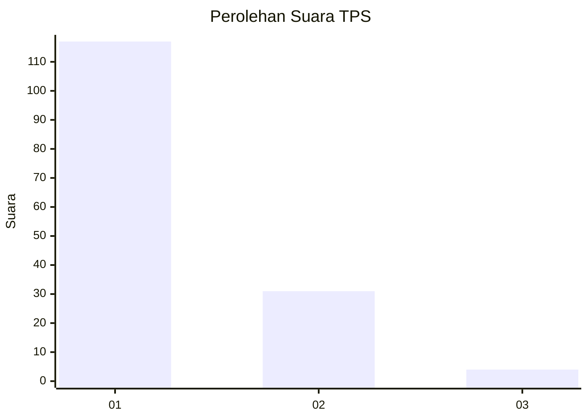
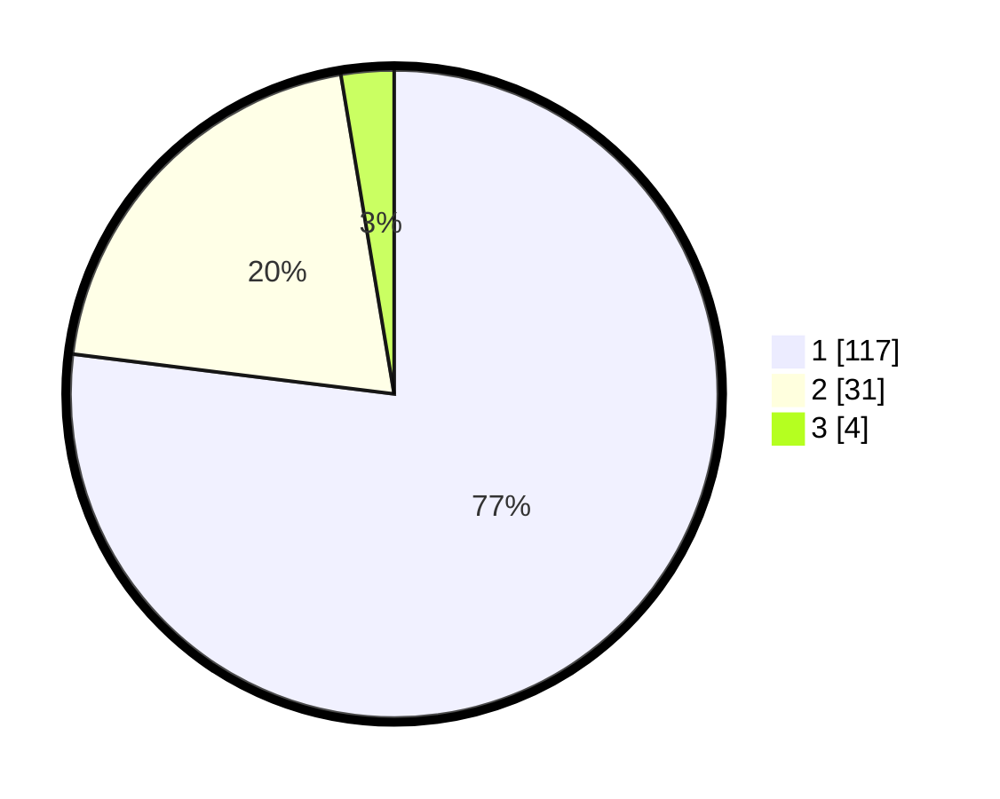

# Hasil

## Grafik

## Tabel

| No. | Nama Paslon    | Suara | Suara (raw) | Persentase |
|:--- |:-------------- | -----:| -----------:| ----------:|
| 1   | ANIES MUHAIMIN | 117   | [117][p-1]  | 76,97      |
| 2   | PRABOWO GIBRAN | 31    | [31][p-2]   | 20,39      |
| 3   | GANJAR MAHFUD  | 4     | [4][p-3]    | 2,63       |

[p-1]: https://github.com/gigit-pemilu/pemilu-2024-13-sumatera-barat/blob/main/pilpres/hitung-suara/sub/13-sumatera-barat/sub/03-sijunjung/sub/05-iv-nagari/sub/2001-palangki/sub/003-tps/sub/paslon-1.txt
[p-2]: https://github.com/gigit-pemilu/pemilu-2024-13-sumatera-barat/blob/main/pilpres/hitung-suara/sub/13-sumatera-barat/sub/03-sijunjung/sub/05-iv-nagari/sub/2001-palangki/sub/003-tps/sub/paslon-2.txt
[p-3]: https://github.com/gigit-pemilu/pemilu-2024-13-sumatera-barat/blob/main/pilpres/hitung-suara/sub/13-sumatera-barat/sub/03-sijunjung/sub/05-iv-nagari/sub/2001-palangki/sub/003-tps/sub/paslon-3.txt

## Foto C Plano

https://sirekap-obj-formc.kpu.go.id/0488/pemilu/ppwp/13/03/05/20/01/1303052001003-20240215-023837--f8bb98be-1c1b-46f9-a19b-1c7bcf351e97.jpg

https://sirekap-obj-formc.kpu.go.id/0488/pemilu/ppwp/13/03/05/20/01/1303052001003-20240222-092509--9d46f3dc-a12f-42fb-a9e5-d3e97a2396d3.jpg

https://sirekap-obj-formc.kpu.go.id/0488/pemilu/ppwp/13/03/05/20/01/1303052001003-20240222-112236--3b48025d-e9f2-4e75-b661-ec703f0b7146.jpg

## Metadata

| Key        | Value               |
| ---------- | ------------------- |
| Time Stamp | 2024-02-22 12:00:00 |

