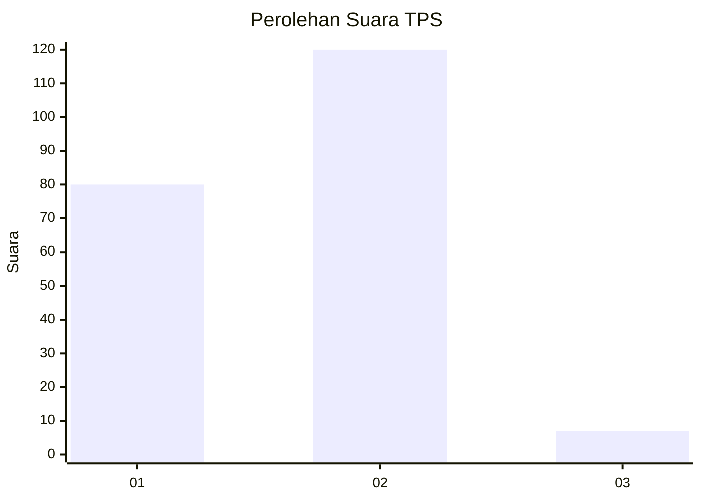
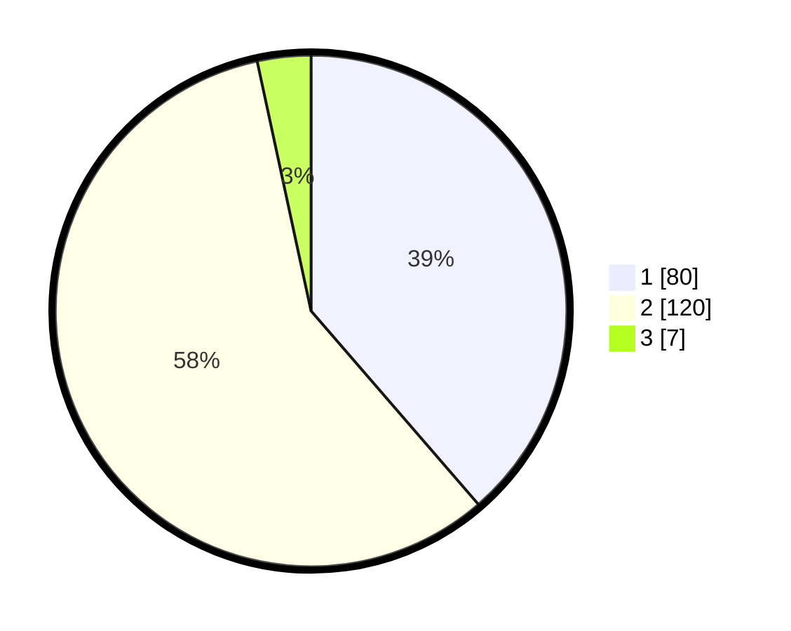

# Hasil

## Grafik

## Tabel

| No. | Nama Paslon    | Suara | Suara (raw) | Persentase |
|:--- |:-------------- | -----:| -----------:| ----------:|
| 1   | ANIES MUHAIMIN | 80    | [80][p-1]   | 38,65      |
| 2   | PRABOWO GIBRAN | 120   | [120][p-2]  | 57,97      |
| 3   | GANJAR MAHFUD  | 7     | [7][p-3]    | 3,38       |

[p-1]: https://github.com/gigit-pemilu/pemilu-2024-13-sumatera-barat/blob/main/pilpres/hitung-suara/sub/13-sumatera-barat/sub/03-sijunjung/sub/06-kamang-baru/sub/2001-sungai-lansek/sub/004-tps/sub/paslon-1.txt
[p-2]: https://github.com/gigit-pemilu/pemilu-2024-13-sumatera-barat/blob/main/pilpres/hitung-suara/sub/13-sumatera-barat/sub/03-sijunjung/sub/06-kamang-baru/sub/2001-sungai-lansek/sub/004-tps/sub/paslon-2.txt
[p-3]: https://github.com/gigit-pemilu/pemilu-2024-13-sumatera-barat/blob/main/pilpres/hitung-suara/sub/13-sumatera-barat/sub/03-sijunjung/sub/06-kamang-baru/sub/2001-sungai-lansek/sub/004-tps/sub/paslon-3.txt

## Foto C Plano

https://sirekap-obj-formc.kpu.go.id/4323/pemilu/ppwp/13/03/06/20/01/1303062001004-20240215-033250--0ad82da8-29b6-4185-a529-fad333bd6a30.jpg

https://sirekap-obj-formc.kpu.go.id/4323/pemilu/ppwp/13/03/06/20/01/1303062001004-20240215-001035--8fa42087-25d6-4286-a55b-bf289504d3b0.jpg

https://sirekap-obj-formc.kpu.go.id/4323/pemilu/ppwp/13/03/06/20/01/1303062001004-20240215-001354--d7a832bd-f660-41e0-8870-4a28ad5f2101.jpg

## Metadata

| Key        | Value               |
| ---------- | ------------------- |
| Time Stamp | 2024-02-15 20:30:46 |

