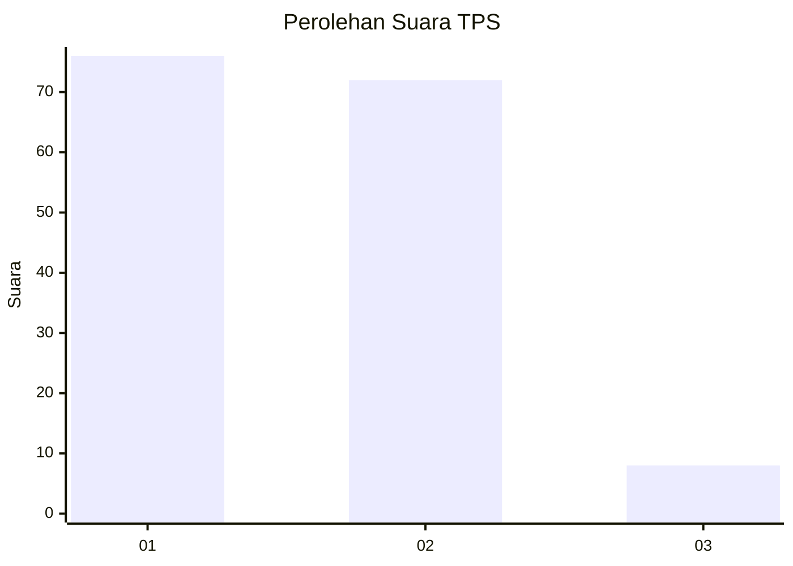
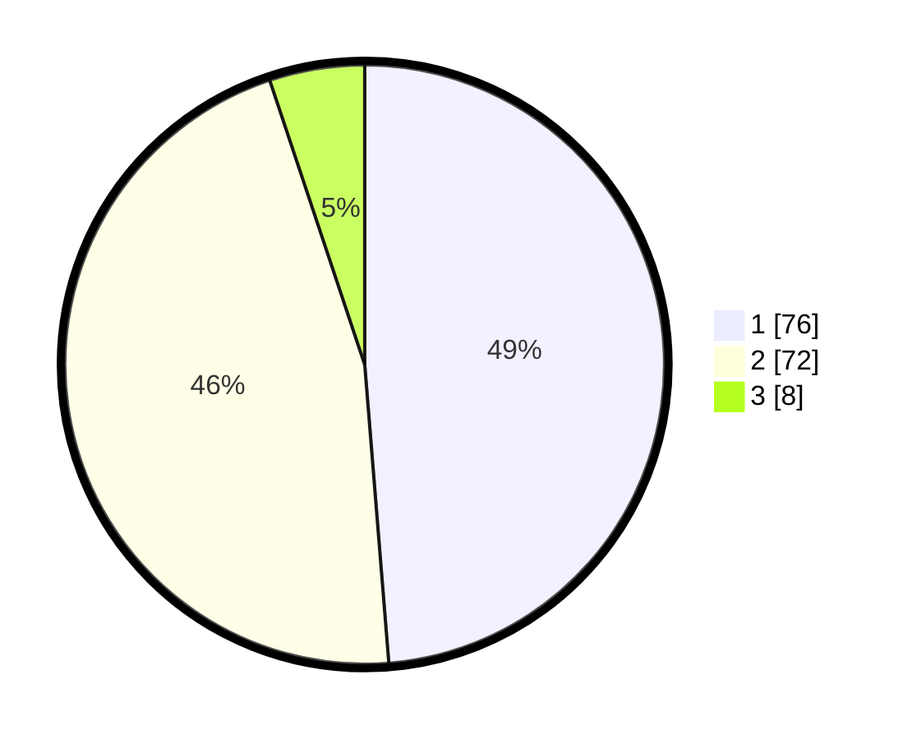

# Hasil

## Grafik

## Tabel

| No. | Nama Paslon    | Suara | Suara (raw) | Persentase |
|:--- |:-------------- | -----:| -----------:| ----------:|
| 1   | ANIES MUHAIMIN | 76    | [76][p-1]   | 48,72      |
| 2   | PRABOWO GIBRAN | 72    | [72][p-2]   | 46,15      |
| 3   | GANJAR MAHFUD  | 8     | [8][p-3]    | 5,13       |

[p-1]: https://github.com/gigit-pemilu/pemilu-2024-13-sumatera-barat/blob/main/pilpres/hitung-suara/sub/13-sumatera-barat/sub/03-sijunjung/sub/07-lubuak-tarok/sub/2001-lubuak-tarok/sub/003-tps/sub/paslon-1.txt
[p-2]: https://github.com/gigit-pemilu/pemilu-2024-13-sumatera-barat/blob/main/pilpres/hitung-suara/sub/13-sumatera-barat/sub/03-sijunjung/sub/07-lubuak-tarok/sub/2001-lubuak-tarok/sub/003-tps/sub/paslon-2.txt
[p-3]: https://github.com/gigit-pemilu/pemilu-2024-13-sumatera-barat/blob/main/pilpres/hitung-suara/sub/13-sumatera-barat/sub/03-sijunjung/sub/07-lubuak-tarok/sub/2001-lubuak-tarok/sub/003-tps/sub/paslon-3.txt

## Foto C Plano

https://sirekap-obj-formc.kpu.go.id/08a8/pemilu/ppwp/13/03/07/20/01/1303072001003-20240215-030257--8323c2d3-4420-4a46-bd3f-f132be9e8e6e.jpg

https://sirekap-obj-formc.kpu.go.id/08a8/pemilu/ppwp/13/03/07/20/01/1303072001003-20240215-030517--88c93ca8-837b-4f7e-b5c2-9fa3a2886b22.jpg

https://sirekap-obj-formc.kpu.go.id/08a8/pemilu/ppwp/13/03/07/20/01/1303072001003-20240215-034009--7ad9c178-90c2-4df1-86dd-933f3966ea1f.jpg

## Metadata

| Key        | Value               |
| ---------- | ------------------- |
| Time Stamp | 2024-02-15 12:00:28 |

