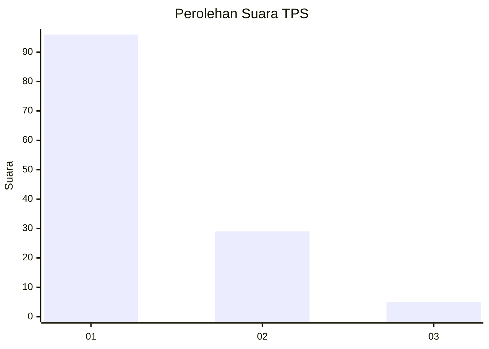
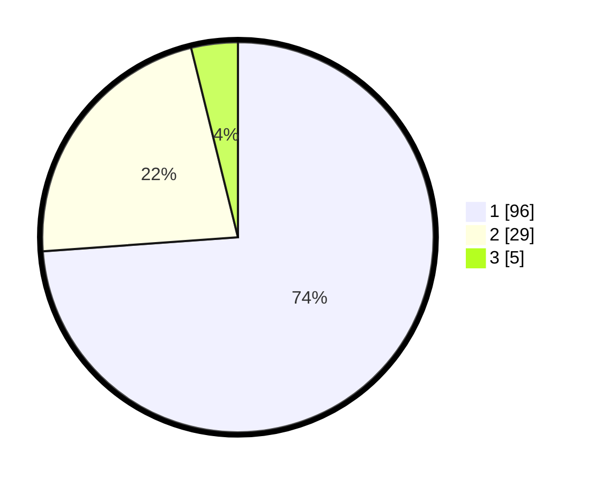

# Hasil

## Grafik

## Tabel

| No. | Nama Paslon    | Suara | Suara (raw) | Persentase |
|:--- |:-------------- | -----:| -----------:| ----------:|
| 1   | ANIES MUHAIMIN | 96    | [96][p-1]   | 73,85      |
| 2   | PRABOWO GIBRAN | 29    | [29][p-2]   | 22,31      |
| 3   | GANJAR MAHFUD  | 5     | [5][p-3]    | 3,85       |

[p-1]: https://github.com/gigit-pemilu/pemilu-2024-13-sumatera-barat/blob/main/pilpres/hitung-suara/sub/13-sumatera-barat/sub/03-sijunjung/sub/07-lubuak-tarok/sub/2003-buluah-kasok/sub/003-tps/sub/paslon-1.txt
[p-2]: https://github.com/gigit-pemilu/pemilu-2024-13-sumatera-barat/blob/main/pilpres/hitung-suara/sub/13-sumatera-barat/sub/03-sijunjung/sub/07-lubuak-tarok/sub/2003-buluah-kasok/sub/003-tps/sub/paslon-2.txt
[p-3]: https://github.com/gigit-pemilu/pemilu-2024-13-sumatera-barat/blob/main/pilpres/hitung-suara/sub/13-sumatera-barat/sub/03-sijunjung/sub/07-lubuak-tarok/sub/2003-buluah-kasok/sub/003-tps/sub/paslon-3.txt

## Foto C Plano

https://sirekap-obj-formc.kpu.go.id/8319/pemilu/ppwp/13/03/07/20/03/1303072003003-20240214-230634--b51bbebf-ca30-4d54-84ee-7aec4ab3f1bd.jpg

https://sirekap-obj-formc.kpu.go.id/8319/pemilu/ppwp/13/03/07/20/03/1303072003003-20240214-231203--66262c91-b983-44c8-a397-6c8c05cf256d.jpg

https://sirekap-obj-formc.kpu.go.id/8319/pemilu/ppwp/13/03/07/20/03/1303072003003-20240214-231901--7d02e079-f2b5-43a2-9c97-45d84ec698a1.jpg

## Metadata

| Key        | Value               |
| ---------- | ------------------- |
| Time Stamp | 2024-02-16 10:00:28 |

