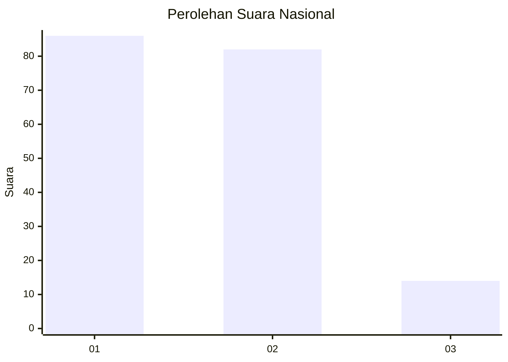
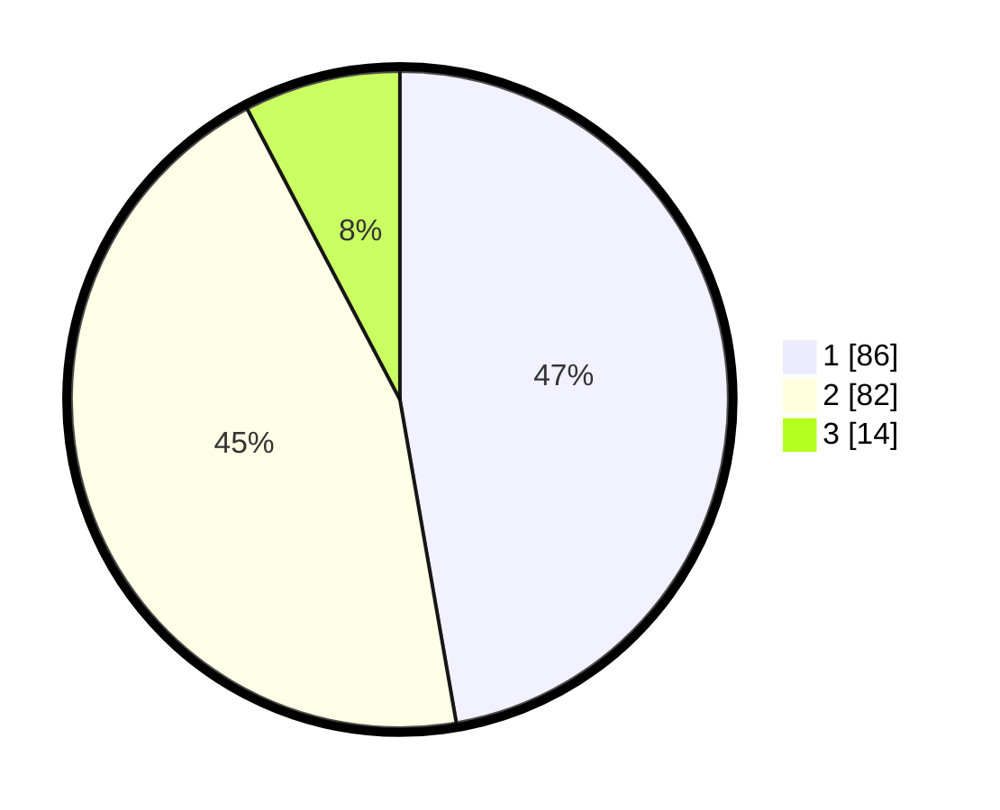

# Hasil

## Grafik

## Tabel

| No. | Nama Paslon    | Suara | Suara (raw) | Persentase |
|:--- |:-------------- | -----:| -----------:| ----------:|
| 1   | ANIES MUHAIMIN | 86    | [86][p-1]   | 47,25      |
| 2   | PRABOWO GIBRAN | 82    | [82][p-2]   | 45,05      |
| 3   | GANJAR MAHFUD  | 14    | [14][p-3]   | 7,69       |

[p-1]: https://github.com/gigit-pemilu/pemilu-2024/blob/main/pilpres/hitung-suara/sub/13-sumatera-barat/sub/03-sijunjung/sub/08-koto-vii/sub/2001-limo-koto/sub/002-tps/sub/paslon-1.txt
[p-2]: https://github.com/gigit-pemilu/pemilu-2024/blob/main/pilpres/hitung-suara/sub/13-sumatera-barat/sub/03-sijunjung/sub/08-koto-vii/sub/2001-limo-koto/sub/002-tps/sub/paslon-2.txt
[p-3]: https://github.com/gigit-pemilu/pemilu-2024/blob/main/pilpres/hitung-suara/sub/13-sumatera-barat/sub/03-sijunjung/sub/08-koto-vii/sub/2001-limo-koto/sub/002-tps/sub/paslon-3.txt

## Foto C Plano

https://sirekap-obj-formc.kpu.go.id/b51d/pemilu/ppwp/13/03/08/20/01/1303082001002-20240214-211453--84f2a3e0-29f4-4212-81dc-dda29d248047.jpg

https://sirekap-obj-formc.kpu.go.id/b51d/pemilu/ppwp/13/03/08/20/01/1303082001002-20240214-230855--0faaaca2-dd32-43b3-ba3f-8852c554aad2.jpg

https://sirekap-obj-formc.kpu.go.id/b51d/pemilu/ppwp/13/03/08/20/01/1303082001002-20240214-231257--1f285f1f-ed4e-47be-ac22-207e3db26de0.jpg

## Metadata

| Key        | Value               |
| ---------- | ------------------- |
| Time Stamp | 2024-02-16 10:00:28 |

