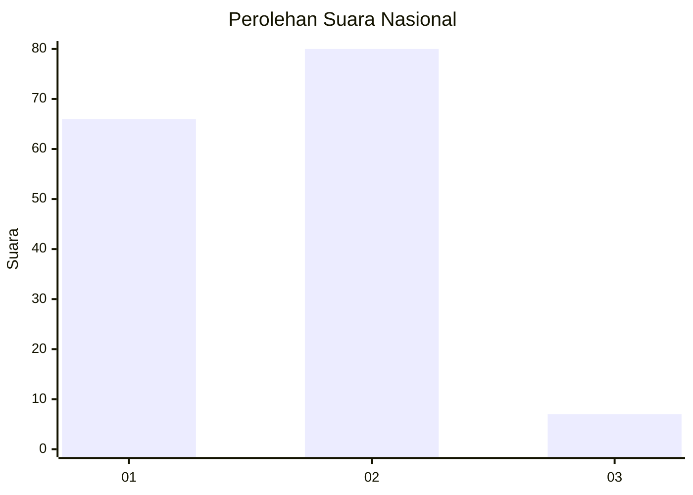
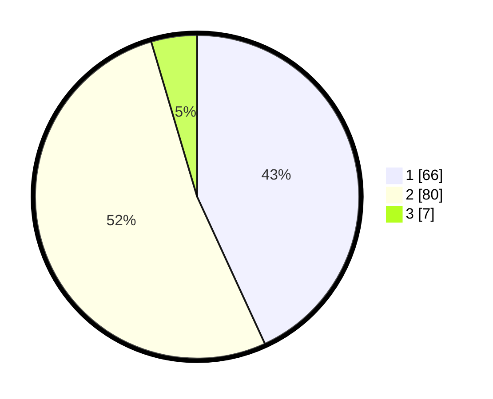

# Hasil

## Grafik

## Tabel

| No. | Nama Paslon    | Suara | Suara (raw) | Persentase |
|:--- |:-------------- | -----:| -----------:| ----------:|
| 1   | ANIES MUHAIMIN | 66    | [66][p-1]   | 43,14      |
| 2   | PRABOWO GIBRAN | 80    | [80][p-2]   | 52,29      |
| 3   | GANJAR MAHFUD  | 7     | [7][p-3]    | 4,58       |

[p-1]: https://github.com/gigit-pemilu/pemilu-2024/blob/main/pilpres/hitung-suara/sub/13-sumatera-barat/sub/03-sijunjung/sub/08-koto-vii/sub/2001-limo-koto/sub/004-tps/sub/paslon-1.txt
[p-2]: https://github.com/gigit-pemilu/pemilu-2024/blob/main/pilpres/hitung-suara/sub/13-sumatera-barat/sub/03-sijunjung/sub/08-koto-vii/sub/2001-limo-koto/sub/004-tps/sub/paslon-2.txt
[p-3]: https://github.com/gigit-pemilu/pemilu-2024/blob/main/pilpres/hitung-suara/sub/13-sumatera-barat/sub/03-sijunjung/sub/08-koto-vii/sub/2001-limo-koto/sub/004-tps/sub/paslon-3.txt

## Foto C Plano

https://sirekap-obj-formc.kpu.go.id/480d/pemilu/ppwp/13/03/08/20/01/1303082001004-20240214-222108--ee155f34-a962-43a3-9748-61a4727efeb8.jpg

https://sirekap-obj-formc.kpu.go.id/480d/pemilu/ppwp/13/03/08/20/01/1303082001004-20240214-222309--610e1fca-c8e6-4f50-8ced-236ef8d58ed6.jpg

https://sirekap-obj-formc.kpu.go.id/480d/pemilu/ppwp/13/03/08/20/01/1303082001004-20240214-210722--863a8dcb-897e-44d2-9ecc-e77db3f6f057.jpg

## Metadata

| Key        | Value               |
| ---------- | ------------------- |
| Time Stamp | 2024-02-16 10:00:28 |

