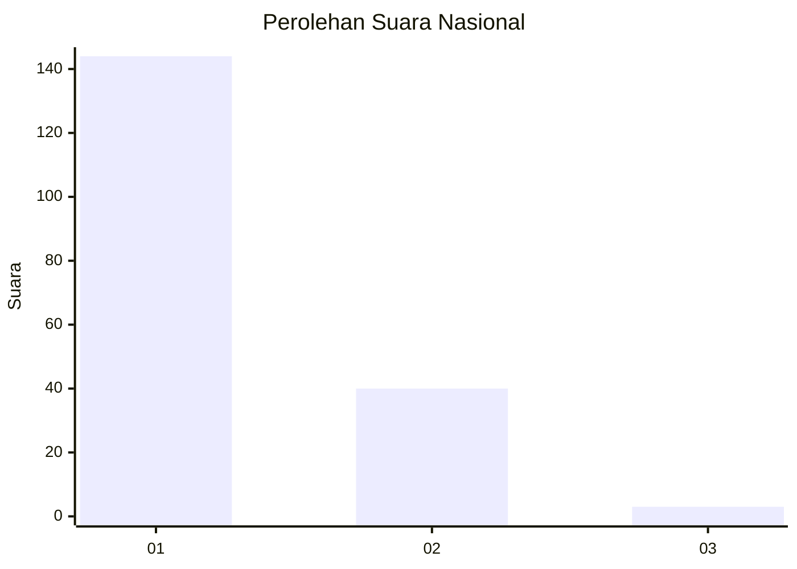
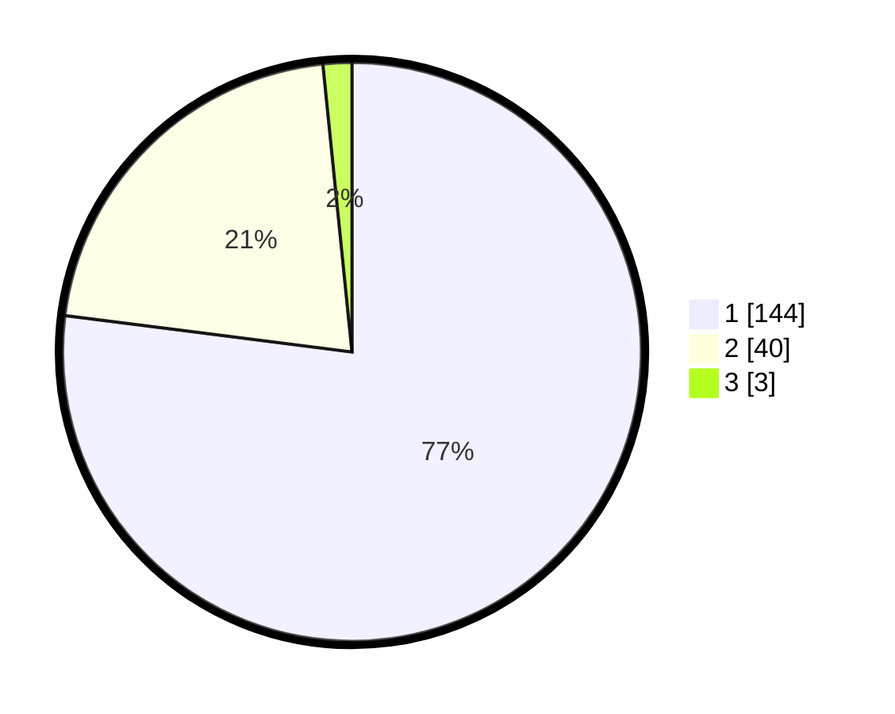

# Hasil

## Grafik

## Tabel

| No. | Nama Paslon    | Suara | Suara (raw) | Persentase |
|:--- |:-------------- | -----:| -----------:| ----------:|
| 1   | ANIES MUHAIMIN | 144   | [144][p-1]  | 77,01      |
| 2   | PRABOWO GIBRAN | 40    | [40][p-2]   | 21,39      |
| 3   | GANJAR MAHFUD  | 3     | [3][p-3]    | 1,60       |

[p-1]: https://github.com/gigit-pemilu/pemilu-2024/blob/main/pilpres/hitung-suara/sub/13-sumatera-barat/sub/04-tanah-datar/sub/01-x-koto/sub/2008-pandai-sikek/sub/004-tps/sub/paslon-1.txt
[p-2]: https://github.com/gigit-pemilu/pemilu-2024/blob/main/pilpres/hitung-suara/sub/13-sumatera-barat/sub/04-tanah-datar/sub/01-x-koto/sub/2008-pandai-sikek/sub/004-tps/sub/paslon-2.txt
[p-3]: https://github.com/gigit-pemilu/pemilu-2024/blob/main/pilpres/hitung-suara/sub/13-sumatera-barat/sub/04-tanah-datar/sub/01-x-koto/sub/2008-pandai-sikek/sub/004-tps/sub/paslon-3.txt

## Foto C Plano

https://sirekap-obj-formc.kpu.go.id/c321/pemilu/ppwp/13/04/01/20/08/1304012008004-20240214-204509--af4ee791-d1f0-45f2-afd1-cfd13b2a5067.jpg

https://sirekap-obj-formc.kpu.go.id/c321/pemilu/ppwp/13/04/01/20/08/1304012008004-20240214-204641--b32d6422-b07b-44f4-85e5-30a3098896af.jpg

https://sirekap-obj-formc.kpu.go.id/c321/pemilu/ppwp/13/04/01/20/08/1304012008004-20240214-204716--1eaa4b11-558d-4506-bf0f-f8b26ab582b4.jpg

## Metadata

| Key        | Value               |
| ---------- | ------------------- |
| Time Stamp | 2024-02-15 12:00:28 |

