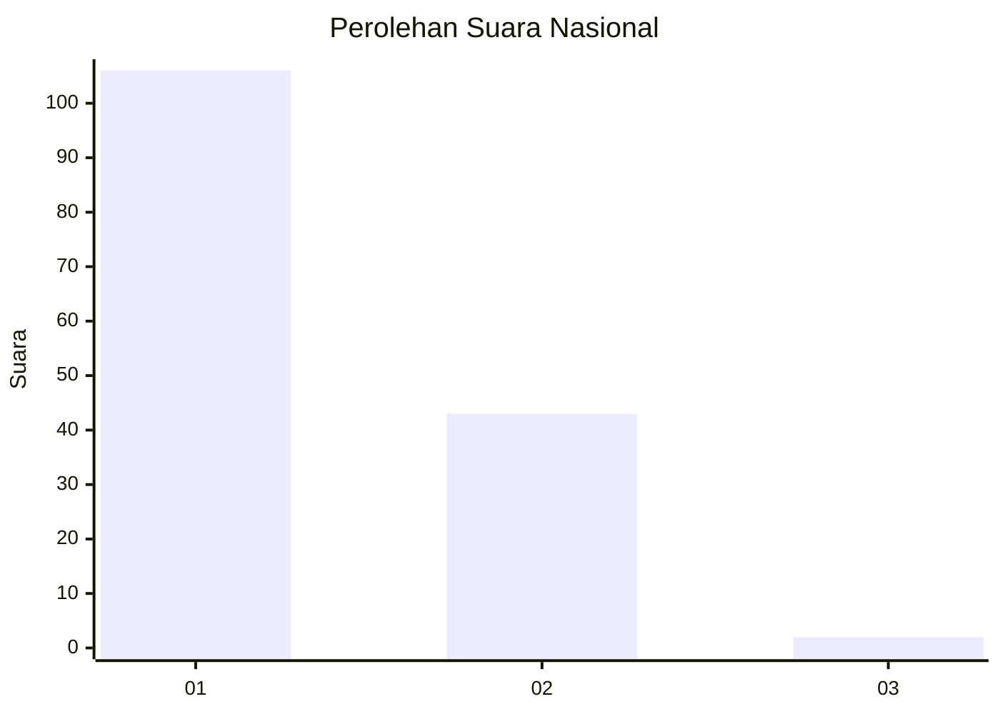
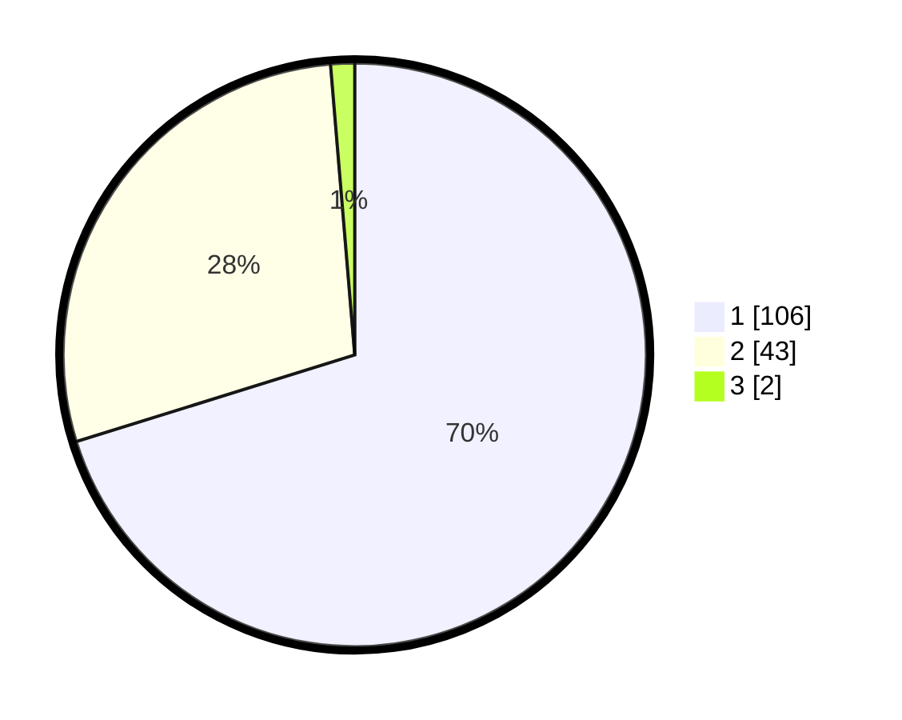

# Hasil

## Grafik

## Tabel

| No. | Nama Paslon    | Suara | Suara (raw) | Persentase |
|:--- |:-------------- | -----:| -----------:| ----------:|
| 1   | ANIES MUHAIMIN | 106   | [106][p-1]  | 70,20      |
| 2   | PRABOWO GIBRAN | 43    | [43][p-2]   | 28,48      |
| 3   | GANJAR MAHFUD  | 2     | [2][p-3]    | 1,32       |

[p-1]: https://github.com/gigit-pemilu/pemilu-2024/blob/main/pilpres/hitung-suara/sub/13-sumatera-barat/sub/04-tanah-datar/sub/02-batipuh/sub/2002-sabu/sub/001-tps/sub/paslon-1.txt
[p-2]: https://github.com/gigit-pemilu/pemilu-2024/blob/main/pilpres/hitung-suara/sub/13-sumatera-barat/sub/04-tanah-datar/sub/02-batipuh/sub/2002-sabu/sub/001-tps/sub/paslon-2.txt
[p-3]: https://github.com/gigit-pemilu/pemilu-2024/blob/main/pilpres/hitung-suara/sub/13-sumatera-barat/sub/04-tanah-datar/sub/02-batipuh/sub/2002-sabu/sub/001-tps/sub/paslon-3.txt

## Foto C Plano

https://sirekap-obj-formc.kpu.go.id/ab34/pemilu/ppwp/13/04/02/20/02/1304022002001-20240215-011757--6ac306db-6bc1-4712-aee5-c4e124419e4b.jpg

https://sirekap-obj-formc.kpu.go.id/ab34/pemilu/ppwp/13/04/02/20/02/1304022002001-20240215-011830--95136510-ca8d-454a-98f2-311b8aa6667f.jpg

https://sirekap-obj-formc.kpu.go.id/ab34/pemilu/ppwp/13/04/02/20/02/1304022002001-20240215-011856--c392b810-f2d0-4597-b42c-8aad69865f5a.jpg

## Metadata

| Key        | Value               |
| ---------- | ------------------- |
| Time Stamp | 2024-02-24 22:31:28 |

