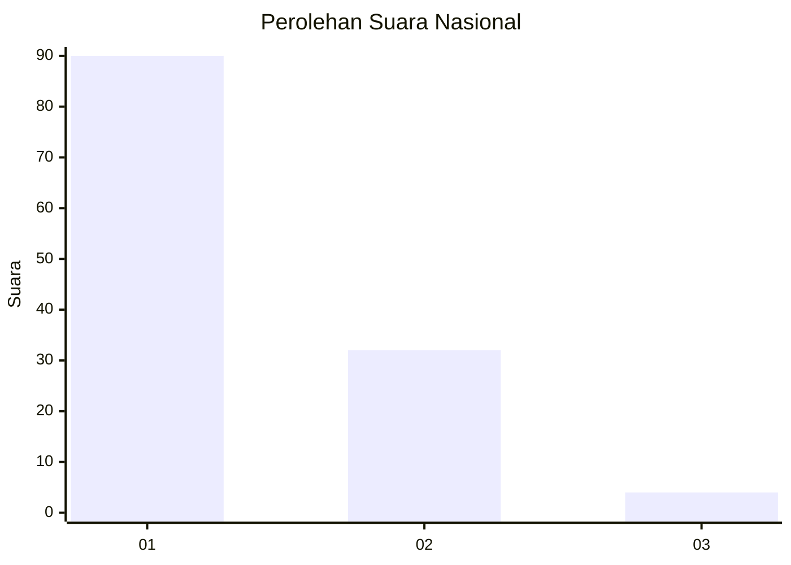
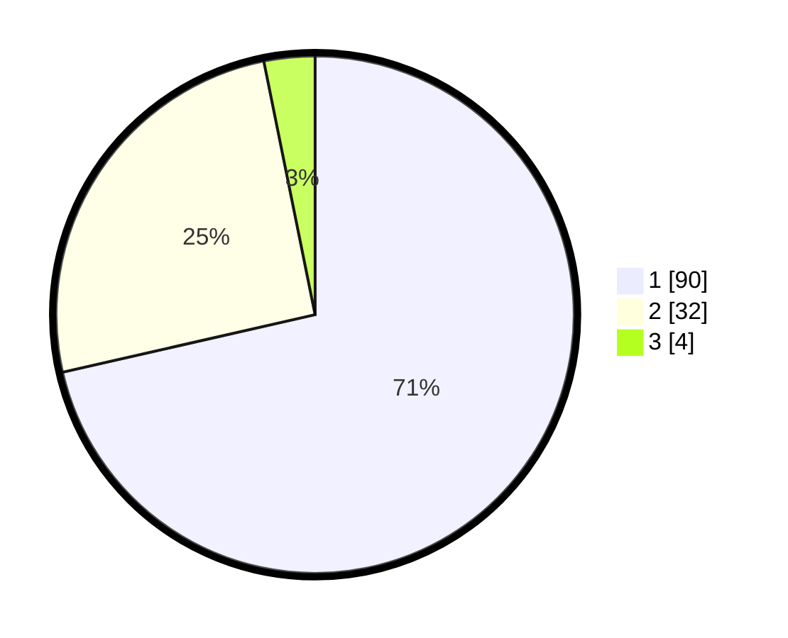

# Hasil

## Grafik

## Tabel

| No. | Nama Paslon    | Suara | Suara (raw) | Persentase |
|:--- |:-------------- | -----:| -----------:| ----------:|
| 1   | ANIES MUHAIMIN | 90    | [90][p-1]   | 71,43      |
| 2   | PRABOWO GIBRAN | 32    | [32][p-2]   | 25,40      |
| 3   | GANJAR MAHFUD  | 4     | [4][p-3]    | 3,17       |

[p-1]: https://github.com/gigit-pemilu/pemilu-2024/blob/main/pilpres/hitung-suara/sub/13-sumatera-barat/sub/04-tanah-datar/sub/02-batipuh/sub/2003-batipuah-ateh/sub/001-tps/sub/paslon-1.txt
[p-2]: https://github.com/gigit-pemilu/pemilu-2024/blob/main/pilpres/hitung-suara/sub/13-sumatera-barat/sub/04-tanah-datar/sub/02-batipuh/sub/2003-batipuah-ateh/sub/001-tps/sub/paslon-2.txt
[p-3]: https://github.com/gigit-pemilu/pemilu-2024/blob/main/pilpres/hitung-suara/sub/13-sumatera-barat/sub/04-tanah-datar/sub/02-batipuh/sub/2003-batipuah-ateh/sub/001-tps/sub/paslon-3.txt

## Foto C Plano

https://sirekap-obj-formc.kpu.go.id/4e53/pemilu/ppwp/13/04/02/20/03/1304022003001-20240216-203038--8080f0ee-e0df-49f2-8a34-d278efcf4c8c.jpg

https://sirekap-obj-formc.kpu.go.id/4e53/pemilu/ppwp/13/04/02/20/03/1304022003001-20240214-202148--fda8ed4b-351c-4ccb-885d-4654c0ef5156.jpg

https://sirekap-obj-formc.kpu.go.id/4e53/pemilu/ppwp/13/04/02/20/03/1304022003001-20240214-202204--84ecb09c-c087-496c-a577-b36ce4afb794.jpg

## Metadata

| Key        | Value               |
| ---------- | ------------------- |
| Time Stamp | 2024-02-24 22:31:28 |

