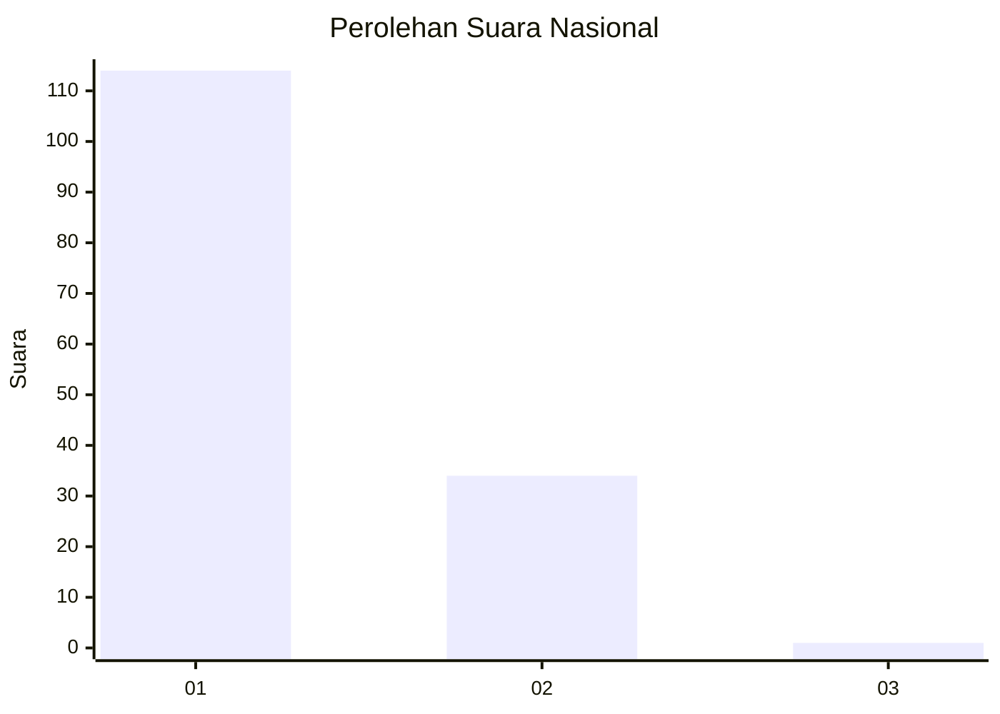
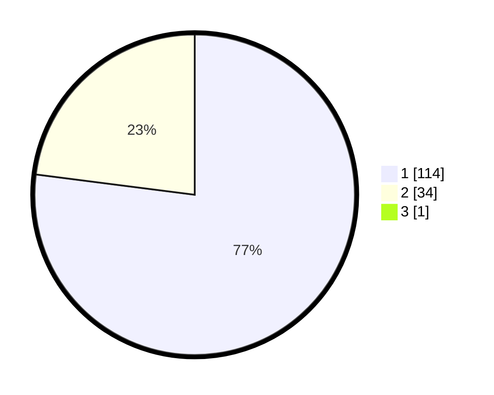

# Hasil

## Grafik

## Tabel

| No. | Nama Paslon    | Suara | Suara (raw) | Persentase |
|:--- |:-------------- | -----:| -----------:| ----------:|
| 1   | ANIES MUHAIMIN | 114   | [114][p-1]  | 76,51      |
| 2   | PRABOWO GIBRAN | 34    | [34][p-2]   | 22,82      |
| 3   | GANJAR MAHFUD  | 1     | [1][p-3]    | 0,67       |

[p-1]: https://github.com/gigit-pemilu/pemilu-2024/blob/main/pilpres/hitung-suara/sub/13-sumatera-barat/sub/04-tanah-datar/sub/02-batipuh/sub/2004-batipuah-baruah/sub/024-tps/sub/paslon-1.txt
[p-2]: https://github.com/gigit-pemilu/pemilu-2024/blob/main/pilpres/hitung-suara/sub/13-sumatera-barat/sub/04-tanah-datar/sub/02-batipuh/sub/2004-batipuah-baruah/sub/024-tps/sub/paslon-2.txt
[p-3]: https://github.com/gigit-pemilu/pemilu-2024/blob/main/pilpres/hitung-suara/sub/13-sumatera-barat/sub/04-tanah-datar/sub/02-batipuh/sub/2004-batipuah-baruah/sub/024-tps/sub/paslon-3.txt

## Foto C Plano

https://sirekap-obj-formc.kpu.go.id/4414/pemilu/ppwp/13/04/02/20/04/1304022004024-20240218-230357--ca707dd3-3326-4a06-a01d-9192d8df4bca.jpg

https://sirekap-obj-formc.kpu.go.id/4414/pemilu/ppwp/13/04/02/20/04/1304022004024-20240218-225832--ed59f8e9-50c9-41a1-9c61-ad1aa0b3c300.jpg

https://sirekap-obj-formc.kpu.go.id/4414/pemilu/ppwp/13/04/02/20/04/1304022004024-20240218-225939--97b8c7ba-1326-483d-82b8-277736f6a059.jpg

## Metadata

| Key        | Value               |
| ---------- | ------------------- |
| Time Stamp | 2024-02-24 22:31:28 |

