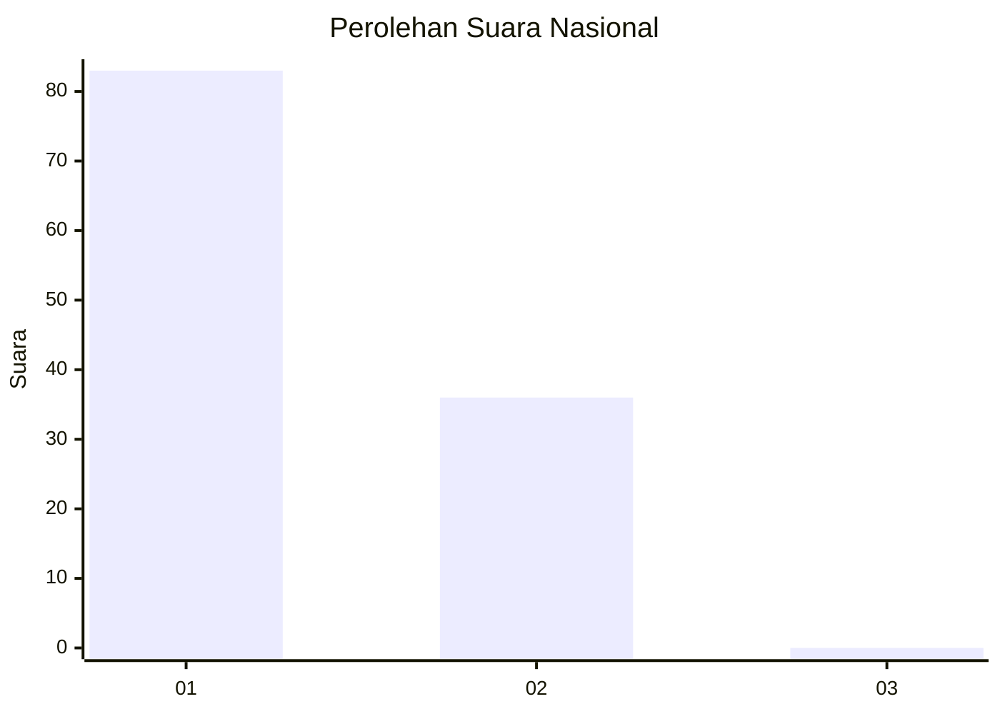
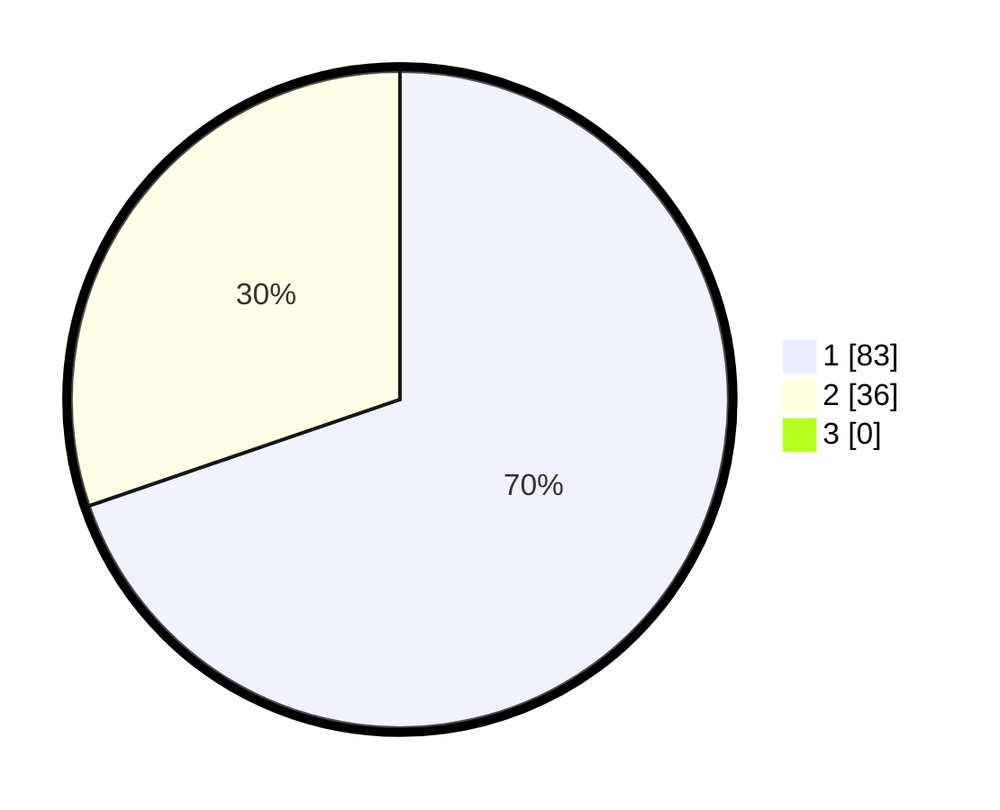

# Hasil

## Grafik

## Tabel

| No. | Nama Paslon    | Suara | Suara (raw) | Persentase |
|:--- |:-------------- | -----:| -----------:| ----------:|
| 1   | ANIES MUHAIMIN | 83    | [83][p-1]   | 69,75      |
| 2   | PRABOWO GIBRAN | 36    | [36][p-2]   | 30,25      |
| 3   | GANJAR MAHFUD  | 0     | [0][p-3]    | 0,00       |

[p-1]: https://github.com/gigit-pemilu/pemilu-2024/blob/main/pilpres/hitung-suara/sub/13-sumatera-barat/sub/04-tanah-datar/sub/03-rambatan/sub/2001-simawang/sub/003-tps/sub/paslon-1.txt
[p-2]: https://github.com/gigit-pemilu/pemilu-2024/blob/main/pilpres/hitung-suara/sub/13-sumatera-barat/sub/04-tanah-datar/sub/03-rambatan/sub/2001-simawang/sub/003-tps/sub/paslon-2.txt
[p-3]: https://github.com/gigit-pemilu/pemilu-2024/blob/main/pilpres/hitung-suara/sub/13-sumatera-barat/sub/04-tanah-datar/sub/03-rambatan/sub/2001-simawang/sub/003-tps/sub/paslon-3.txt

## Foto C Plano

https://sirekap-obj-formc.kpu.go.id/c4a7/pemilu/ppwp/13/04/03/20/01/1304032001003-20240216-190739--b6a155fe-9a41-4866-844e-937362cdebb1.jpg

https://sirekap-obj-formc.kpu.go.id/c4a7/pemilu/ppwp/13/04/03/20/01/1304032001003-20240215-010636--4bfe424d-28f8-4cc3-acd9-4595f76b0a60.jpg

https://sirekap-obj-formc.kpu.go.id/c4a7/pemilu/ppwp/13/04/03/20/01/1304032001003-20240215-010751--15453fab-4587-486f-a26b-4f760857c4ba.jpg

## Metadata

| Key        | Value               |
| ---------- | ------------------- |
| Time Stamp | 2024-02-16 21:01:00 |

