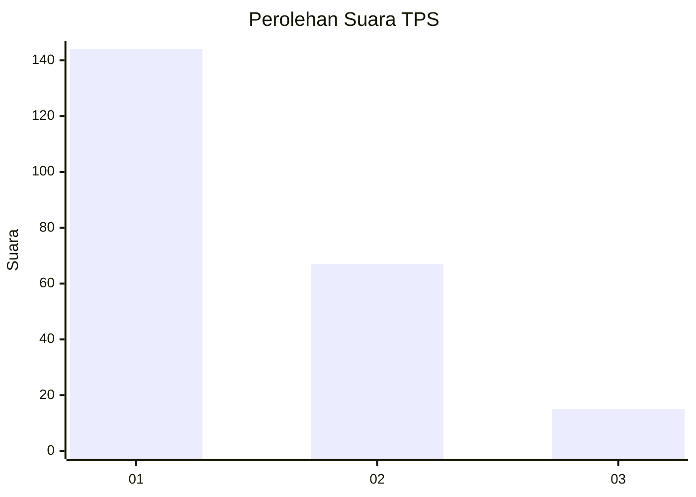
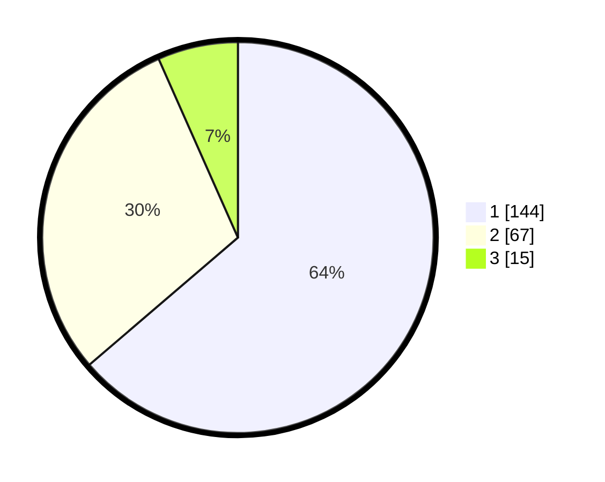

# Hasil

## Grafik

## Tabel

| No. | Nama Paslon    | Suara | Suara (raw) | Persentase |
|:--- |:-------------- | -----:| -----------:| ----------:|
| 1   | ANIES MUHAIMIN | 144   | [144][p-1]  | 63,72      |
| 2   | PRABOWO GIBRAN | 67    | [67][p-2]   | 29,65      |
| 3   | GANJAR MAHFUD  | 15    | [15][p-3]   | 6,64       |

[p-1]: https://github.com/gigit-pemilu/pemilu-2024-13-sumatera-barat/blob/main/pilpres/hitung-suara/sub/13-sumatera-barat/sub/04-tanah-datar/sub/03-rambatan/sub/2002-balimbiang/sub/005-tps/sub/paslon-1.txt
[p-2]: https://github.com/gigit-pemilu/pemilu-2024-13-sumatera-barat/blob/main/pilpres/hitung-suara/sub/13-sumatera-barat/sub/04-tanah-datar/sub/03-rambatan/sub/2002-balimbiang/sub/005-tps/sub/paslon-2.txt
[p-3]: https://github.com/gigit-pemilu/pemilu-2024-13-sumatera-barat/blob/main/pilpres/hitung-suara/sub/13-sumatera-barat/sub/04-tanah-datar/sub/03-rambatan/sub/2002-balimbiang/sub/005-tps/sub/paslon-3.txt

## Foto C Plano

https://sirekap-obj-formc.kpu.go.id/4e7b/pemilu/ppwp/13/04/03/20/02/1304032002005-20240214-233052--c59752b7-a56d-4a3a-9b1c-523c3fece421.jpg

https://sirekap-obj-formc.kpu.go.id/4e7b/pemilu/ppwp/13/04/03/20/02/1304032002005-20240214-232511--4ce87a7e-63de-4c88-ac03-42b655c67000.jpg

https://sirekap-obj-formc.kpu.go.id/4e7b/pemilu/ppwp/13/04/03/20/02/1304032002005-20240214-232753--86ffc1e7-637b-4fdb-a89f-f2946d3e4bf7.jpg

## Metadata

| Key        | Value               |
| ---------- | ------------------- |
| Time Stamp | 2024-02-24 22:31:28 |

