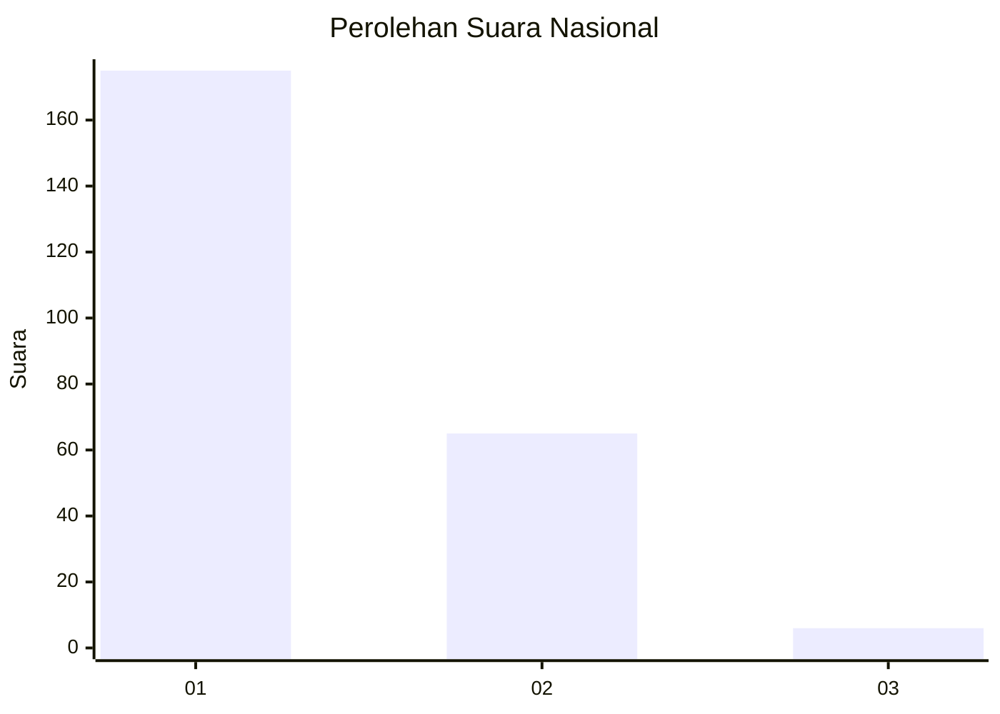
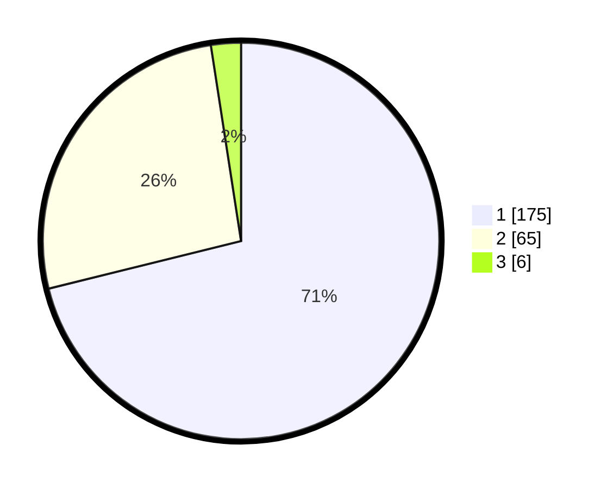

# Hasil

## Grafik

## Tabel

| No. | Nama Paslon    | Suara | Suara (raw) | Persentase |
|:--- |:-------------- | -----:| -----------:| ----------:|
| 1   | ANIES MUHAIMIN | 175   | [175][p-1]  | 71,14      |
| 2   | PRABOWO GIBRAN | 65    | [65][p-2]   | 26,42      |
| 3   | GANJAR MAHFUD  | 6     | [6][p-3]    | 2,44       |

[p-1]: https://github.com/gigit-pemilu/pemilu-2024/blob/main/pilpres/hitung-suara/sub/13-sumatera-barat/sub/04-tanah-datar/sub/03-rambatan/sub/2002-balimbiang/sub/011-tps/sub/paslon-1.txt
[p-2]: https://github.com/gigit-pemilu/pemilu-2024/blob/main/pilpres/hitung-suara/sub/13-sumatera-barat/sub/04-tanah-datar/sub/03-rambatan/sub/2002-balimbiang/sub/011-tps/sub/paslon-2.txt
[p-3]: https://github.com/gigit-pemilu/pemilu-2024/blob/main/pilpres/hitung-suara/sub/13-sumatera-barat/sub/04-tanah-datar/sub/03-rambatan/sub/2002-balimbiang/sub/011-tps/sub/paslon-3.txt

## Foto C Plano

https://sirekap-obj-formc.kpu.go.id/dc4b/pemilu/ppwp/13/04/03/20/02/1304032002011-20240217-234547--ef3b7f6e-a071-4fff-8282-f82e15fff9b6.jpg

https://sirekap-obj-formc.kpu.go.id/dc4b/pemilu/ppwp/13/04/03/20/02/1304032002011-20240215-015438--432c661b-a534-4b43-a016-68be06acbaba.jpg

https://sirekap-obj-formc.kpu.go.id/dc4b/pemilu/ppwp/13/04/03/20/02/1304032002011-20240215-015713--73052b66-1620-40ea-ba09-363ee42e7972.jpg

## Metadata

| Key        | Value               |
| ---------- | ------------------- |
| Time Stamp | 2024-02-24 22:31:28 |

